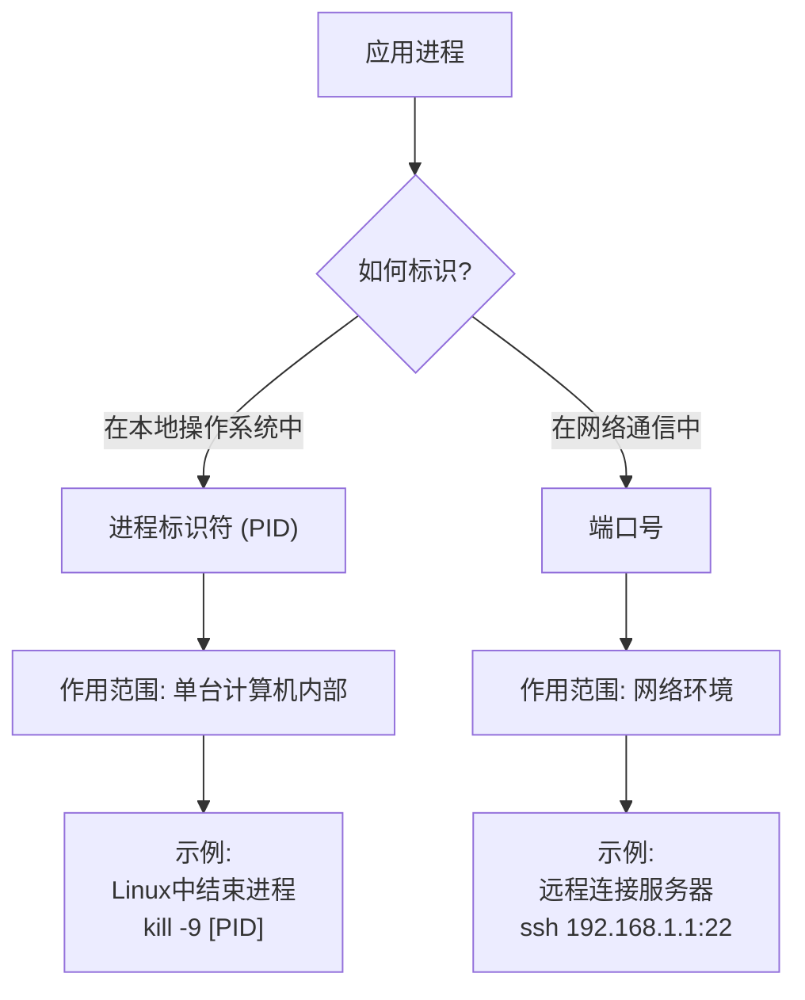

# 1 概述

## 1.1 計算機網絡基本概念

### 1.1.1 定義

- **internet**（互連網）是一個通用名詞，泛指由多個計算機網絡互連而成的計算機網絡。在這些網絡之間可以使用任意的通信協議作為通信規則，不一定非要使用 TCP/IP。
- **Internet**（互聯網或因特網）則是一個專用名詞，指當前全球最大的、開放的、由眾多網絡和路由器互連而成的特定計算機網絡，它採用 TCP/P 族作通信規則。(test)

### 1.1.2 組成

物理上看：

- **硬件**：主要由主機（端系統）、通信鏈路（如雙絞線、光纖）、交換設備（如路由器、交換機等) 和通信處理機（如網卡）等組成
- **軟件**：主要包括各種實現資源共享的軟件和方便用戶使用的各種工具軟件（如網絡操作系統、郵件收發程序、FTP 程序、聊天程序等)
- **協議**：計算機網絡的核心，規定了網絡傳輸數據時所遵循的規範

邏輯上看：

1. 節點：主機（host） 路由器 交換機
2. 通信鏈路：接入鏈路 主幹鏈路
3. 協議

工作方式上看：

1. 邊緣
   1. 由端系統（主機）構成
      1. 主機分為 客戶 和 服務器
2. 接入
   1. 端系統通過ISP（Internet Service Provider）接入因特網
3. 核心
   1. 由⼤量網絡和連接這些網絡的路由器組成

### 1.1.3 功能

- 數據通信：最基本的功能
- 資源共享：包括軟件共享、硬件共享
- 分佈式管理
- 提高可靠性
- 負載均衡

### 1.1.4 分類

- **按分佈範圍**：
  - 廣域網 WAN：互聯網的核心部分，採用**交換**技術
  - 城域網 MAN：大多采用以太網技術
  - 局域網 LAN：採用**廣播**技術
  - 個域網 PAN：採用無線技術，無線個人局域網（WPAN）
- **按傳輸技術**：
  - 廣播式
  - 點對點
- **按拓撲結構**：
  - 總線形
  - 星形
  - 環形
  - 網狀形
- **按交換技術**：
  - 電路交換
  - 報文交換
  - 分組交換

### 1.1.5 性能指標

1. 時延
   1. 發送、傳播、處理、排隊 
2. 帶寬
   1. 單位時間內網絡中點對點的**最高數據傳輸速率**
   2. 短板效應：`min(主机接口速率, 线路带宽, 交换机或路由器的接口速率)`
3. 吞吐量
   1. 單位時間通過某接口的實際數據量
   2. 也有短板效應
4. 時延帶寬積
   1. 字面意思：`传播时延 * 信道带宽`
   2. 指發送端發送的第一個比特即將到達終點時，發送端已發出了多少比特
   3. 也稱為**以比特為單位的鏈路長度**
5. 往返時間 RTT
   1. 指從發送端**發送數據**分組開始，到發送端**收到接收端發來的相應確認**分組為止，總共耗費的時間
6. 利用率
   1. **信道利用率**
      1. 用來表示某鏈路有百分之幾的時間是被利用的 (有數據通過)
      2. **信道利用率不是越高越好**：根據排隊論，當某鏈路的利用率增大時，該信道引起的時延也會激增 
   2. **網絡利用率**：全網絡所有鏈路的鏈路利用率的加權平均
7. 丟包率
   1. 即分組丟失率，是指在一定的時間範圍內，傳輸過程中丟失的分組數量與總分組數量的比率
   2. 具體可分為：接口丟包率、結點丟包率、鏈路丟包率、路徑丟包率、網絡丟包率等
   3. **分組丟失的兩種情況**
      1. 分組在傳輸過程中**出現誤碼**，被傳輸路徑中的**交換機**（例如路由器）或**目的主機**檢測出誤碼而丟棄
      2. 分組到達一臺**隊列已滿**的分組交換機時被丟棄，在通信量較大時就可能造成網絡擁塞

#### 有效速率

例題：鏈路帶寬 50kbps，傳播時延 250msec；數據長度 1000bits；採用應答方式，應答發送時延不計，求有效速率。

數據往返時間 $250*2 = 500$
數據發送時延 $1000/50k = 20 ms$
一個 transaction 完整延時 $520ms$
有效速率（有效帶寬）：
$$20/520 * 50kbps = 1.92kbps$$

## 1.2 體系結構

### 1.2.1 分層結構

分層結構的要求：

- 第 n 層的實體不僅要**使用**第 n-1 層的**服務**來實現自身定義的功能，還要向第 n+1 層**提供本層的服務**，該服務是第 n 層及其下面各層提供的服務總和
- 最低層只提供服務，是整個層次結構的基礎；最高層面向用戶提供服務
- 上一層只能通過相鄰層間的**接口**使用下一層的服務，而不能調用其他層的服務；下一層所提供服務的實現細節對上一層**透明**
- 兩臺主機通信時，對等層**在邏輯上**有一條直接信道，表現為不經過下層就把信息傳送到對方

### 1.2.2 協議、接口、服務

**協議**和**服務**的區別：

1. 服務(Service)：低層向上層提供它們之間的通信能力，是通過原語 (primitive)來操作的，_垂直_。
2. 協議(protocol) ：對等層實體(peer entity)在相互通信的過程中，需要遵循的規則的集合，_水平_。

#### 協議棧


#### 封裝和解封裝


#### 各層次的協議數據單元

**協議數據單元 PDU**：對等層之間傳送的數據單位。

- 應用層：報文 message
- 傳輸層：報文段 segment
  - TCP 段、UDP 數據報
- 網絡層：分組 packet（如果無連接方式：數據報 datagram）
- 數據鏈路層：**幀** frame
- 物理層：位 bit

### 1.2.3 OSI 參考模型

三種常見的模型：


OSI 共 7 層：

- **低三層統稱為通信子網**，它是為了聯網而附加的通信設備，完成數據的傳輸功能
- **高三層統稱為資源子網**，它相當於計算機系統，完成數據的處理等功能

#### 物理層

1. 傳輸單位：比特
2. 物理層主要定義數據終端設備（DTE）和數據通信設備（DCE）的物理與邏輯連接方法
   1. 規定了通信鏈路與通信結點的連接所需**電路接口**的一些參數
   2. 規定了通信鏈路上傳輸的信號的意義和電氣特徵
3. 功能：在物理媒體上為數據端設備透明地傳輸原始比特流
4. 注意：
   1. 傳輸信息所利用的一些物理介質（雙絞線、光纜、無線信道等），並不在物理層協議之內而在物理層協議下面
   2. 因此，有人把物理介質當作第 0 層
5. 接口標準：EIA-232 C、EIA/TIARS-449、CCITT 的X.21 等

#### 數據鏈路層

1. 傳輸單位：幀
2. 將網絡層傳來的 IP 分組**封裝成幀**，並**可靠**地傳輸到相鄰結點的網絡層
3. 功能：**封裝成幀、差錯控制、流量控制、傳輸管理**

#### 網絡層

1. 傳輸單位：數據報
2. 把網絡層的協議數據單元（分組）從源端傳到目的端，為分組交換網上的不同主機提供通信服務，並對分組進行路由選擇
3. 功能：流量控制、**擁塞控制**、差錯控制和網際互連
   1. 網絡層流量控制能力有限，**盡力而為**，沒有**節點到節點**的能力
4. 網絡層協議： IP、IPX、ICMP、IGMP、ARP、RARP、OSPF 等

另外，因特網是一個很大的互聯網，它由大量異構網絡通過路由器（Router）相互連接起來。

1. 因特網的主要網絡層協議是無連接的網際協議 IP 和許多路由選擇協議
2. 因特網的網絡層也稱**網際層**或 IP 層

#### 傳輸層

1. 傳輸單位：報文段
2. 負責主機中兩個**進程**之間的通信，為**端到端**連接提供**可靠**的傳輸服務
3. 功能：流量控制、差錯控制、服務質量、傳輸管理
4. 一臺主機可同時運行多個進程，具有**複用和分用**的功能
5. 傳輸層協議：TCP、UDP

> [!NOTE] 鏈路層和傳輸層的對比
>
> 數據鏈路層提供的是**點到點**的通信：
>
> 1. **主機**到主機之間的通信
> 2. 一個點是指一個硬件地址或 IP 地址，網絡中參與通信的主機是通過硬件地址或地址標識的
>
> 傳輸層提供的是**端到端**的通信：
>
> 1. 不同主機內的兩個**進程**之間的通信
> 2. 一個進程由一個**端口**來標識

#### 會話層

1. 允許同主機上的各個進程之間進行**會話**
2. 管理主機間的會話進程，包括建立、管理及終止進程間的會話
3. 可以使用校驗點使通信會話在通信失效時從校驗點繼續恢復通信，實現**數據同步**

> [!NOTE] 建立會話
>
> 1. 也稱建立**同步**（SYN）
> 2. 主要為表示層實體或用戶進程建立連接並**在連接上有序地傳輸數據**，這就是會話。

#### 表示層

1. 主要處理在兩個通信系統中交換信息的表示方式
2. 採用插象的標準方法定義數據結構，並採用標準的編碼形式，使不同表示方法的數據和信息之間能互相交換
   1. 不同機器採用的編碼和表示方法不同，使用的數據結構也不同
3. 功能：**數據壓縮、加密和解密**

#### 應用層

1. OSI 參考模型的最高層，是用戶與網絡的界面
2. 為特定類型的**網絡應用**提供訪問 OSI 參考模型環境的手段
3. 網絡層協議：用於文件傳送的 FTP、用於電子郵件的 SMTP、用於萬維網的 HTTP 等
   1. 用戶的實際應用多種多樣，因此應用層協議最多、**最複雜**

### 1.2.4 TCP/IP 模型


熟練掌握 OSI 即可，TCP/IP 可以基本對應上 OSI 的各層。

| TCP/IP         | 協議    | OSI                        |
| -------------- | ------- | -------------------------- |
| **應用層**     | HTTP等  | **會話層、表示層、應用層** |
| 傳輸層         | TCP/UDP | 傳輸層                     |
| 網際層         | IP      | 網絡層                     |
| **網絡接口層** | 接口    | **物理層、數據鏈路層**     |

# 2 物理層

物理層的主要功能是提供透明**比特流**的傳輸服務。


## 2.1 通信基礎

### 2.1.1 基礎概念

#### 碼元

碼元是指用一個固定時長的信號波形（數字脈衝），代表不同離散數值的基本波形，這個**固定時長**稱為**碼元寬度**。

若碼元的有 M 個離散狀態，則稱為 M 進制碼元。

- 在二進制系統中，一個碼元可以是“0”或“1”，對應低電平或高電平。
- 在四進制系統中，一個碼元可以是“00”、“01”、“10”、“11”，對應四種不同的波形（如四種相位）。

#### 信源與信宿


#### 同步/異步傳輸

- **同步傳輸**
  - 指數據塊以**穩定**的**比特流**形式傳輸，字節之間沒有間隔
  - 接收端在每個比特信號的中間時刻 (有區分 `0,1` 的標誌) 進行檢測，以判別接收到的是比特 `0` 還是 `1
  - 收發雙方時鐘同步方法：
    - **外同步**：在收發雙方之間加一條單獨的時鐘信號線
    - **內同步**：發送端將時鐘同步信號編碼到發送數據中一起傳輸 (如曼徹斯特編碼) `
- **異步傳輸**
  - 指以**字節**為**獨立**的傳輸單位，字節間的時間間隔不是固定的
  - 接收端僅在每個字節的起始處對字節內的比特實現同步
  - 通常傳送前要在每個字節前後加上起始位和結束位
  - 異步是指**字節之間異步**【字節之間的時間間隔不固定】
  - **字節中的每個比特仍然要同步**【各比特的持續時間是相同的】

#### 通信方式

- **單工通信**
  - 只有**一個方向**的通信而沒有反方向的交互，如無線電廣播、電視廣播
  - 只需一個信道
- **半雙工通信**
  - 通信雙方都可發送或接收信息，但**不能同時**通信
  - 需要兩個信道
- **全雙工通信**
  - 通信雙方可同時發送或接收信息
  - 需要兩個信道

#### 速率

速率也叫數據率，是指數據的傳輸速率，表示單位事件內傳輸的數據量。

速率主要有**波特率/碼元傳輸速率**、**比特率/信息傳輸速率**兩種。

##### 碼元傳輸速率

- 又叫波特率、碼元速率、波形速率、調製速率

表示單位時間內數字通信系統所傳輸的**碼元**個數(或稱脈衝個數、信號變換次數），單位為**波特**（Baud），波特是速度單位。

1波特表示數字通信系統每秒傳輸一個碼元，這裡的碼元可以是多進制的，也可以是二進制的，但**碼元速率與進制數無關。**

- 曼徹斯特編碼下，碼元速率是傳輸速率的兩倍

##### 信息傳輸速率

- 又叫比特速率、信息速率

表示單位事件內數字通信系統傳輸的**二進制碼元**個數（即**比特數**），單位為比特/秒，即 1s 傳輸多少比特

> [!NOTE] 碼元傳輸速率和信息傳輸速率的關係
>
> 若一個碼元攜帶 `n` 比特的信息量，則 `M` Baud 的碼元傳輸速率所對應的信息傳輸速率為 `M x n` 比特/秒。
>
> - N 進制就是攜帶 $n = log_2N$ 個比特

#### 帶寬

在**模擬信號**系統中，帶寬（又稱頻率帶寬）用來表示某個信道所能傳輸信號的頻率範圍，即**最高頻率與最低頻率之差**，單位是赫茲（Hz）。

在計算機網絡中，帶寬用來表示網絡的通信線路的最大數據傳輸率。

##### 例題


1. `带宽 = 最高频率 - 最低频率`
2. `频率 = 光速 / 波长`


### 2.1.2 奈奎斯特定理

在**理想低通**（沒有噪聲、帶寬有限）的信道中，為了避免碼間串擾，極限碼元傳輸率為 $2W$ Baud。

- W 是理想低通信道的帶寬，單位為 Hz

轉換為以 bit 為單位：

- V 表示每個碼元離散電平的數目
  - 指有多少種不同的碼元，與 V 進制等價
  - 故，$\log_{2}V$ 表示每個碼元的比特數
- 理想低通信道下的極限數據傳輸率 $2W\log_{2}V$（b/s）

### 2.1.3 香農定理

香農定理給出了帶寬受限旦**有高斯噪聲**干擾的信道的極限傳輸速率。

香農公式表示**極限傳輸速度**：
$$C = W*log_2 (1+\frac{S}{N}), \text{(bit/s)}$$

- W 是帶寬，單位為Hz
- $\frac{S}{N}$ 一般需要通過**信噪比 SNR** 來計算，相關公式如下：
  $$
  \begin{cases}SNR=10*log_{10}\frac{S}{N}\\
  \frac{S}{N}=10^{\frac{SNR}{10}}\end{cases}
  $$
- 信噪比 SNR 單位為 dB

對於香農定理，有以下結論：

1. 信道的帶寬或信道中的**信噪比**越大，信息的極限傳輸速率越高。
2. 對一定的傳輸帶寬和一定的信噪比，信息傳輸速率的上限是**確定的**。
3. 只要信息傳輸速率低於信道的極限傳輸速率，就能找到某種方法實現**無差錯**的傳輸。
4. 香農定理得出的是極限信息傳輸速率，**實際**信道能達到的傳輸速率要比它低不少。

### 2.1.4 編碼與調製


- 編碼轉為數字信號
- 調製轉為模擬信號

#### 常用編碼


說明一下反向非歸零（NRZI）：

1. **Non-Return-to-Zero Inverted**，非歸零**反相**編碼這個說法更好
   1. 非歸零 NTZ
2. 用電平的跳變表示 0、電平保持不變表示 1。
3. **跳變信號**本身可作為一種通知機制。
4. 這種編碼方式集成了前兩種編碼的優點，既能傳輸時鐘信號，又能儘量不損失系統帶寬。
5. USB 2.0 的編碼方式就是 NRZI 編碼
6. 差分曼徹斯特編碼類似 NRZI
   1. 不變是1，跳變是0，**第一位無法判斷**
7. 其他編碼看圖很好理解

#### 模擬數據轉數字信號

採樣、量化和編碼，常用於對音頻信號進行編碼的PCM 編碼。

1. **採樣**是指對模擬信號進行**週期性掃描**，將時間上連續的信號變成時間上離散的信號。
   1. 根據奈奎斯特定理，採樣頻率必須大於或等於模擬信號最大頻率的兩倍。
2. **量化**是指將採樣得到的電平幅值按照一定的分級標度轉換為對應的**數值並取整**，這樣就將連續的電平幅值轉換了離散的數字量。
   1. 採樣和量化的實質就是**分割和轉換**。
3. **編碼**是指將量化得到的離散整數轉換為與之對應的二進制編碼。

#### 數字數據調製為模擬信號

數字數據**調製**技術在發送端將數字信號轉換模擬信號，而在接收端將模擬信號還原數字信號，分別對應於調制解調器的調製和解調過程。

**數字調製**的 4 種方式：

1. 調幅 AM / 幅移鍵控 ASK
2. 調頻 FM / 頻移鍵控 FSK
   1. **抗干擾強**，應用廣泛
   2. 24 真題
3. 調相 PM / 相移鍵控 PSK
4. 正交幅度調製 QAM 1. 09 23 真題 1. 在**頻率相同**的前提下，將 AM 與 PM 結合起來，形成疊加信號。設波特率為 B，採用 m 個相位，每個相位有 n 種振幅，則該 **QAM 的數據傳輸速率 R** 為 $R = B\log_{2}{mn}$（單位為 b/s）1. $log_{2}{mn}$ 表示每個信號傳輸的**比特數**，可以代入奈氏算最大傳輸速率2. **QAM-xx，表示一個碼元有 xx 種符號表示**
   

| 調製方式 | 典型形式          | 決定碼元進制   | 狀態數 $N$ | 碼元比特數 |
| :------- | :---------------- | :------------- | :--------- | :--------- |
| **ASK**  | 4-ASK             | 振幅           | 4          | 2          |
| **FSK**  | 4-FSK             | 頻率           | 4          | 2          |
| **PSK**  | BPSK, QPSK, 8-PSK | 相位           | 2, 4, 8    | 1, 2, 3    |
| **QAM**  | 64-QAM            | **振幅乘相位** | 16, 64     | 4, 6       |

### 2.1.5 電路交換

為每個呼叫預留一條**專有**線路，作為專用資源，**不共享**

- 保證性能
- 用戶始終佔用著**端到端**的固定傳輸帶寬

e.g. 電話網：


#### 優點

- 通信時延小，實時性好
- **有序傳輸**
- **沒有衝突**

#### 缺點

- 建立連接時間長
- 線路獨佔，使用效率低
- 計算機通信有突發性，若使用電路交換，易造成浪費
- 可靠性不高，**不便於差錯控制**

### 2.1.6 報文交換

報文交換（Message Switching）是分組交換的前身，報文被**整個**發送，數據交換的單位是**報文**。

- 報文攜帶有目標地址、源地址等信息
- 報文交換在交換結點採用**存儲轉發**的傳輸方式
- 交換節點將報文**整體接收完成後**才能查找轉發表，將整個報文**轉發**到下一個節點
- 報文大小**沒有**限制

#### 優點

- **無需建立連接**
- 動態分配線路
- 提高線路可靠性
  - 如果某條線路出現故障，會重新選擇另一條線路
- 提高線路利用率
  - 通信雙方在不同的時間分段佔用物理線路
- 提供多目標服務
  - 一個報文可以同時發送給多個目的地址

#### 缺點

- **轉發時延**
  - 交換結點要將報文**整體**接收完後，才能查找轉發錶轉發到下一個結點
- 報文太長
  - 交換節點的**緩存開銷大**
  - 錯誤處理**低效**，重傳代價大

### 2.1.7 分組交換

分組交換（Packet Switching）也採用**存儲轉發**技術，但解決了報文交換中**報文過長**的問題。源主機在發送之前，先把較長的報文劃分成若干較小的**等長數據段**，在每個數據段前面添加一些由必要**控制信息**（如源地址、目的地址和編號信息等）組成的首部，構成**分組**（Packet）。

- 分組交換還可以進一步分為**面向連接的虛電路方式**和**無連接的數據報方式**，這兩種服務方式都由網絡層提供。

報文劃分：


分組轉發過程：

1. 源主機將**分組**發送到分組交換網中
2. 分組交換網中的**分組交換機**收到一個分組後，先將其**緩存**，然後從其首部中提取**目的地址**
3. 據此查找自己的**轉發表**，再後將**分組轉發**給下一個分組交換機
4. 經過多個分組交換機的存儲轉發後，分組最終到達目的主機


分組交換除繼承報文交換的諸多優點外，還有如下優點：

1. 方便存儲管理，存儲轉發開銷小
   1. 因為分組的長度固定，所以相應緩衝區的大小也固定。
2. 傳輸效率高
   1. 分組是逐個傳輸的，可以使**後一個分組的存儲操作與前一個分組的轉發操作並行**，這種流水線方式減少了報文的傳輸時間。
   2.
3. 減少了出錯概率和重傳代價
   1. 因為分組較短，其出錯概率必然減小，所以每次重發的數據量也就大大減少，這樣不僅提高了可靠性，還減小了傳輸時延。

#### 缺點

1. **存儲轉發時延**
   1. 儘管分組交換比報文交換的傳輸時延小，但相對於電路交換仍存在存儲轉發時延，且其節點交換機必須具有更強的處理能力。
2. 傳輸**額外**的信息量
   1. 每個小數據段都要加上控制信息以構成分組，這使得傳送的信息量增大了5%~10%，進而使得控制複雜，降低了通信效率。
3. 若採用**數據報**服務時，可能出現**失序**、丟失或重複分組的情況，分組到達目的主機時，要對分組按編號進行排序等工作，而這些工作很麻煩。
4. 若採用**虛電路**服務，有呼叫建立、數據傳輸和虛電路釋放三個過程。

#### 總結：三種交換

| 三種交換 | 使用場景                                     |
| -------- | -------------------------------------------- |
| 電路交換 | 大量數據，且數據傳送時間遠大於建立連接的時間 |
| 報文交換 | 突發式數據傳送                               |
| 分組交換 | 突發式數據傳送，時延更小                     |

## 2.2 傳輸介質

傳輸介質：是計算機網絡設備之間的物理通路，也稱為傳輸媒介。

傳輸介質可以分為：

- **導向傳輸介質**：固體傳輸（銅線，光纖）
- **非導向傳輸媒介質**：無線傳輸（空氣，真空，海水）

### 2.2.1 雙絞線

- 把兩根互相絕緣的銅導線並排放在一起，然後用規則的方法絞合起來
- **絞合可減少對相鄰導線的電磁干擾**
- 在局域網和傳統電話網中普遍使用
- **屏蔽雙絞線 STP**：在雙絞線的外面再加上一層用金屬絲編織成的屏蔽層，提高抗電磁干擾的能力
- **非屏蔽雙絞線 UTP**：無屏蔽層的雙絞線

#### 優缺點

- 價格便宜
- 通信距離一般為幾千米到數十千米
- 長距離的模擬傳輸需要放大器放大衰減信號
- 長距離的數字傳輸需要用中繼器將失真的信號整形


### 2.2.2 同軸電纜

- 由內導體、絕緣層、網狀編織屏蔽層和塑料外層所組成
- **基帶同軸電纜 (50 $\Omega$)**：傳送基帶數字信號，早期用於局域網
- **寬帶同軸電纜 (75 $\Omega$)**：傳送寬帶信號，目前主要用於有線電視

#### 優缺點

- 由於外導體屏蔽層的作用，同軸電纜具有很好的**抗干擾特性**
- 被廣泛用於傳輸較高速率的數據
- 傳輸距離比雙絞線更遠，價格也更高


### 2.2.3 光纖

光纖通信：

- 利用光導纖維（光纖）傳遞光脈衝來進行通信
- 有光脈衝表示 1，無光脈衝表示 0
- 可見光的頻率約為 $10^8$ MHz 量級，因此光纖通信系統的帶寬極大


**原理**：基於全反射，當光纖碰到包層時就會折射到纖芯，這個過程不斷重複，光就沿著光纖傳輸下去

#### 優缺點

- 傳輸損耗小，中繼距離長，對遠距離傳輸特別經濟
- **抗雷電和電磁干擾性能好**
- 無串音干擾，**保密性好**，也不易被竊聽或截取數據
- 體積小，重量輕
- 割接需要專用設備
- 光電接口價格較**貴**

### 2.2.4 無線電波

- 屬於**非導向介質**
- 具有較強的**穿透**能力，可以傳輸很長的距離
- 廣泛應用於通信領域（無線手機通信、無線局域網）
- 無線電波使信號向**所有方向**擴散，有效距離範圍內的接收設備無須對準某個方向

### 2.2.5 微波、紅外線和激光

- 屬於**非導向介質**
- **微波**：
  - 通信頻率較高，頻段範圍較寬，載波頻率通常為 2~40 GHz，因此通信容量大
  - 信號沿直線傳播，超過一定距離後需要使用中繼站
  - **衛星通信**：
    - 利用地球同步衛星作為中繼來轉發微波信號
    - 3 顆同步衛星可基本實現全球通信
    - 優點：通信容量大、距離遠、覆蓋廣
    - 缺點：保密性差、端到端的傳播時延長
- **紅外線**：
  - 點對點無線傳輸
  - 直線傳播，**中間不能有障礙物**，傳輸距離短
  - 傳輸速率低 (`4Mb/s~16Mb/s`)
- **可見光**：
  - 即光源作為信號源，前景好，暫時未被大範圍應用

### 2.2.6 物理層接口的特性

- 機械特性：指明接口所用接線器的**形狀**和**尺寸**、**引腳數目**和**排列**、**固定**和**鎖定**裝置
- 電氣特性：指明在接口電纜的各條線上出現的**電壓範圍**
- 功能特性：指明某條線上出現的某一電平的**電壓表示何種意義**
- 過程特性：指明對於不同功能的各種可能**事件的出現順序**，也稱規程特性

## 2.3 物理層設備

### 2.3.1 中繼器 Repeater

中繼器用於**整型、放大並轉發信號**，以消除信號經過一長段電纜後而產生的失真和衰減，使信號的波形和強度達到所需要的要求，進而擴大網絡傳輸的距離。

- **原理**：信號再生，而非簡單地將衰減的信號放大
- **兩個端口**：
  - 數據從一個端口輸入，再從另一個端口發出
  - 端口僅作用於信號的電氣部分，並不管數據中有沒有錯誤數據或者不適於網段的數據
  - 兩端可以連接相同媒體，也可以連接不同媒體
  - 兩端的網絡部分是網段（不是子網）
- **注意**：
  - 中繼器連接的幾個網段仍然是一個局域網
  - 中繼器工作在物理層，因此它**不能連接兩個具有不同速率的局域網**
  - 如果某個網絡設備具有存儲轉發的功能，那麼可以認為它能連接兩個不同的協議
  - **中繼器沒有存儲轉發功能**，因此兩端的網段一定要使用同一個協議
  - 放大器和中繼器都起放大作用：
    - 放大器放大的是模擬信號，原理是將衰減的信號放大
    - 中繼器放大的是**數字信號**，原理是將衰減的信號整形再生
- **5-4-3 規則**：
  - 5 個網段，4 箇中繼器，3 個網段為主機段
  - 在 5 個網段中的任意發送方和接收方**最多**只能經過 4 箇中繼器 

### 2.3.2 集線器 Hub

- **集線器最高功能層就是物理層，真題**

實質上是一個多端口的中繼器，對接收到的信號進行**再生整形**放大，以擴大網絡的傳輸範圍。

把所有節點集中在以它為中心的節點上，端口收到數據後，從除輸入端口外的所有端口**廣播**出去，**不具備信號的定向**傳送能力，是一個共享設備。

- 集線器主要使用**雙絞線**組建共享網絡，是從服務器連接到桌面的最經濟方案
- 集線器的每個端口連接的網絡部分是同一個網絡的**不同網段**

**注意**：

- 多臺計算機必然會發生同時通信的情形，因此**集線器不能分割衝突域，所有集線器的端口都屬於同一個衝突域**
- 使用集線器的以太網雖然**物理拓撲是星型**的，但**邏輯上仍是一個總線網**，各站共享總線資源，使用的還是 `CSMA/CD` 協議
- 集線器**只工作在物理層**，它的**每個接口僅簡單地轉發比特**，**不進行碰撞檢測**(由各站網卡檢測)
- 集線器一般都有少量的容錯能力和網絡管理功能
- 集線器是**半雙工模式**，收發不能同時進行


- 集線器在**一個時鐘週期中只能傳輸一組信息**，如果一臺集線器連接的機器數目較多，且多臺機器經常需要同時通信，那麼將導致信息碰撞，使得集線器的工作效率很差
- 一個帶寬為 10 Mb/s 的集線器上連接了 8 臺計算機，當這 8 臺計算機同時工作時，每臺計算機真正所擁有的帶寬為 10/8 Mb/s=1.25 Mb/s

# 3 數據鏈路層

**網絡層**解決了一個網絡如何到達另外一個網絡的**路由問題**。而**鏈路層**則解決**在一個網絡內部**如何由一個節點（主機或者路由器）到達另外一個相鄰節點。

在鏈路層，我們基本只討論局域網內的鏈路層功能，因為廣域網由於節點之間距離非常遠（網課的例子是中國到日本到夏威夷），所以**廣域網鏈路層是採用點到點的鏈路**，非常簡單，沒什麼好講的。

- PPP 是目前廣泛使用的點到點協議


而局域網中，鏈路層採用的是**多點連接**的方式，其中就包含集線器 hub、交換機 switch 等結構。

## 3.1 數據鏈路層的功能

- 本小節籠統介紹鏈路層基本功能，之後詳細介紹

封裝成幀，鏈路接入：

- 將數據報封裝在幀中，加上幀頭、幀尾部
- 如果採用的是共享性介質，信道接入獲得信道訪問權
- 在幀頭部使用 **MAC 地址**（物理地址）而不是IP地址來標示源和目的

其他：

- 流量控制
- 差錯檢測和糾正

鏈路層功能在 “適配器”上 實現 (AKA network interface card, NIC) ，最常見的就是以太網卡。

### 3.1.1 鏈路管理

數據鏈路層連接的建立、維持和釋放過程，稱為**鏈路管理**，它主要用於**面向連接**的服務。鏈路兩端的節點要進行通信，必須首先**確認**對方已處於就緒狀態，並交換一些必要的信息以對幀序號初始化，然後才能建立連接，在傳輸過程中要能維持連接，而在傳輸完畢後要釋放該連接。

### 3.1.2 封裝成幀

幀長等於幀的數據部分長度加上首部和尾部的長度。

幀定界：首部和尾部中含有很多控制信息，它們的一個重要作用是**確定幀的界限**，即接收方能從接收到的二進制比特流中區分出幀的開始與結束。

- e.g. 在 HDLC 協議中，用**標識位** F（01111110）來標識幀的開始和結束。
  - 在通信過程中，檢測到幀標識位 F 即認為其是幀的**開始**，然後一旦檢測到幀標識位 F 即表示幀的**結束**。
  - HDLC 標準幀格式如圖3.4所示。 
  - 為了提高幀的**傳輸效率**，應當使幀的數據部分的長度儘可能地大於首部和尾部的長度，但隨著幀長的增加，傳輸差錯發生的概率也隨之提高，發生差錯時重傳的代價也越大
  - 因此每種鏈路層協議都規定了**幀的數據部分的長度上限**，即**最大傳送單元**（Maximum Transmission Unit, MTU）。

#### 透明傳輸

透明傳輸：無論上層（網絡層）傳下來什麼樣的數據（包括和**幀定界符**相同的比特/字節），數據鏈路層都能**正確**地封裝、傳輸、接收並還原，而不會**誤判**幀邊界或丟失數據。

### 3.1.3 流量控制

流量控制實際上就是**限制發送方的發送速率**，使之不超過接收方的接收能力。這個過程需通過某種反饋機制，使發送方知道在什麼情況下可以接著發送下一幀，而在什麼情況下必須暫停發送，以等待收到某種反饋信息後繼續發送。

在 OSI 體系結構中，數據鏈路層具有流量控制的功能。而在 **TCP/IP 體系**結構中，流量控制功能被移到了傳輸層。它們控制的對象不同。對數據鏈路層來說，控制的是**相鄰節點**之間的數據鏈路上的流量，而對傳輸層來說，控制的則是從**源端到目的端**之間的流量。

### 3.1.4 差錯檢測

幀在傳輸過程中可能會出現錯誤，這些錯誤分為**位錯**和**幀錯**。

1. 位錯：幀中某些位出現差錯
   1. 通常採用循環冗餘檢驗（CRC）來發現位錯。
2. 幀錯：幀丟失、幀重複或幀失序等錯誤

過去 OSI 的觀點是：**必須讓數據鏈路層向上提供可靠傳輸**。因此在 CRC 檢錯的基礎上，增加了**幀編號、確認和重傳機制**。收到正確的幀就要向發送方發送確認。發送方在一定期限內若未收到對方的確認，就認為出現了差錯，因此進行重傳，直到收到確認為止。

現在，在通信質量較差的無線傳輸中，數據鏈路層依然使用確認和重傳機制，向上提供可靠的傳輸服務。對於通信質量良好的有線鏈路，數據鏈路層已不再使用確認和重傳機制，即**不要求向上提供可靠傳輸的服務**，而僅需進行 CRC 檢錯，目的是將有差錯的幀丟棄，保證上交的幀都是正確的，而**對出錯的幀的重傳任務則由高層協議**（如傳輸層 TCP）完成。

## 3.2 組幀

發送方根據一定規則將網絡層交付的分組封裝成幀。

數據鏈路層之所以要將比特組合成以幀為單位傳輸，是為了在出錯時**只重發出錯的幀**，而不必重發全部數據，從而提高效率。

組幀主要解決幀定界、幀同步、透明傳輸等問題。實現組幀的方法通常有以下4種。

### 3.2.1 字符計數法

每個幀的首位字符用於記錄當前幀的長度（字符數）。

- 不安全，首位出錯就亂套了
  

### 3.2.2 字節填充法

鏈路層在網絡層基礎上，在結束字符之前再插入一個轉義符 ESC，表示之後 ESC 之後的字符是結束符，不是數據。

- 若轉義字符 ESC 也出現在數據中，則解決方法是在轉義字符前再插入一個轉義字符。


- SOH、EOT 是網絡層表示幀的開始和結束的**控制字符**

### 3.2.3 零比特填充法

零比特填充法允許數據幀包含任意個數的比特，它使用一個**特定的比特串** 01111110 來標誌一幀的開始和結束。

為了不使數據字段中出現的比特流 01111110 被**誤判**為幀的首尾標誌，發送方先掃描整個數據字段，**每遇到5個連續的“1”，就自動在其後插入一個“0”**。

- 經過這種**比特填充**後，就可保證數據字段中不會出現6個連續的“1”。
- 接收方執行該過程的逆操作，即每收到5個連續的“1”，就自動刪除後面緊跟的“0”，以恢復原始數據。
- 在數據鏈路層早期使用的 **HDLC 協議**中，便是採用這種比特填充的首尾標誌法來實現**透明傳輸**的。


### 3.2.4 違規編碼法

在**物理層**進行比特編碼時，常採用違規編碼法。

- e.g. 曼徹斯特編碼方法將數據比特“1”編碼成“高-低”電平對，將數據比特“0”編碼成“低-高”電平對，而“高-高”電平對和“低-低”電平對在數據比特中是違規的（沒有采用），因此**可借用這些違規編碼序列**來定界幀的起始和終止。
- 局域網 IEEE 802標準就採用了這種方法。
- 違規編碼法**不採用任何填充技術**便能實現數據的**透明傳輸**，但只適用於採用冗餘編碼的特殊編碼環境。

因為字符計數法中計數字段的脆弱性和字節填充法實現上的複雜性與不兼容性，所以目前較常用的組幀方法是**零比特填充法和違規編碼法**。

## 3.3 差錯控制

差錯控制主要有兩類：

1. 自動重傳請求（Automatic Repeat reQuest, ARQ）
   1. 在 ARQ方式中，當接收方檢測到差錯時，就設法通知發送方重發，直到收到正確的數據止。
2. 前向糾錯（Forward Error Correction, FEC）。
   1. 在FEC 方式中，接收方不但能發現差錯，而且**能確定錯誤的位置並加以糾正**。
   2. 因此，差錯控制又可分為檢錯編碼和糾錯編碼。

計算機網絡中一般採用**奇偶校驗和循環冗餘校驗**兩種方式作**檢錯**編碼，這兩種方式不能定位錯誤，因此**無法糾錯**。

- 循環冗餘校驗漏檢率低，檢錯能力強，雖然計算複雜，但是非常易於用硬件實現，因此被廣泛應用於鏈路層

最常見的糾錯碼是**海明碼**，可以進行前向糾錯。但是由於糾錯碼的開銷較大，一般不在計算機網絡中使用。計網中採用檢錯重傳的方式實現糾錯或者直接丟棄不糾錯。

### 3.3.1 奇偶校驗

- 檢錯編碼


- 兩位誤碼是不能檢出錯誤

### 3.3.2 CRC 循環冗餘校驗

- 檢錯編碼

#### 前置知識

1. 雙方採用同一個生成多項式
2. 採用模2除法運算
   1. 模2就是異或
   2. 模2除法是指原來除法的豎式減法部分的減法改成模2運算
   3. 注意，模2除法判斷是否夠除（商寫1還是0），只看位數，不看大小，
   4. 詳見例題
3. 餘數作為冗餘碼（EDC）

生成多項式：


#### 校驗過程

Sender：

1. 模2除法得到**餘數**
   1. 商沒什麼用
2. 餘數和數據一起發送，應該是附在數據後
   

Receiver：

1. 數據和餘數作模2除法
2. 餘數不為0則有錯誤
   

#### 例題


#### CRC 性能


### 3.3.3 海明碼

- 糾錯編碼

#### 碼距

- 任何一種編碼的檢錯能力和糾錯能力都與該編碼的**最小距離**有關。

**碼距**（也稱海明距離）是指兩個碼字對應位**取值不同的比特數量**。

- 計算碼距的一種方法是對兩個位串進行**異或**運算，結果中1的個數即為碼距。

在一個編碼集中，任意兩個碼字的碼距的**最小值**稱為**該編碼集的碼距**。

- e.g. 對於編碼集`｛10011, 01011, 11110, 00001｝`，儘管 11110 和 00001 的碼距為5，但 10011 和 01011 的碼距為2，取最小值，因此該編碼集的碼距為2。

根據糾錯理論，編碼方案的檢錯能力和糾錯能力與碼距 $l$ 的關係如下：$$l=d+c+1, d \geq c$$

- 碼距 $l$ 越大，其檢錯的位數 $d$ 就越大，糾錯的位數 $c$ 也就越大，且糾錯能力恆小於或等於檢錯能力（**能糾錯必然能檢錯**）。
  - e.g. 當碼距 $l=3$ 時，這種編碼最多能檢錯2位，或能糾錯1位。
  - 存在 `c=0` 和 `d=c=0` 的兩種邊界情況，還可以推出如下結論：
    - 為了檢測 d 位錯誤，需要一個碼距為 d+1 的編碼方案。
    - 為了糾正c 位錯誤，需要一個碼距 2c +1 的編碼方案。

#### 海明碼編碼過程

經典海明碼具有**1位糾錯**能力，現以數據1010為例講述海明碼的編碼過程。

1. **確定海明碼的位數**
   1. 設信息位有 n 位，檢驗位為 k 位，k 位檢驗位能表示 $2^k$ 種狀態，信息位和檢驗位共有 n+k 種1位出錯的狀態，此外還需要一種表示正確的狀態，**因此 n 和 k 應滿足 $2^k \geq n+k+1$**
   2. 海明碼位數 $4+3+1 \leq 2^3$ 成立，則 n=4、k=3滿足條件。
   3. 設信息位為 $D_{4}D_{3}D_{2}D_{1}$（1010），共4位，檢驗位為 $P_{3}P_{2}P_{1}$，共3位，對應的7位海明碼為 $H_{7}H_{6}H_{5}H_{4}H_{3}H_{2}H_{2}H_{1}$。
2. **確定檢驗位的分佈**
   1. **規定：檢驗位 $P_{i}$ 在海明位號為 $2^{i-1}$ 的位置上，其餘各位為信息位**
   2. 分佈如下：
3. **確定檢驗分組**
   1. 每個數據位用**多個檢驗位**進行檢驗，被檢驗**數據位**的海明位號等於檢驗該數據位的各**檢驗位**海明位號之和。
   2. 分組形成的檢驗關係如下：
4. **檢驗位取值**
   1. 檢驗位 $P_i$ 的值為第 $i$ 組（由該檢驗位檢驗的數據位）所有位求異或。
   2. 根據步驟（3）中的分組有：
      1. $P_1 = D_1 \oplus D_2 \oplus D_4 = 0 \oplus 1 \oplus 1 = 0$
      2. $P_2 = D_1 \oplus D_3 \oplus D_4 = 0 \oplus 0 \oplus 1 = 1$
      3. $P_3 = D_2 \oplus D_3 \oplus D_4 = 1 \oplus 0 \oplus 1 = 0$
   3. 所以，1010 對應的海明碼為 101*0*0*10*（斜體為檢驗位，其他為信息位）。
5. 海明碼的檢驗原理
   1. 每個檢驗組分別利用**檢驗位**和**參與形成該檢驗位的信息位**進行奇偶檢驗檢查，構成 $k$ 個檢驗方程：
      1. $S_1 = P_1 \oplus D_1 \oplus D_2 \oplus D_4$
      2. $S_2 = P_2 \oplus D_1 \oplus D_3 \oplus D_4$
      3. $S_3 = P_3 \oplus D_2 \oplus D_3 \oplus D_4$
   2. 若 $S_3 S_2 S_1$ 的值為 "000"，則說明無錯；否則說明出錯，且**這個數就是錯誤位的位號**。
      1. e.g. $S_3 S_2 S_1 = 001$，說明第 1 位出錯，即 $H_1$ 出錯，直接將該位取反就達到了糾錯的目的。

## 3.4 流量控制

### 3.4.1 滑動窗口機制

常見的流量控制方法有兩種：

1. 停止-等待協議
2. 滑動窗口協議

數據鏈路層和傳輸層均有流量控制的功能，它們都用到了**滑動窗口協議**，但也有所區別，主要體現如下：

1. 數據鏈路層控制的是相鄰**節點**之間的流量，而傳輸層控制的是**端到端**的流量。
2. 數據鏈路層的控制手段是接收方收不下時就不返回確認，傳輸層的控制手段是接收方通過確認報文段中的窗口值來調整發送方的發送窗口。

根據滑動窗口大小，可以把協議分類：

| 協議大類   | SW  | RW  | 具體分類    |
| ---------- | --- | --- | ----------- |
| 停等協議   | 1   | 1   |             |
| 流水線協議 | >1  | 1   | 回退N步 GBN |
| 流水線協議 | >1  | >1  | 選擇重傳 SR |

#### 發送窗口 SW

發送窗口存放了已發送的分組：

- `发送窗口大小 <= 发送缓冲区大小`
- 綠塊的是緩衝區，紅框是發送窗口
  

#### 接收窗口 RW

接收窗口存放了已收到的分組：

- **接收窗口大小 = 接收緩衝區大小**

兩種流水線的差別：

- GBN：接收窗口尺寸 `RW = 1`，則只能順序接收
- SR：接收窗口尺寸 `RW > 1` ，則可以亂序接收


其實理解了發送和接收窗口的原理，就理解了 GBN 和 SR 的工作原理。

### 3.4.2 停止-等待協議

在停等協議中，發送方每次只能發送一個幀，當發送方收到接收方的確認幀之後，才可以發送下一個幀。

- 即 `SW = 1 and RW = 1`

在停等協議中，可能出現兩種差錯：

1. 數據幀出錯
   1. 接收方檢測到數據幀出錯，直接丟棄。
2. 數據幀丟失
   1. 幀在傳輸過程中丟失，接收方是無從得知的。
   2. 需要發送方裝備計時器，在一個幀發送後，發送方等待確認，**超時重發**，重複直到正確。
3. 確認幀出錯或丟失
   1. 若接收方已收到正確的數據幀，但發送方收不到確認幀，因此發送方會重傳已被接收的數據幀，接收方收到相同的數據幀時會丟棄該幀，並重傳一個該幀對應的確認幀。

此外，為了超時重傳和判定重複幀的需要，發送方和接收方都要設置一個**幀緩衝區**。

- 當發送方發送完數據幀時，必須在其發送緩存中保留該數據幀的**副本**，這樣才能在出現差錯時進行**重傳**。
- 在收到對方發來的確認幀 ACK 後，方可清除該副本。

停等協議的信道利用率很**低**。為了提高傳輸效率，產生了連續 ARQ 協議（後退N幀協議和選擇重傳協議），發送方可連續發送多個幀，而不是每發完一個幀就停止等待確認。

### 3.4.3 GBN 和 SR

回退 N 步協議 GBN 和 選擇重傳協議 SR 的不同就在於接收窗口大小不同，所以這兩個協議發送端相同，**接收端不同**。

- GBN發送**累積型確認**：始終發送從0開始連續收到的最後一個
- SR發送**非累積確認**：每個分組單獨確認，接收哪個確認哪個

由於 GBN **出錯的重傳代價高**，需要重傳丟失分組之後的**所有**分組，所以 GBN 適合出錯率低的場景，而 SR 適合出錯率高的場景。


#### GBN 實例

由於在接收端對於亂序的分組不接受（**不緩存**），因此被丟失分組之後所有的分組都要重傳，即使上一次的傳送都是正確的。

- 這一特性體現在 `RW = 1`


注意，由於 GBN 採用 cumulative ACK，所以接收方成功接收的最大分組，應當以發送方收到的最後一個 ACK 編號為準。

- e.g. （09真題）發送方收到 ACK 0、2、3，表示接收方已經收到 **0、1、2、3**，此時發送方計時超時只需重傳 3 之後的分組。

#### SR 實例


若採用 n bit 對數據幀編號：

1. $W_{R} + W_{S} \leq 2^n$
   1. 否則，在接收方的接收窗口向前移動後，若有確認幀丟失，則發送方就會超時重傳之前的舊數據幀，接收窗口內的新序號與之前的舊序號出現重疊，接收方就無法分辨是新數據幀還是重傳的舊數據幀。
2. $W_{R} \leq W_{S}$
   1. 否則，接收窗口永遠不可能填滿，接收窗口多出的空間就毫無意義。

### 3.4.4 信道利用率分析

從時間角度看，信道利用率 U 是對**發送方**而言的，是指發送方在一個發送週期（從發送方開始發送分組到收到第一個確認分組所需的時間）內，**有效發送數據的時間（一般是發送時延）與整個發送週期之比**。

#### 停等協議

$$
U = \frac{T_{D}}{T_{D}+RTT+T_{A}}
$$

1. 發送時延 $T_{D}$
   1. $T_{D}=\frac{\text{分组长度}}{\text{数据传输速率}}$
   2. 分組長度就是幀長度
2. 往返時延 $RTT$
3. 接收方的 ACK 的發送時延 $T_{A}$


#### GBN

當 $T_{D} < T_{D}+RTT+T_{A}$ 時：

$$
U = \frac{n T_{D}}{T_{D}+RTT+T_{A}}
$$

- **n 表示發送窗口大小**
- 數據幀越長，發送窗口越多，利用率越高

當 $T_{D} \geq T_{D}+RTT+T_{A}$ 時：

$$
U = 1
$$


## 3.5 介質訪問控制

- 單個共享信道的廣播型鏈路

介質訪問控制（Medium Access Control，MAC）：為使用介質的每個節點**隔離**來自同一信道上其他節點所傳送的信號，以協調活動節點的傳輸。

常用於單個**共享信道的廣播型**鏈路：當2個或更多站點同時傳送時會產生衝突（collision），所以需要一個協議來控制如何使用共享信道。

e.g. 節點 A、B、C、D、E共享廣播信道，假設A要與C通信，B 要與D通信，因它們共用一條信道，若不加控制，則兩對節點之間的通信可能會因互相干擾而失敗。


- 用來決定廣播信道中信道分配的協議屬於數據鏈路層的一個**子層**，稱為介質訪問控制子層。

### 3.5.1 MAC 協議

常見的 **MAC 方法/協議**有：

1. **信道劃分**
   - 把信道劃分成小片（時間、頻率、編碼）
   - 分配片給每個節點專用
2. **隨機訪問**
   - 信道不劃分，允許衝突
   - 衝突後恢復
3. **輪詢訪問**
   - 節點依次輪流
   - 但是有很多數據傳輸的節點可以獲得較長的信道使用權

其中前者是靜態劃分信道的方法，而後兩者是動態分配信道的方法。

### 3.5.2 信道劃分

TDMA FDMA


網絡資源（如帶寬）被分成片，常見：頻分，時分，波分三種方式

- **頻分** FDM 是在可用頻率內進行分片
- **時分** TDM 是按週期，在每個週期內分片
- **波分** WDM 可以看作是對於光波的頻分


#### 時分多路複用

時分複用（Time Division Multiplexing，TDM）是指將信道的傳輸時間劃分為一段段等長的時間片，稱為 TDM 幀。

- TDM 幀實際上是一段**固定長度**的時間，它與數據鏈路層的幀不是同一個概念。

因為時分複用是按**固定次序**給用戶分配時隙的，當用戶在某段時間暫無數據傳輸時，其他用戶也**無法使用**這個暫時空閒的線路資源，所以時分複用後的**信道利用率不高**。

**統計**時分複用（Statistic TDM，STDM），也稱**異步**時分複用，是對 TDM 的一種改進。

- **不固定**分配時隙，而按需**動態**分配時隙
- 當用戶有數據要傳送時，才會分配到 STDM 幀中的時隙
- 提高了線路的利用率
  - e.g. 假設線路的數據傳輸速率為 6000b/s，則3個用戶的平均速率都為 2000b/s，當採用 TDM 方式時，每個用戶的最高速率為 2000b/s，而在 STDM 方式下，每個用戶的最高速率可達 6000b/s。

#### 頻分多路複用

頻分複用（Frequency Division Multiplexing,FDM）是指將信道的總頻帶劃分為多個**子頻帶**，每個子頻帶作為一個子信道，每對用戶使用一個子信道進行通信。

所有用戶在同一時間佔用不同的頻帶資源。每個子信道分配的頻帶可不相同，但它們的總和不能超過信道的總頻帶。在實際應用中，為了防止子信道之間互相干擾，相鄰信道間還要加入**隔離頻帶**。


#### 波分多路複用

波分複用（Wavelength Division Multiplexing，WDM）即**光的頻分複用**，它在一根光纖中傳輸多種不同波長（頻率）的光信號，因波長不同，各路光信號互不干擾，最後用光分用器將各路波長分解出來。因為光波處於頻譜的**高頻段**，有很大的帶寬，所以可以實現多路的波分複用。

#### 碼分多路複用

碼分複用（Code Division Multiplexing, CDM）：採用**不同的編碼**來區分各路原始信號的一種複用方式。

- 特點：既共享信道的頻率，又共享時間。
- 更常用的術語是**碼分多址（Code Division Multiple Access, CDMA）**。

##### 原理

1. **時間劃分**：
   - 每個**比特**時間劃分為 $m$ 個短時間槽，稱為**碼片（Chip）**。
   - 通常 $m = 64$ 或 $128$，示例中取 $m = 8$。

2. **碼片序列分配**：
   - 每個站點被指派一個唯一的 $m$ 位碼片序列。
   - 發送比特 1：發送碼片序列。
   - 發送比特 0：發送碼片序列的反碼。

3. **多站點發送**：
   - 多個站點同時發送時，各路數據在信道中**線性相加**。
   - 要求各站點的碼片序列**相互正交**，以便分離信號。

##### 正交性

- 將碼片中的 `0` 寫為 `-1`，`1` 寫為 `+1`。
- 示例：A 站碼片序列為 `00011011` → 向量表示為：
  $$
  S = (-1, -1, -1, +1, +1, -1, +1, +1)
  $$

正交性條件：

- 不同站點的碼片向量規格化內積為 0 ，即**正交**：
  $$
    S \cdot T = \frac{1}{m} \sum_{i=1}^{m} S_i T_i = 0
  $$
- 自身碼片向量的規格化內積為 1：
  $$
    S \cdot S = \frac{1}{m} \sum_{i=1}^{m} S_i^2 = 1
  $$
- 自身碼片向量與反碼向量的規格化內積為 -1：
  $$
    S \cdot \overline{S} = -1
  $$

CDMA 利用**正交碼片序列**實現多路信號在同一頻帶和時間內傳輸，通過規格化內積運算分離各路信號。

- 優點：**抗干擾性強，保密性好，軟容量限制**。

##### 實例

假設：

- A 站碼片序列： $S = (-1, -1, -1, +1, +1, -1, +1, +1)$
  - `00011011`
- B 站碼片序列： $T = (-1, -1, +1, -1, +1, +1, +1, -1)$

可以驗證，A、B 的規格化內積是 0，不同站點的碼片是正交的。

發送情況：

- A 站發送比特 1：發送向量 $S$
- B 站發送比特 0：發送向量 $\overline{T}$
  - $\overline{T} = (+1, +1, -1, +1, -1, -1, -1, +1)$

信道疊加結果：

$$
S + \overline{T} = (0, 0, -2, 2, 0, -2, 0, 2)
$$

到達 C 站後，進行數據分離，若要**得到來自 A 站的數據**，則 C 站就必須知道 **A 站的碼片序列**，讓 $S$ 和 $S+\overline{T}$ 進行規格化內積。

- 根據疊加原理，其他站點的信號都在內積的結果中被過濾掉（正交結果為 0），而只剩下 A 站發送的信號。

故此，計算

$$
S\cdot(S+\overline{T})
$$

規格化結果為 1，則 A 站發出的數據是 1；**結果為 -1，則發出數據為 0**；結果為 0，表示正交，無數據。

##### 例題


### 3.5.3 隨機訪問

在隨機訪問協議中，**不採用集中控制**方式解決發送信息的次序問題，所有用戶都能根據自己的意願**隨機**地發送信息，**佔用信道的全部速率**。

在總線形網絡中，當有兩個或多個用戶同時發送信息時，就會產生**幀衝突**（也稱**碰撞**），導致所有衝突用戶的發送均以失敗告終。

為了解決隨機訪問發生的衝突，每個用戶需要按照一定的規則反覆地**重傳**它的幀，直到該幀無衝突地通過，**這些規則就是隨機訪問介質訪問控制協議**。

- 其核心思想是：勝利者通過爭用獲得信道，進而獲得信息的發送權。
- 因此，隨機訪問介質訪問控制協議也稱爭用型協議。

可見，

- 若採用信道劃分機制，則節點之間的通信要麼共享空間，要麼共享時間，要麼共享空間和時間
- 若採用隨機訪問控制機制，則節點之間的通信**既不共享時間，又不共享空間**

因此，隨機介質訪問控制實質上是一種將廣播信道轉換**點到點信道**的機制。

#### ALOHA 協議

ALOHA 協議分為：

1. 純 ALOHA 協議
   1. 當總線形網絡中的任何站點需要發送數據時，可以**不進行任何檢測**就發送數據。
   2. 若在一段時間內未收到確認，則該站點就認為傳輸過程中發生了衝突。發送站點需要等待一段隨機的時間後再發送數據，直至發送成功。
   3. 圖中的重疊表示發生衝突。
   4. 每個站均可自由地發送數據幀，假定所有幀都是**定長**的。
      1. **幀長不用比特而用發送這個幀所需的時間來表示**，圖中用 T 表示。
2. 時隙 ALOHA 協議
   1. 同步各站點的時間，將時間劃分為一段段等長的時隙（Slot），規定：
      1. 站點**只能在每個時隙開始時發送幀**
      2. 發送一幀的時間必須小於或等於時隙的長度
   2. 這樣就避免了用戶發送數據的隨意性，降低了產生衝突的可能性，提高了信道的利用率。
   3. 如上圖，每個幀到達後，一般都要在緩存中等待一段小於時隙的時間，才能發送出去。
   4. **當在一個時隙內有多個的幀到達時**，在下一個時隙將產生衝突。
      1. 衝突後重傳的策略與純 ALOHA 協議的情況相似。

#### CSMA

ALOHA 網絡發生衝突的概率很大。若每個站點在發送前都**先監聽公用信道**，發現信道空閒後再發送，則會大大降低衝突的可能性，從而提高信道的利用率，由此引入了**載波監聽多路訪問（Carrier Sense Multiple Access,CSMA）協議**。

CSMA 協議是在 ALOHA 協議基礎上提出的一種改進協議：

1. **CS**
   1. 載波監聽
   2. 在傳輸之前先偵聽信道：
      - 如果偵聽到信道空閒，傳送整個幀
      - 如果偵聽到信道忙，推遲傳送
2. **MA**
   1. 多址接入
   2. 多個站點接入一條總線，競爭使用總線


根據對於信道忙的處理方式的不同，CSMA 協議分為三種：

1. 1-堅持 CSMA
   1. 監聽信道發現信道忙，則**繼續堅持監聽**，直至信道空閒。
   2. “1”的含義是監聽到信道空閒時，立即發送幀的概率為1。
2. 非堅持 CSMA
   1. 監聽信道發現信道忙，則**放棄監聽**，等待一個**隨機**的時間後，再重新監聽。
   2. 降低了多個站點等待信道空閒後，**同時發送數據**導致**衝突**的概率，但也增加了數據在網絡中的平均時延。
3. p-堅持 CSMA
   1. p-堅持 CSMA 只適用於時分信道
   2. 監聽信道發現信道忙，則**堅持監聽**，（不是立刻繼續，而是**等到下一個時隙再監聽**），直至信道空閒。
   3. 若信道空閒，則以概率 p 發送數據，以概率 1-p 推遲到下一個時隙再繼續監聽；直到數據發送成功。
      1. 設置概率 p 可以**降低** 1-堅持 CSMA 中多個站點檢測到信道空閒時**同時發送幀的衝突概率**。
      2. 同時，堅持監聽又能**克服**非堅持 CSMA 中因隨機等待造成的**延遲時間較長**的缺點。
   4. 因此，P-堅持 CSMA 協議是非堅持 CSMA 協議和 1-堅持 CSMA 協議的折中。

| 信道 | 1 - 堅持     | 非堅持                           | p - 堅持                                       |
| ---- | ------------ | -------------------------------- | ---------------------------------------------- |
| 空閒 | 立即發送     | 立即發送                         | 以概率 p 發送數據，以概率 1-p 推遲到下一個時隙 |
| 忙   | 繼續堅持監聽 | 放棄監聽，等待隨機的時間後再監聽 | 持續監聽（等到下一時隙再監聽），直至信道空閒   |

#### CSMA/CD

- **以太網**是有線局域網，便於衝突檢測CD，常用 CSMA/CD
- 而無線局域網無法直接檢測衝突，所以採用了衝突避免CA的方法（下一節）

載波監聽多路訪問/衝突檢測（CSMA/CD）協議是 CSMA 協議的改進方案，適用於**總線形**網絡或**半雙工**網絡環境。

- 對於全雙工網絡，因為全雙工採用兩條信道，分別用來發送和接收，在任何時候，發收雙方都可以發送或接收數據，**不可能產生衝突**，所以不需要CSMA/CD 協議。

##### 衝突檢測

**衝突檢測**（Collision Detection）就是**邊發送邊檢測**，發生了衝突，要立即停止發送數據，等待一段隨機時間後再次發送。

- **先聽後發，邊聽邊發，衝突停發，隨機重發**
- 沒有傳完一個幀就可以在短時間內檢測到衝突，並放棄傳輸終止，減少對信道的浪費

另外，檢測到信道空閒時，信道不一定空閒：


##### 爭用期

設以太網的端到端**單程**的傳播時延為 $\tau$ ，則主機最多經過 $2\tau(\delta→0)$ 的時長就可以檢測到本次發送是否遭受了碰撞，$2\tau$ 稱為**爭用期**。

- 從發送幀開始，超過爭用期還沒有檢測到碰撞，就可以肯定這次發送不會發生碰撞
- 總線的長度越長，端到端的傳播時延 $\tau$ 越大，網絡中站點數量越多，發生碰撞的可能性就越大
  - 所以，共享式以太網**不能連接太多的主機**，**使用的總線也不能太長**

##### 最短幀長

最短幀長是**爭用期內可發送的數據長度**。

$$
发送帧的时间 \geq 争用期时间
$$

目的是確保共享總線以太網上的每一個站點在發送完一個完整的幀之前，就能夠檢測出是否產生了碰撞。

$$
\text{最短帧长}=\text{数据传输速率}*\text{争用期时间}=\text{数据传输速率}*\text{单程传播时延}*2
$$

因為在爭用期檢測到碰撞就立即中止發送，所以此時已經發送出去的數據一定小於最短幀長。由此可知，凡**長度小於最短幀長的幀**都是由於**碰撞檢測而異常中止的無效幀**，所以，收到這種無效幀應**立即丟棄**。

e.g. 以太網規定 51.2us 為爭用期的長度。對於 10Mb/s 的以太網，在爭用期內可發送 512bit，即 **64B**。

- **常考：默認以太網最短幀是 64B**，爭用期時間根據發送最短幀時間來算

##### 二進制指數退避算法

1. **確定基本退避時間**
   - 基本退避時間 = $2\tau$（$\tau$ 為總線端到端傳播時延）
   - $2\tau$ 稱為**爭用期**

2. **選擇隨機退避時間**
   - 從離散整數集合 $\{0, 1, \cdots, (2^k-1)\}$ 中隨機取一個數 $r$
     - 參數 $k = \min[\text{重传次数}, 10]$
   - 重傳推遲時間 = $r 2\tau$

3. **重傳次數限制**
   - 當重傳達到 **16 次** 仍不成功時，拋棄該幀並向高層報告出錯

動態退避：算法重傳推遲的平均時間隨重傳次數增大而增大

- 降低衝突概率，有利於系統穩定
- $k$ 最大為 10，避免退避時間過長

##### CSMA/CD 協議流程

1. 準備發送
   1. 適配器從網絡層獲得分組
   2. 封裝成幀，放入適配器緩存
2. 檢測信道
   1. 若信道忙：持續檢測，直至信道空閒
   2. 若信道空閒：等待 **9.6μs**（幀間最小間隔）
      1. 若在 9.6μs 內信道保持空閒：發送幀

- **位時（bit time）**：網絡通信中用於描述**時間長度**的一個單位，具體是指傳輸一個**比特**（bit）所需要的時間。

#### CSMA/CA

- **無線局域網**不便於實現衝突檢測 CD，採用事先**避免衝突 CA**的方法

##### 幀間間隔 IFS

- Interframe Space

為了儘量避免碰撞，802.11 標準規定，所有的站完成發送後，必須等待一段很短的時間（繼續監聽）才能發送下一幀，這段時間稱為**幀間間隔 IFS**

1. **SIFS（短 IFS）**:
   - 最短的 IFS，用來分隔屬於一次對話的各幀
   - 類型有 ACK 幀、CTS 幀、分片後的數據幀，以及所有回答 AP 探詢的幀
2. **PIFS（點協調 IFS）**:
   - 中等長度的 IFS，在 PCF 操作中使用
3. **DIFS（分佈式協調 IFS）**:
   - 最長的 IFS
   - 用於異步幀競爭訪問的時延
   - $DIFS = SIFS + (2 * Slot time)$

`802.11` 的 `MAC` 層標準定義了兩種不同的媒體接入控制方式：

- **分佈式協調功能 DCF**：
  - 沒有中心控制站點，每個站點使用 `CSMA/CA` 協議通過**爭用信道來獲取發送權**
  - 這是 `802.11` 定義的默認方式
- **點協調功能 PCF** ：
  - 使用集中控制的接入算法（一般在接入點 AP 實現）
  - 是 `802.11` 定義的可選方式，在實際中較少使用


##### 工作原理

- **虛擬載波監聽機制**
  - 源站將它要佔用信道的持續時間（包括目的站發回 ACK 幀所需的時間）及時通知給所有其他站，以便使所有其他站在這段時間內都停止發送
  - 表示其他站並未監聽信道，而是因收到了源站的通知才不發送數據，這種效果就像是其他站都監聽了信道
- **網絡分配向量 NAV**
  - 指出了完成這次幀的傳送且信道轉入空閒狀態所需的**時間**
- **源站檢測到信道空閒後，還需要等待 DIFS 時間**
  - 其他站此時可能有**優先級更高**的幀需要發送，因此有 `DIFS` 時間進行緩衝
  - 若這個時間內沒有高優先級的幀要發送，則說明信道是真正的空閒
- **目的站接收到幀後，還需要等到 SIFS 時間才返回 ACK 確認幀**
  - `SIFS` 是最短的幀間間隔，用來分割一次對話的各幀
  - 在這個時間裡由接收狀態轉變為發送狀態
- **發現信道忙後，等待了 DIFS 時間後，還要退避一段隨機時間**
  - 可能有多個站點在信道忙時都想發送幀，在 `DIFS` 時間後他們會**同時**發送，而實際上多個站點同時發送數據會碰撞，因此需要一個隨機時間將他們進行錯峰發送


##### 退避算法

當某個站要發送數據幀時，僅在這種情況下才**不使用退避算法**：

- 檢測到信道空閒，並且該數據幀**不是**成功發送完上一個數據幀之後立即連續發送的數據幀

除此之外的以下情況，都**必須使用退避算法**：

1. 在發送幀之前檢測到信道處於忙態
2. 在每一次重傳一個幀時
3. 在每一次成功發送幀後要**連續**發送下一個幀時


在執行退避算法時，站點為退避計時器設置一個隨機的退避時間：

- 在進行第 `i` 次退避時，退避時間在時隙編號 $\{0,1,..,2^{i+2}-1\}$ 中隨機選擇一個，然後乘以基本退避時間 (也就是一個時隙的長度) 就可以得到**隨機**的退避時間（為了使不同站點選擇相同退避時間的概率減少）
- 當時隙編號達到 `255` 時 (對應第 `6` 次退避) 就不再增加了

當退避計時器的時間還未減小到 0 時信道又轉變為忙狀態，這時就**凍結退避計時器的數值，重新等待信道變為空閒**，再經過 `DIFS` 後，繼續啟動退避計時器。

##### 處理隱蔽站問題：RTS 和 CTS

- Request-to-Send / Clear-to-Send

隱蔽站：


**解決方案：下圖是重點，需要完全記住**


1. 源站在發送數據幀之前先廣播一個**請求發送 RTS 控制幀**：
   - `RTS` 能被範圍內所有的站點都聽到
   - `RTS` 包括源地址、目的地址以及這次通信 (包括相應的確認幀) 所需的持續時間
2. 若 AP 正確收到 RTS 幀，且信道空閒，則等待時間 SIFS 後，向源站發送一個**允許發送 CTS 控制幀**：
   - `CTS` 包括這次通信所需的持續時間
   - `CTS` 給源站明確的發送許可
   - `CTS` 指示其他站在預約期間內不要發送
3. 源站收到 CTS 幀後，在等待時間 SIFS，就可發送數據幀
4. 若 AP 正確收到源站發來的數據，則等待時間 SIFS 後就向源站發送確認幀 ACK

**NAV 值的分析**：

- 源站在 RTS 幀中填寫的所需佔用信道的持續時間為 `SIFS + CTS + SIFS + 数据帧 + SIFS + ACK`
- AP 在 CTS 幀中填寫的所需佔用信道的持續時間為 `SIFS + 数据帧 + SIFS + ACK`
- 使用 RTS 幀和 CTS 幀進行信道預約，也屬於虛擬載波監聽機制

### 3.5.4 輪詢訪問

在輪詢訪問中，用戶不能隨機地發送信息，而要通過一個**集中控制**的監控站，以循環方式輪詢每個結點，再決定信道的分配。

典型的輪詢訪問控制協議是**令牌傳遞協議**：

- **令牌**是一個特殊控制幀，本身不含信息，僅作控制
- 一個**令牌**（Token）沿著環形總線在各站之間依次傳遞，確保**同一時刻只有一個站獨佔信道**
- 站點只有**取得令牌後才能發送幀**，發送完後釋放令牌，**不存在衝突**
- 令牌在網環上依次傳遞，對所有入網計算機而言，訪問權是**公平的**
- 網上**所有結點共享網絡帶寬**
- 適合**負載很高的廣播信道**
  - 即多個結點在同一時刻發送數據概率很大的信道

令牌環網絡中令牌和數據的傳遞過程如下：

1. 當網絡空閒時，環路中只有令牌幀在循環傳遞
2. 當令牌傳遞到有數據要發送的站點時，該站點就**修改令牌中的一個標誌位**，並在令牌中附加自己需要傳輸的數據，**將令牌變成一個數據幀**，然後將這個數據幀發送出去
3. 數據幀沿著環路傳輸，接收到的站點一邊轉發數據，一邊查看幀的目的地址，若目的地址和自己的地址相同，則接收站就複製該數據幀，以便進一步處理
4. 數據幀沿著環路傳輸，直到到達該幀的源站點，源站點收到自己發出去的幀後便不再轉發，同時，通過檢驗返回的幀來查看數據傳輸過程中是否出錯，若出錯則重傳
5. 源站點傳送完數據後，重新產生一個令牌，並**傳遞給下一站點**，交出信道控制權

## 3.6 局域網

- 局域網採用 CSMA/CD
- **以太網**是使用最廣泛的局域網

### 3.6.1 局域網的基本概念與體系結構

局域網：在一個較小的物理範圍（如一所學校）內，將各種計算機、外部設備和數據庫系統等通過**雙絞線、同軸電纜**等連線介質互相連接起來，組成資源和信息共享的計算機互聯網絡。

#### 特點

1. 為一個單位所擁有，且地理範圍和站點數目均有限
2. 所有站點共享較高的總帶寬，即較高的數據傳輸速率
3. 較低的時延和較低的誤碼率
4. 各站為平等關係而非主從關係
5. 能進行廣播和組播

#### 三個特性

1. **拓撲結構**：星形、環形、總線形、星形和總線形結合的複合型結構
2. **傳輸介質**：雙絞線（主流）、銅纜、光纖
3. **介質訪問控制方式**（最重要）：
   - 總線形局域網：CSMA/CD 協議、令牌總線協議
   - 環形局域網：令牌環協議

三種特殊的局域網拓撲實現如下：

|          | 以太網（目前使用範圍最廣） | 令牌環 IEEE 802.5 | FDDI（光纖數字接口，IEEE 802.8） |
| -------- | -------------------------- | ----------------- | -------------------------------- |
| 邏輯拓撲 | 總線形                     | 環形              | 環形                             |
| 物理拓撲 | 星形                       | 星形              | 雙環                             |
|          |                            |                   |                                  |

#### IEEE 802

IEEE 802 標準定義的局域網將數據鏈路層拆分為：

- **邏輯鏈路控制（LLC）子層**：
  - 與傳輸介質無關
  - 向網絡層提供無確認無連接、面向連接、帶確認無連接、高速傳送四種不同的連接服務類型
- **介質訪問控制（MAC）子層**：
  - 與接入傳輸介質有關的內容都在 MAC 子層
  - 向上層屏蔽物理層訪問的各種差異
  - 主要功能：組幀和拆卸幀、比特傳輸差錯檢測、透明傳輸

### 3.6.2 IEEE 802. 3 以太網

以太網 Ethernet 是由 Xerox 公司創建並由 Xerox、Intel、和 DEC 聯合開發的**基帶總線局域網規範**，是局域網最通用的通信協議標準。

- 習慣上把以太網稱作 **IEEE 802.3 局域網**
- 邏輯上採用**總線拓撲結構**，信息以廣播方式發送
- 以太網**簡化通信**的措施：
  1.  採用**無連接**的工作方式
      - 既不對發送的數據幀編號，又不要求接收方發送確認
      - 盡最大努力交付數據，提供的是**不可靠**服務
        - 12 真題
      - 對差錯的糾正由高層完成
  2.  發送的數據使用**曼徹斯特編碼**的信號
      1. 考過：10 base 用什麼編碼

#### 以太網傳輸介質

- 以太網常用的傳輸介質有四種：粗纜、細纜、雙絞線、光纖

| 參數           | 10 BASE 5            | 10 BASE 2            | 10 BASE-T    | 10 BASE-F        |
| -------------- | -------------------- | -------------------- | ------------ | ---------------- |
| **傳輸媒體**   | 基帶同軸電纜（粗纜） | 基帶同軸電纜（細纜） | 非屏蔽雙絞線 | 光纖對（850 nm） |
| **編碼**       | 曼徹斯特編碼         | 曼徹斯特編碼         | 曼徹斯特編碼 | 曼徹斯特編碼     |
| **拓撲結構**   | 總線型               | 總線型               | 星型         | 點對點           |
| **最大段長**   | 500 m                | 185 m                | 100 m        | 2000 m           |
| **最多結點數** | 100                  | 30                   | 2            | 2                |

10 BASE-T 非屏蔽雙絞線以太網拓撲結構為星型網，中心為集線器，但使用集線器的以太網在邏輯上仍是一個總線型網，屬於一個衝突域

#### 網卡

要將計算機連接到以太網，需要使用相應的**網絡適配器**（Adapter），又稱**網絡接口卡**（NIC）。

在計算機內部，**網卡與 CPU** 之間的通信，一般是通過計算機主板上的 I/O 總線以**並行傳輸**方式進行。而 **網卡與外部以太網**（局域網）之間的通信，一般是通過傳輸媒體（同軸電纜、雙絞線電纜、光纖）以**串行方式**進行的。

所以，網卡除了要**實現物理層和數據鏈路層功能**，另外一個重要功能就是要進行**並行傳輸和串行傳輸**的轉換。

為了使網卡正常工作，還必須要在計算機的操作系統中為網卡安裝相應的設備**驅動程序**，負責驅動網卡發送和接收幀。


#### 以太網的 MAC 地址

當多個主機連接在同一個廣播信道上，要想實現兩個主機之間的通信，則每個主機都必須有一個**唯一的標識**，即一個**數據鏈路層地址**。

由於這類地址是用於**介質訪問控制**（Medium Access Control，MAC）的，因此被稱為 MAC 地址。

- 在每個主機發送的**幀的首部**中，都攜帶有發送主機（源主機）和接收主機（目的主機）的 **MAC 地址**


MAC 地址一般被**固化**在網卡的 **EEPROM** （電可擦除可編程只讀存儲器）中，因此 MAC 地址也被稱為**硬件地址**。

MAC 地址有時也被稱為**物理地址**。

- 考過：物理地址**不屬於**物理層的接口規範定義範圍，因為物理地址（MAC 地址）是鏈路層使用的地址。

一般情況下，普通用戶計算機中往往會包含兩塊網卡：

- 一塊是用於接入有線局域網的以太網卡
- 另一塊是用於接入無線局域網的 Wi-Fi 網卡
  - 每塊網卡都有一個**全球唯一的 MAC 地址**

MAC 地址**長 6 字節**（48 位），一般由連字符（或冒號）分割的 12 個十六進制數表示。


注意：

1. 字節的發送順序：第 `1` 字節->第 `6` 字節
2. 字節內的比特發送順序：`b0` -> `b7`
3. 廣播地址（本地組播）`FF-FF-FF-FF-FF-FF`
4. 即第 1 字節 b 0 位=1，第 1 字節 b 1 位=1，並且剩餘 `46` 比特為 `全1`

**網卡從網絡上每收到一個幀，就檢查幀首部中的目的 MAC 地址**，按以下情況處理：

- **廣播幀**（一對全體）：目的 MAC 地址是**廣播地址**（FF-FF-FF-FF-FF-FF），則接受該幀
- **單播幀**（一對一）：目的 MAC 地址與網卡上**固化的全球單播 MAC 地址**相同，則接受該幀
- **組播幀**（一對多）：目的 MAC 地址是網卡**支持的組播地址**，則接受該幀
- 除上述情況外，丟棄該幀

網卡還可被設置為一種特殊的工作方式：**混雜方式**，只要收到共享媒體上傳來的幀就會收下，而不管幀的目的 MAC 地址是什麼。

#### 802.3 MAC 幀

以太網 MAC 幀格式有兩種標準：

1. V2 標準 2. 最流行 3. 源地址和目的地址都是 MAC 地址  4. **類型**：數據段應交給哪個上層協議處理，e.g. 網絡層的 IP 協議。5. **數據**：**46~1500字節**，承載上層的協議數據單元，e.g. IP 數據報。1. 以太網的最大傳輸單元是 **1500 字節** 2. 結合首尾段長度和是 18 字節，由此可算出，以太網的 MAC 幀的長度為 **64~1518 字節**（最小幀長到最大幀長）6. 檢驗碼（FCS）：4字節，檢驗範圍從目的地址段到數據字段，算法採用32位 CRC 碼，不但要檢驗 MAC 幀的數據部分，而且要檢驗目的地址、源地址和類型字段，但**不檢驗前導碼**。
2. IEEE 802.3 標準
   - 用**長度域**替代了 V2 幀中的類型域，指出了數據域的長度
   - **長度、類型並存**：由於長度域最大值是 1500，所以 1501~65535 的值可用於**類型**段標識符

##### 填充字段

由於CSMA/CD算法的限制，以太網幀必須滿足**最小長度**是 64 字節。而 MAC 幀的首部和尾部的總長度為 18 字節，所以，當 IP 數據報少於 46 字節時，MAC 子層就在數據字段的後面加一個整數字節的**填充字段**，以**確保幀長不小於 64 字節**。

### 3.6.3 高速以太網

速率達到或超過 `100Mb/s` 的以太網叫高速以太網。

| 標準名稱     | **100 BASE-T**       | 吉比特               | 10 吉比特    |
| ------------ | -------------------- | -------------------- | ------------ |
| **傳輸速率** | 100 Mb/s             | 1 Gb/s               | 10 Gb/s      |
| **傳輸介質** | **雙絞線**           | 雙絞線或光纖         | 雙絞線或光纖 |
| **通信方式** | 半雙工、全雙工       | 半雙工、全雙工       | 全雙工       |
| **MAC 協議** | 半雙工下使用 CSMA/CD | 半雙工下使用 CSMA/CD | 無           |

- **100 BASE-T 以太網**：
  - **常考，介質也考過**
  - 802.3 標準
  - 又稱快速以太網
  - 在**雙絞線**上傳送 100 Mb/s 基帶信號的星形拓撲以太網
  - 保持最短幀長不變，將一個網段的最大長度減小到 100 m，幀最小間隔由 9.6 $\mu s$ 改為 0.96 $\mu s$

* **吉比特以太網**：
  - 802.3 標準
  - 又稱千兆以太網
* **10 吉比特以太網**：
  - 與 10 Mb/s、100 Mb/s、1 Gb/s 以太網的幀格式完全相同
  - 保留了 802.3 標準規定的以太網最小幀長和最大幀長，以便升級和向後兼容

### 3.6.4 IEEE 802. 11 無線局域網

#### 分類

IEEE 制定了無線局域網的 802.11 系列協議標準，802.11 無線局域網可分為以下兩類：

1. 有固定基礎設施的無線局域網
2. 無固定基礎設施的無線局域網

> [!note] 固定基礎設施
> 固定基礎設施是指預先建立的、能夠覆蓋一定地理範圍的、多個固定的**通信基站**。
>
> 802.11 無線局域網使用最多的是固定基礎設施的組網方式。

##### 有固定基礎設施

802.11 標準使用星形拓撲，其中心稱為**接入點AP**（基站），在 MAC 層**使用 CSMA/CA 協議**。

- **基本服務集 BSS**：
  - 最小構件
  - 一個 BSS 中，包含有一個 AP 和若干個移動站
  - 本 BSS 內各站點之間的通信以及與本 BSS 外的站點之間的通信，都必須經過本 BSS 內的 AP 進行轉發
  - 安裝 AP 時，必須為其分配一個最大 32 字節的**服務集標識符**（SSID）（使用該 AP 的無線局域網的名稱）和**一個無線通信信道**
  - **基本服務區 BSA**：
    - 一個 BSS 所覆蓋的地理範圍
    - 無線局域網的 BSA 的直徑一般 < 100 m


- **擴展的服務集 ESS**：
  - 通過 AP 連接到一個**分配系統 DS**，然後再連接到另一個服務集
  - **分配系統**的作用就是使擴展的服務集對上層的表現就像一個基本服務集一樣
  - ESS 還可以通過 Portal（門戶）設備為無線用戶提供到有線連接的以太網的接入，**門戶的作用相當於一個網橋**
  - **注意**：AP1 到 AP2 的通信使用**有線傳輸**

##### 無固定基礎設施（自組織網絡）

**自組織網絡沒有 AP**，而是由一些平等狀態的移動站相互通信組成的臨時網絡。

- 各結點地位平等
- **中間節點都為轉發結點，因此都具有路由器的功能**


自組網絡和移動 IP 並不相同：

- **移動 IP 技術使漫遊的主機可用多種方法連接到因特網**，其核心網絡功能仍然基於固定網絡中一直使用的各種路由選擇協議
- **自組網絡是將移動性擴展到無線領域中的自治系統**，具有自己特定的路由選擇協議，且可以不和因特網相連

#### 802.11 MAC 幀

802.11 幀分三種：

1. **數據幀**：用於在站點間的傳輸
2. **控制幀**：
   - 通常與數據幀搭配使用
   - 負責區域的清空，虛擬載波監聽的維護以及信道的接入，並於收到數據幀時予以確認
   - ACK 幀，RTS 幀以及 CTS 幀等都屬於控制幀
3. **管理幀**：
   - 用於加入或退出無線網絡，以及處理 AP 之間連接的轉移事宜
   - 信標幀，關聯請求幀以及身份認證幀等都屬於管理幀

**802.11 無線局域網的 MAC 幀格式**：


- 幀主體：數據部分，不超過 2312 字節，比以太網的最大長度**長**很多
- 幀檢驗碼 FCS：幀尾部，4 字節

**MAC 首部**：30 字節，主要包含：

- **地址1、2、3、4**：
  - **重點**，取決於幀控制字段中的“去往 AP”和“來自 AP”這兩個字段的值 
  - 地址 1 是直接接收數據幀的節點地址，地址 2 是實際發送數據幀的節點地址。
  - e.g.1. 假定從一個 BSS 中的 A 站向 B 站發送數據幀。在 A 站發往 AP 的數據幀的**幀控制**字段中：`去往 AP == 1 and 来自 AP == 0`，則此時：
    - 地址 1 是 AP 的 MAC 地址
    - 地址 2 是 A 站的 MAC 地址
    - 地址 3 是 B 站的 MAC 地址（目的地址）
    - 注意，**“接收地址”與“目的地址”並不等同**。
  - e.g.2. AP接收到數據幀後，轉發給B站，此時在數據幀的幀控制字段中：`去往AP=0”而“来自 AP=1”`，則此時：
    - 地址 1 是 B 站的 MAC 地址
    - 地址 2 是 AP 的 MAC 地址
    - 地址 3 是 **A 站**的 MAC 地址（源地址）
    - 注意，**“發送地址”與“源地址”也不等同**。
  - e.g.3. 兩個 AP 的情況，如下圖，原理類似，R1 替代了 B 站 
- 持續期：用於實現 CSMA/CA 的虛擬載波監聽和信道預約機制，在數據幀、RTS 幀和 CTS 幀中用該字段指出將要持續佔用信道的時長
- 序號控制：用來實現 802.11 的可靠傳輸，對數據幀進行編號
- 幀控制字段：只介紹比較重要的類型字段和子類型字段，這兩個字段用來區分幀的午功能。802,/1幀共有三種類型：控制幀、數據幀和管理幀，每種幀又分為若於子類型。例如，控制幀有 RTS、CTS 和 ACK 等不同的子類型。

### 3.6.5 虛擬局域網 VLAN

一個以太網是一個廣播域，當域中的計算機太多時會出現如下問題：

1. 廣播幀太多，e.g. ARP、DHCP
2. 共享局域網的保密性和安全性差

通過**虛擬局域網**（Virtual LAN，VLAN）可以將一個大局域網劃分為較小的、與地理位置無關的、邏輯上的小局域網。

每個 VLAN 是一個小的廣播域，屬於同一個 VLAN的計算機之間可以直接通信，而不同 VLAN的計算機之間不能直接通信。

#### 三種劃分方式

有以下三種劃分 VLAN 的方式：

1. 基於**接口**
   1. 將交換機的若干接口劃為一個邏輯組，這種方法最簡單、最有效，若主機離開了原來的接口，則可能進入一個新的子網。
2. 基於 **MAC 地址**
   1. 按 MAC 地址將一些主機劃分為一個邏輯子網，當主機的物理位置從一個交換機移動到另一個交換機時，它仍屬於原來的子網。
3. 基於 **IP 地址**
   1. 根據**網絡層地址**或協議劃分 VLAN，這樣的 VLAN 可以跨越路由器進行擴展，**將多個局域網的主機組成一個 VLAN**。
   2. 802.3ac 標準定義了支持 VLAN 的以太網幀格式的擴展。它在以太網幀中插入一個4字節的標識符（插在源地址字段和類型字段之間），稱為 VLAN 標籤，用來指明發送該幀的計算機屬於哪個虛擬局域網。插入 VLAN 標籤的幀稱為 802.1Q 幀，如下圖。 
      1. 由於 VLAN 首部加了這個標籤（4字節），所以以太網幀的數據字段的最小長度從原來的46字節變為**42字節**，最大長度保持不變，因此以太網幀的最大幀長從原來的1518字節變為1522字節。
      2. VLAN 標籤的前兩個字節總是置為**0x8100**，表示這是一個 802.1Q 幀。
      3. 在 VLAN 標籤的後兩個字節中，前4位實際上並沒什麼作用，這裡不討論，後12位是該 VLAN 的標識符 VID，它唯一地標識該 802.1Q 幀屬於哪個 VLAN。
         1. 12位的 VID 可識別4096個不同的VLAN。
      4. 插入VLAN 標籤後，802.1Q 幀最後的 **FCS 必須重新計算**。

如下圖，交換機 1 連接7臺計算機，該局域網劃分為兩個虛擬局域網 VLAN-10和VLAN-20，這裡的 10 和 20 就是 802.1Q 幀中的 **VID 字段**的值，由交換機管理員設定。

- 各主機並不知道自己的 VID 值，但**交換機必須知道 VID**。
- 主機與交換機之間交互的都是標準以太網幀。一個 VLAN 的範圍可以跨越不同的交換機，前提是所用的交換機能夠識別和處理 VLAN。

交換機 2 連接5臺計算機，並與交換機 1 相連。交換機 2 中的2臺計算機加入 VLAN-10，另外3臺計算機加入 VLAN-20。**這兩個 VLAN 雖然都跨越了兩個交換機，但各自都是一個廣播域**。

- 連接兩個交換機接口之間的鏈路稱為**幹線鏈路/匯聚鏈路**。


基於上圖，討論一些具體的發送幀的場景：

1. 假定 A 站向 B 站發送幀：
   1. 交換機 1 根據幀首部的目的 MAC 地址，識別 B 站**屬於本交換機管理**的 VLAN-10，因此就像在普通以太網中那樣直接轉發幀。
2. 假定 A 站向 **E 站**發送幀：
   1. 交換機 1 必須把幀轉發到交換機 2，但在轉發前，**要插入 VLAN 標籤**，否則交換機 2 就不知道應把幀轉發給哪個 VLAN。
      1. 因此，**在幹線鏈路上傳送的幀是 802.1Q 幀**。
   2. 交換機 2 在向 E 站轉發幀之前，要**刪除已插入的VLAN 標籤**變成標準以太網幀。
      1. 因此 E 站收到的幀是 A 站發送的**標準以太網幀**，而不是802.1Q幀。
      2. 一般地，主機（E 站）根本就不需要知道 VLAN 的存在，它只看到標準二層以太網通信。VLAN 的分割和管理是完全在交換機內部完成的，對終端主機**透明**。

綜上所述，虛擬局域網只是局域網為用戶提供的一種**服務**，並不是一種新型局域網。

## 3.7 廣域網

### 3.7.1 基本概念

廣域網（**Wide** Area Network，**WAN**）通常是指覆蓋範圍很廣遠超一個城市的範圍的長距離網絡，任務是長距離運送主機所發送的數據。

連接廣域網各節點交換機的鏈路都是**高速鏈路**，廣域網首要考慮的問題是**通信容量**必須足夠大，以便支持日益增長的通信量。

**廣域網不等於互聯網**：

1. 互聯網可以連接不同類型的網絡，通常使用路由器來連接，是相對最大的整體。
2. 由相距較遠的**局域網**通過**路由器**與**廣域網**相連而成的一個覆蓋範圍很廣的**互聯網**。
3. 局域網可以通過**廣域網**與另一個相隔很遠的局域網通信。


廣域網由一些**節點交換機**及連接這些節點交換機的鏈路組成。

- 注意，**不是路由器**，節點交換機和路由器都用來轉發分組，它們的工作原理也類似。
  - 節點交換機在單個網絡中轉發分組
  - **路由器**在**多個網絡**構成的**互聯網**中轉發分組

廣域網和局域網的區別和聯繫：

|                      | 廣域網                                                                         | 局域網                                                                                 |
| -------------------- | ------------------------------------------------------------------------------ | -------------------------------------------------------------------------------------- |
| **覆蓋範圍**         | 很廣，通常跨區域                                                               | 較小，通常在一個區域內                                                                 |
| **連接方式**         | 通常採用點對點連接                                                             | 普遍使用廣播信道                                                                       |
| **OSI 參考模型層次** | 物理層、數據鏈路層、網絡層                                                     | 物理層、數據鏈路層                                                                     |
| **著重點**           | 強調資源共享                                                                   | 強調數據傳輸                                                                           |
| **聯繫與相似點**     | 廣域網和局域網都是互聯網的重要構件，從互聯網的角度看，二者平等（不是包含關係） | 當連接到一個廣域網或另一個局域網上的主機在該網內進行通信時，只需要使用其網絡的物理地址 |

廣域網**早期**使用能實現可靠傳輸的**高級數據鏈路控制（HDLC）協議**，目前使用**最廣泛**的是**點對點（PPP）協議**。

### 3.7.2 PPP 協議

PPP 用於規定**幀格式**，使之成為各種主機、網橋和路由器之間簡單連接的一種共同的解決方案。

- PPP 是使用**串行線路**通信的面向**字節**的協議
- 主要有兩種應用：
  1.  PPP 是用戶**計算機與 ISP 通信**時所用的數據鏈路層協議
      1. 用戶通常都要連接到某個 ISP 才能接入互聯網
  2.  PPP 廣泛用於廣域網路由器之間的專用線路

#### 組成部分

1. **一個鏈路控制協議 LCP**：用來建立、配置、測試數據鏈路連接，以及協商一些選項。
2. **一套網絡控制協議 NCP**： PPP 協議允許採用多種網絡層協議，每個不同的網絡層協議要用一個相應的 NCP 來配置，為網絡層協議建立和配置邏輯連接。
3. **一種將 IP 數據報封裝到串行鏈路的方法**：IP 數據報在 PPP 幀中就是其信息部分，這個信息部分的長度受最大傳送單元 (MTU) 限制。

#### PPP 幀

PPP 是面向字節的，因此所有 PPP 幀的長度都是**整數個字節**。


1. 首部和尾部各有一個**標誌字段 F** ，規定為 0x7E（01111110），它表示一個幀的開始和結束，即 PPP 幀的定界符。
   1. **實現透明傳輸**，必須採取一些定界措施：
      1. 當 PPP 使用**異步**傳輸時，採用**字節填充法**，使用的轉義字符是0x7D （01111101）。
      2. 當 PPP 使用**同步**傳輸時，採用**零比特填充法**來實現透明傳輸。
2. 地址字段 A 佔1字節，規定為 0xFF
3. 控制字段 C 佔1字節，規定為0x03
   1. 這兩個字段的意義暫未定義
4. 協議段，佔2字節
   1. 表示信息段運載的是什麼種類的分組。
      1. 若 0x0021，則信息字段是 IP 數據報
      2. 若為 0xC021，則信息字段是 PPP 鏈路控制協議 （LCP）的數據。
5. 信息段，長度可變，為0~1500字節
6. 幀檢驗序列（FCS），佔2字節，是使用 CRC 檢驗的冗餘碼。

#### PPP 鏈路連接過程

以用戶撥號接入 ISP 的過程例：

1. 當用戶撥號接入ISP 後，就建立了一條從用戶到 ISP 的**物理連接**。
2. 用戶向 ISP 發送一系列的 LCP 分組（封裝成多個 PPP 幀），以便建立 **LCP 連接**。
3. 接著進行網絡層配置，NCP 給新接入的用戶分配一個**臨時 IP 地址**。
4. 通信結束後，依次釋放網絡層、鏈路層、物理層的鏈接。


#### 特點

- PPP **提供差錯檢測但是不提供糾錯功能**，只保證無差錯接收（CRC 校驗），它是**不可靠的傳輸**協議，因此也**不使用序號和確認機制**
  - 有連接不可靠
- PPP 僅支持**點對點**的鏈路通信，不支持多點線路（PPP 屬於廣域網，這點就屬於廣域網和局域網的區別了）
- PPP 只支持**全雙工**鏈路
- PPP **兩端可以運行不同的網絡層協議**，但仍然可以使用同一個 PPP 進行通信
- PPP 是**面向字節**的，因此所有 PPP 幀的長度都是整數個字節

## 3.8 數據鏈路層設備

鏈路層鏈路的發展大致是：

1. 同軸電纜：共享總線，廣播，容易衝突，容易斷
2. 集線器 Hub：邏輯上還是**共享總線**，物理上把那根總線放到一個盒子裡面集中，讓所有主機來連盒子上的端口，好處是總線不暴露在外面，暴露在外面的只是各個主機到盒子的線，所以總線不容易斷了。
3. 交換機 Switch ：不再是共享總線了，不廣播，改為由 switch table 進行端口轉發

### 3.8.1 集線器 Hubs


### 3.8.2 以太網交換機

從後面的章節，我們知道**路由器**負責子網與子網之間的分組傳送。

而**交換機**可以看作子網內部的小“路由器”，是鏈路層的存儲轉發設備，有和路由表類似的 switch table 進行端口轉發。

- 多路同時傳輸，解決了共享總線的問題
- 不廣播了，選擇性轉發，偶爾廣播泛洪（比如交換表中找不到表項的時候）
- 可以級聯
- switch table 是自學習得到的，不需要管理員設置
- 以太網交換機也稱**二層交換機**
  - 二層是指以太網交換機工作在數據鏈路層

以太網交換機實質上是一個多接口的網橋，它能將網絡分成小的衝突域，為每個用戶提供更大的帶寬。

- e.g. 對於傳統使用集線器的共享式 10Mb/s 以太網，若共有 N 個用戶，則每個用戶的平均帶寬為總帶寬（10Mb/s）的 1/N。
  - 使用以太網交換機（全雙工方式）連接這些主機時，雖然從每個接口到主機的帶寬還是10Mb/s，但是因為一個用戶通信時是**獨佔帶寬**的（而不是和其他網絡用戶共享傳輸介質帶寬的）
  - 擁有 N 個接口的交換機的總容量為 `N*10` Mb/s，這正是交換機的最大優點。

#### 特點

1. 當交換機的**接口直接與主機**或其他交換機連接時，通常都工作在**全雙工**方式。
2. 交換機具有**並行性**，能同時連通多對接口，使每對相互通信的主機都能像獨佔通信介質那樣，**無衝突地**傳輸數據，這樣就不需要使用 CSMA/CD 協議。
3. 當交換機的**接口連接集線器**時，只能使用 **CSMA/CD** 協議且只能工作在**半雙工**方式。
   1. 當前的交換機和計算機中的網卡都能自動識別上述兩種情況。
4. 交換機是一種**即插即用**設備，其內部的幀轉發表是通過**自學習算法**，基於網絡中各主機間的通信，自動地逐漸建立的。
5. 交換機因為使用專用交換結構芯片，交換速率較高。

#### 交換模式

以太網交換機主要採用兩種交換模式：

1. **直通交換方式**
   1. 接收到幀的同時就**立即**按該幀的目的 MAC 地址決定**轉發**接口。
   2. 這種方式的**轉發時延非常小**，缺點是**不檢查差錯**就直接轉發，因此可能將一些無效幀轉發給其他站。
   3. **轉發時延**至少是讀取 MAC 地址（6B）所需的時間。
      1. $转发时延=\frac{6\times 8\ bit}{数据传输速率 \ Mbps}$
      2. 13 真題
2. **存儲轉發交換方式**
   1. 首先緩存接收到的幀，然後檢查幀是否正確（可能還需要進行速率匹配或協議轉換）
   2. **確認無誤**後，根據目的 MAC 地址決定轉發接口；若幀出錯，則丟棄。
   3. 優點是**可靠性高**，且支持不同速率接口間的轉換，缺點是**時延較大**。
   4. 交換機一般都具有多種速率的接口，如10Mb/s、100Mb/s 的接口，以及多速率自適應接口。
   5. **轉發時延**至少是讀取整個幀所需的時間。
      1. 以太網幀必須滿足**最小長度**是 64 字節

#### 自學習

- 決定一個幀是轉發到某個接口還是丟棄它稱為**過濾**。
- 決定一個幀應被移至哪個接口稱為**轉發**。

交換機的**過濾和轉發**藉助**交換表**（switch table）完成。

交換表中的一個表項至少包含：

1. 一個 MAC地址
2. 連通該MAC地址的接口

如下圖，以太網交換機有4個接口，各連接一臺計算機，MAC 地址分別為 A、B、C和D，交換機的交換表初始為空。


1. 假定 A 先向 B 發送一幀，從接口1進入交換機。
2. 交換機收到幀後，先查找交換表，找不到 MAC 地址為B 的表項。
3. 交換機將該幀的**源地址 A 和接口1寫入交換表**，並向除接口1外的所有接口廣播這個幀。
   1. C 和 D丟棄該幀，因為目的地址不匹配。只有 B 才收下這個目的地址正確的幀。
4. 交換表中寫入 `(A,1)` 後，從任何接口收到目的地址 A 的幀都應從接口1轉發出去。
   1. 既然A發出的幀從接口1進入交換機，那麼從接口1轉發出去的幀也應能到達 A。
5. 假定 B 通過接口3向 A 發送一幀，交換機查找交換表後，發現有表項`(A,1)`，將該幀從接口1轉發給 A。
   1. 顯然，此時已沒有必要再廣播收到的幀。
6. 交換機將該幀的**源地址 B 和接口3寫入交換表**
   1. 表明以後若有發送給 B 的幀，則應從接口3轉發出去。
7. 以此類推，交換表不斷完善並更新。
   1. 同時，交換表的每個表項都設有一定的**有效時間**，過期表項會被自動刪除。保證了交換表中的數據符合當前網絡的實際狀況。

#### 共享式以太網與交互式以太網的對比

- 本質是集線器（共享式）和交換機（交互式）的對比

**單播幀**/普通幀：

- **共享式以太網**：集線器將幀轉發到其他所有接口，其他各主機中的網卡根據幀的目的 MAC 地址決定接收或丟棄該幀
- **交換式以太網**：交換機收到幀後，根據幀的目的 MAC 地址，查自身的**交換表**，將幀**明確地轉發**給目的主機


**廣播幀**：

- 儘管集線器和交換機對於廣播幀的效果是相同的，但是它們的工作原理不同
- **共享式以太網，集線器只工作在物理層**：
  - 並**不能**識別幀首部中的目的 MAC 地址，因為 MAC 地址屬於數據鏈路層的範疇
  - 將幀轉發到其他所有接口
  - 其他各主機中的網卡檢測到幀的目的 MAC 地址是廣播地址時，就接收
- **交換式以太網，交換機工作在數據鏈路層**：
  - 可以識別幀的結構，**從幀首部中提取出目的 MAC 地址**，知道這是一個廣播幀，從其他所有接口轉發該幀（**不查轉發表**）
  - 其他主機收到該廣播幀後，就接收


**多主機同時通信**：

- **共享式以太網**：**必然**產生衝突
- **交換式以太網**：交換機能實現多對接口的高速並行交換，不會衝突


**使用集線器和交換機擴展共享式以太網的區別**：

- 集線器既擴大了廣播域，又擴大了衝突域
- 交換機擴大了廣播域，隔離了衝突域

# 4 網絡層

網絡層的主體是路由器的選擇轉發：

- 從傳輸層接收 TCP/UDP 報文，封裝成 IP 報文傳輸
- 經過多跳**轉發**、選擇**路由**器
  - 經過每個路由器也要進行小的解封裝，以判斷下一跳路徑
- 到達目標之後，把 IP 報文解封裝成 TCP/UDP 報文交給上層


> [!NOTE] 網絡層和傳輸層連接服務的區別
>
> - 網絡層: 在2個主機之間，**涉及到路徑上的一些路由器**
> - 傳輸層: 在2個進程之間，很可能**只體現在端系統**上 (TCP連接)

## 4.1 網絡層的功能

### 4.1.1 異構網絡互聯

互聯網是由全球範圍內數以百萬計的**異構網絡**互連起來的。這些網絡的拓撲結構、尋址方案、差錯處理方法、路由選擇機制等都**不盡相同**。網絡層所要完成的任務之一就是**實現這些異構網絡的互連**。

TCP/IP 在網絡互連方面的做法是在**網絡層**採用**標準化協議**，但相互連接的網絡可以是**異構**的，最終形成一個大的、整體的虛擬 IP 網絡，


### 4.1.2 路由與轉發

網絡層最主要的兩大作用是**轉發**和**路由**：

- **數據平面**負責**分組轉發**
  - 局部功能：局部選擇轉發端口
- **控制平面**負責**路由️選擇**
  - 全局功能：全局規劃路由路徑

### 4.1.3 虛電路 數據報

|                        | 數據報服務                                                   | 虛電路服務                                               |
| ---------------------- | ------------------------------------------------------------ | -------------------------------------------------------- |
| **連接的地址**         | 不需要                                                       | 必需                                                     |
| **目的地址**           | 每個分組都有完整的目的地址                                   | 僅在連接建立階段使用，之後每個分組使用長度較短的虛電路號 |
| **路由選擇**           | 每個分組獨立地進行路由選擇和轉發                             | 屬於同一條虛電路的分組按照同一路由轉發                   |
| **分組順序**           | 不保證有序                                                   | 有序                                                     |
| **可靠性**             | 不保證可靠通信，可靠性由用戶主機保證                         | 可靠性由網絡保證                                         |
| **對網絡故障的適應性** | 出故障的結點丟失分組，其他分組路徑選擇發生變化時可以正常傳輸 | 所有經過故障結點的虛電路均不能工作                       |
| **差錯處理和流量控制** | 由用戶主機進行流量控制，不保證數據報的可靠性                 | 可由分組交換網負責，也可由用戶主機負責                   |

#### 面向連接的虛電路服務

當兩臺計算機進行通信時，先建立一個網絡層的連接，稱為**虛電路 VC**。連接一旦建立，就固定了虛電路對應的**物理路徑**。

- 三個階段：虛電路建立（需要路由選擇）、數據傳輸、虛電路釋放
- 虛電路就是對電路交換的**模擬**
  - 由於是模擬，所以**不需要像真的電路那樣預分配帶寬**


每次建立虛電路時，將一個未用過的**虛電路號 VCID**分配給該虛電路。分組的首部**僅在連接建立時使用完整的目的地址**，之後每個**分組的首部只需攜帶一條虛電路號 VCID**。

虛電路網絡中的每個結點上都維持一張**虛電路表**：

- 表中每項記錄一個打開的虛電路的信息
- 包括在接收鏈路和發送鏈路上的虛電路號、前一結點和下一結點的標識

特點：

1. 提供了**可靠的通信功能**
2. 通信鏈路的**建立和拆除需要時間開銷**
   - 對長時間、頻繁的數據交換效率高
   - 對交互式應用和少量的短分組開銷大
3. **分組首部不包含目的地址，包含的是虛電路號**
4. 路由選擇體現在連接建立階段
5. 當網絡中某個結點或鏈路出現故障而失效時，將會造成全局破壞

#### 無連接的數據報服務

網絡在發送分組前**不需要建立連接**，源主機的高層協議將報文拆成若干較小的數據段，並加上地址等控制信息後構成**分組**。在中間結點存儲分組很短一段時間，找到最佳的路由後，儘快轉發每個分組。

網絡本身**不**提供端到端的可靠傳輸服務，這就使網絡中的路由器可以做得比較簡單，而且價格低廉（與電話網絡相比）。


特點：

1. 發送分組前**不需要建立連接**
2. 網絡盡最大努力交付，**傳輸不保證可靠性**
   1. 誤碼、丟失、重複、失序
3. 每個分組的**首部必須包括髮送方和接收方的完整地址**，以便獨立傳輸
4. 分組在交換結點存儲轉發時，需要排隊等候處理，帶來一定時延
5. **網絡具有冗餘路徑**，當某個結點或鏈路出現故障，可相應地更新轉發表，尋找其他路徑
6. **收發雙方不獨佔某條鏈路，資源利用率高**

> [!NOTE]
> 因特網採用了這種設計思想，也就是**將複雜的網絡處理功能置於因特網的邊緣 (用戶主機和其內部的運輸層)**，而將相對簡單的盡最大努力的分組交付功能置於因特網核心。

### 4.1.4 SDN 基本概念

之前介紹的網絡層都是傳統方式，而軟件定義網絡（Software Defined Network，SDN）是一種新型的網絡層實現方式。

#### 傳統方式的缺點

**垂直集成**是傳統方式實現的網絡層的最根本問題：

- **硬件、私有網絡設備OS、協議私有實現**，三方面\*\*集成在一個網絡設備中
- 垂直集成意味著每個設備自己實現了數據平面和控制平面，無法實現邏輯上集中的控制平面，導致控制平面只能採取**固化的分佈式**實現。
- 分佈式帶來了**控制邏輯固化、升級/管理困難、不利於創新**等多種問題

> [!NOTE] 如何理解“不利於創新”
>
> 這裡說的創新是集成的反義詞，具體可以參考 IBM 開放 PC 設計促進創新但是自我毀滅的故事：
>
> 1981年8月，IBM 推出了IBM PC。 **1982年，IBM 公開了 IBM PC 上除 BIOS 之外的全部技術資料，從而形成了 PC 機的“開放標準”，使不同廠商的標準部件可以互換**。 開放標準聚攏了大量板卡生產商和整機生產商，大大促進了PC機的產業化發展速度和創新，但是 IBM 本身的硬件優勢逐漸失去壁壘，不久之後 IBM 就沒落了，最大受益者正是現在大名鼎鼎的 Microsoft 和 Intel。

#### SDN 的優點

邏輯上**集中**的控制平面：


- 數據平面：**分組交換機**
  - 根據流表的不同設置，分組交換機可以很靈活地實現成（變成）路由器、交換機以及其他網絡設備
- 控制平面：**網絡控制應用 + 控制器**
  - 邏輯上集中，網絡管理容易
  - 主要功能是下發流表給交換機

#### SDN 架構

三層：SDN交換機 + 控制器 + 控制應用


- SDN 通過為開發者提供強大的編程接口，使得**網絡具有很好的編程性**：
  - **北向接口**：
    - SDN 提供的編程接口
    - 面向應用，提供了一系列豐富的 API，開發者調用 API 提出網絡需求（例如流量監控、策略控制）
  - **南向接口**：
    - **SDN 控制器和轉發設備（路由器）** 建立雙向會話的接口
    - 使用南向接口協議（Openflow），負責**下發流表項**、收集設備狀態
      - 允許控制器通過消息把 **流表項（Flow Entries）** 下發到交換機裡，規定匹配條件（Match）、動作（Action）、優先級
        - 22 真題
      - SDN 控制器可兼容不同的硬件設備，同時在設備中實現上層應用的邏輯
  - **東西向接口**：
    - SDN 控制器集群內部控制器之間的通信接口
    - 用於控制器**集群之間同步信息**，增強整個控制平面的可靠性和可拓展型

#### 通用轉發

通用轉發是 **SDN 集中下發流表**這一特點帶來的新的轉發模式：使用簡單的分組處理規則，實現靈活地可編程式轉發（嚴格來說不能寫轉發，交換機也可以做丟棄的行為）。

SDN下發的流表定義了路由器接收到分組的處理步驟：匹配 + 行動。


### 4.1.5 擁塞控制

擁塞：在通信子網中，因出現**過量的分組**而引起網絡性能下降的現象，表現為當前所有節點都來不及接受分組，而要丟棄大量分組。

**判斷是否擁塞的方法**：

- 觀察網絡吞吐量與網絡負載的關係：
  - 隨著網絡負載的增加，吞吐量明顯小於正常標準，進入輕度擁塞
  - 網絡的吞吐量隨著網絡負載的增大而下降，可能已經進入擁塞狀態
- 輕度擁塞 to 擁塞 to 死鎖

**擁塞控制的作用**：

- 確保網絡能夠承載所達到的流量
- 全局性過程：涉及網絡中所有的主機、路由器及導致網絡傳輸能力下降的所有因素

**擁塞控制的方法**：

- **開環控制**（靜態）：
  - 在設計網絡時**事先考慮**可能發生擁塞的情況，一旦系統啟動並運行，就不修改
  - 手段包括：確定何時可接收新流量、何時可丟棄分組及丟棄哪些分組，確定何種調度策略等
- **閉環控制**（動態）：
  - 採用**監測網絡**監視哪裡發生了擁塞，動態調整網絡系統運行
  - 基於反饋環路的概念

## 4.2 IPv4

### 4.2.1 IPv4 分組


#### IP 數據報格式


- 頭部一般是 20字節 $\begin{cases}20B=4B*5行\\1行占4B=32b\end{cases}$ ，不包含options
- version
  - 版本，佔4位，`ver=4` 表示 IPv4
- head length
  - 首部長度，佔4位，以 4B 為單位
    - 最大首部長度為 60B（$15 \times 4B$）
    - 最常用的首部長度是 20B，此時 `head len=5`
- length
  - 總長度，佔16位，指首部+數據的長度，以 B 為單位
    - 理論上，**數據報最大長度是 $2^{16}-1=65535 B$**
    - 又由於以太網幀的 MTU 是 1500B，所以當 IP 數據報被封裝成幀時，**分片後的單個數據報的長度（首部+數據）不超過 MTU 的值**
- identifier
  - 標識 ID，佔16位，計數器的作用，每產生一個數據報就 +1
  - 當數據報超過網絡 MTU 需要分片時，**每個數據報片共享同一個標識號**，以便後續能正確地重組為原來的數據報
- **flag**
  - 標誌，佔3位
  - 最低位是 MF，`MF=1` 表示後面還有分片，`MF=0` 表示最後一片
  - 中間一位是 DF，`DF=0` 表示允許分片
- fragment offset
  - 片偏移，佔13位，以 8B 為偏移單位
- time to live
  - 生存時間 TTL，佔8位，數據報可在網絡中通過的路由器數的最大值
  - TTL 減為0，則丟棄數據報
- upper layer
  - 上層協議，佔8位，`layer=6` 表示 TCP
- Internet checksum
  - **首部**檢驗和，佔16位，只計算首部

#### IP 分片和重組

- 重組只在最終的目標主機進行

網絡鏈路同樣有**最大傳輸單元** MTU 的限制，所以一個大的 IP 數據報在傳輸時需要分片（fragmented）。

- 分片成的每個小數據報有**相同的 ID**、**不同的 fragment offset**
- 最後一個分片的 flag 標記為0，表示這是最後一個分片
- 複習：鏈路層的 MTU 為 1500B

#### 例題：根據 MTU 分片傳輸


- 藍筆標註的是 fragment offset，**以 8B為單位**
  - **重點，此處恰為 8B 整數倍，21真題出現的 `MTU-20` 不是 8B 的整數倍，計算的時候要按照取整數倍來判斷**。

- **注意，最後一個分片不滿1480B，但是偏移仍然按照1480計算，對齊粒度是1480B**

### 4.2.2 IPv4 地址

32位標識，分為**子網部分**（高位）和**主機部分**（低位）

#### IPv4地址分類


IP地址分為三個部分：Class、Network、Host

- Class：ABC類是單播地址；D類是組播/組播地址；E類是預留地址
- Network：路由器的表項是以network為單位，不關注具體的host

#### 特殊的 IP 地址

一些約定：

- 主機部分全為0，本網絡本身
  - 子網部分全為0，本網絡 ，棄用
- 主機部分全為1，**廣播地址**，這個網絡的所有主機
- 32位全0，本網絡上的本主機，**只能作為源地址**
- 32位全1，**受限的廣播地址**，只在本網絡廣播
  - 不通過路由器
- 127，本地迴環 Loopback


所以在算某類 IP 地址的總主機數時，計算 Host 時要減去2，A類的 Network 需要減2。

三類地址的範圍：

- 注意 A 類是1~126，**0和127都不能用**
  

#### 內網專用 IP 地址

專用地址：地址空間的一部份供專用地址使用

- 也稱私有地址、可重用地址
- 永遠不會被當做公用地址來分配，不會與公用地址重複
- 只在**局部網絡**中有意義，區分不同的設備
- 路由器**不**對目標地址是專用地址的分組進行轉發


### 4.2.3 NAT：網絡地址轉換

- **常考真題**

NAT（Network Address Translation）實現內外網地址的轉換，既節省IP資源，又增加內網安全性。

- 轉換對存在 NAT 轉換表中


使用 NAT 時，內網主動向外網發起的連接，**NAT 會修改 IP 分組的源地址，改成路由器向外接口的公網 IP**，這是沒有問題的，可以發送並返回；但是對於外網主動向內網發起的連接就有問題了。

- e.g. 外網要訪問這個內網的80端口的 web 服務，外網找到最後一跳的路由器之後，並不能指定到底訪問哪個內網主機哪個端口，這時候就需要配置**內網穿透**。

#### NAT 轉換表

1. 假設用戶主機 10.0.0.1（隨機端口3345）向 web 服務器 128.119.40.186（端口80）發送請求。
2. NAT 路由器收到 IP 分組後，為該 IP 分組生成一個**新端口號 5001**，將 IP 分組的源地址改為 138.76.29.7（NAT 路由器的全球 IP 地址），將源端口號改為 5001。
3. **NAT 路由器在 NAT 轉換表中增加一個表項**，如下圖。
4. Web 服務器並不知道剛抵達的 IP 分組已被 NAT 路由器改裝，更不知道用戶的專用地址，它響應的 IP 分組的目的地址是 NAT 路由器的全球 IP 地址 138.76.29.7，目的端口號是5001。
5. 響應分組到達 NAT 路由器後，**通過 NAT 轉換表將 IP 分組的目的 IP 地址改為 10.0.0.1，將目的端口號改成 3345**。


### 4.2.4 子網劃分

#### 子網 subnet

IP 地址的**子網前綴部分一致**的主機組成了一個子網。

從1985年起，在 IP 地址中又增加了一個**子網號字段**，使兩級 IP 地址變成了三級 IP 地址，這就是劃分子網。

- 劃分子網已成為互聯網的正式標準協議。
- 劃分子網就是從網絡的**主機號**借用若干位作為**子網號**，當然主機號也相應減少了相同的位數。
- 三級 IP地址的結構：`<网络号＞，＜子网号＞，＜主机号>`。
- 路由器轉發分組根據的仍然是 IP 數據報的目的網絡號，**本單位的路由器**收到 IP 數據報後，再按目的網絡號和**子網號**找到目的子網。最後把 IP 數據報交付給目的主機。
- **子網內部**的主機在 IP 層面**一跳可達**，不需要路由器，**只**需要交換機。666666666666

#### 實例：有幾個子網

下圖共有6個子網，每個藍色部分是一個子網：

- 圓盒子是路由器，表明子網內不需要路由器
  

鑑於兩個路由器之間的鏈路是一個**子網**，再結合子網掩碼，有時可以通過排除法，由一段鏈路一端的接口得到另一端的接口的 IP 地址。

- 16 真題

#### 子網掩碼

現在的互聯網標準規定：所有網絡（包括ABC三類）都必須使用**子網掩碼**。若一個網絡未劃分子網，則該網絡的子網掩碼就使用默認子網掩碼。

- A、B、C類地址的默認子網掩碼分別為255.0.0.0、255.255.0.0、255.255.255.0。
- e.g. 某主機的IP 地址為 192.168.5.56，顯然是一個 C 類地址，子網掩碼為 255.255.255.0。進行逐位“與”運算後，得出該主機所在子網的網絡號為192.168.5.0。

在使用子網掩碼的情況下：

1. 一臺主機在設置IP 地址信息的同時，必須設置子網掩碼。
2. **同屬於一個子網**的所有主機及路由器的相應端口，必須設置**相同的子網掩碼**。
3. 路由器的路由表中所包含的信息主要內容有目的網絡地址、子網掩碼、下一跳地址。

#### CIDR

- CIDR: Classless InterDomain Routing （無類域間路由）

無類拋棄了原本分類的class部分，IP地址中 Network 和 Host 的劃分可以在任意的位置。

- **無類通過掩碼來實現**

斜線記法：


CIDR 地址塊中的地址數一定是2的整數次冪，**實際可指派的地址數通常為 $2^N-2$。**

- N表示主機號的位數，主機號全0代表網絡號，主機號全1為廣播地址。
- 網絡前綴越短，其地址塊包含的地址數就越多；而在三級結構的 IP 地址中，劃分子網使網絡前綴變長。

#### 路由聚合

一個大的 CIDR 地址塊中包含很多小地址塊，因此在路由表中就可利用較大的一個 CIDR 地址塊來代替許多較小的地址塊，這種方法稱為**路由聚合**。

它使得路由表中的一個項目可以表示原來傳統分類地址的多條路由項目，壓縮了路由表所佔的空間，從而提高了網絡性能。

e.g. 在如圖所示的網絡中：


- 若不使用路由聚合，則R1 的路由表中需要分別有到網絡1和網絡2的路由表項。不難發現，網絡1和網絡2 的網絡前綴在二進制表示的情況下，**前16位都是相同的**，第17位分別是0和1，並且從R1 到網絡1和網絡2的路由的下一跳皆為R2。
- 若使用路由聚合，則在 R1 看來，網絡1 和網絡2可以構成一個更大的地址塊 206.1.0.0/16，到網絡1和網絡2的兩條路由就可聚合成一條到 **206.1.0.0/16** 的路由。

**最長前綴匹配**：

- 若路由器查錶轉發分組時發現有多條路由條目匹配，則選擇網絡前綴最長的那條路由條目
- **網絡前綴越長，地址塊越小，路由越具體**

**CIDR 查找路由表的方法**：

- 將無分類編址的路由表存放在一種層次式數據結構（通常採用二叉線索）
- 自上而下地按層次進行查找

#### 子網劃分實例

假設某單位擁有一個 CIDR 地址塊為 `208.115.21.0/24`，該單位有三個部門，各部門的主機臺數分別為50、20、5，現在用兩種方式劃分：

1. 定長子網掩碼：浪費多
   

2. 變長子網掩碼： 重點
   

### 4.2.5 分組轉發的過程

同一個網絡的主機可以直接通信，**不同網絡之間的主機需要路由器中轉**。

IP 數據報的發送和轉發過程包括以下兩個過程。

##### 主機發送 IP 數據報

源主機判斷目的主機和自己**是否在同一個網絡**：

- 將自身的 `IP` 地址與子網掩碼**相與**得到自身的網絡號 `1`
- 再將目的 `IP` 地址與自身子網掩碼**相與**得到網絡號 `2`
- 若兩個網絡號相等，處在同一個網絡，則通過交換機**直接交付**
- 若兩個網絡號不相等，處於不同網絡，則通過路由器**間接交付**

間接交付過程：


> [!NOTE] 主機 C 如何知道路由器 R 的存在？
>
> 用戶為了讓本網絡中的主機能和其他網絡中的主機進行通信，就必須給其指定本網絡的一個路由器的接口，由該路由器幫忙進行轉發， 所指定的路由器，也被稱為**默認網關**。
> 
>
> **注意，默認網關是可能配置錯誤的：主機將無法找到對應的路由器接口，無法通過路由器轉發分組！**

路由表中可增加兩種特殊路由：**常考**

1. **特定主機路由**：
   - 對特定目的主機的 IP 地址專門指明一個路由，以方便網絡管理員控制和測試網絡
   - 轉發表中對應項的目的網絡是 `a.b.c.d/32`，掩碼32沒有意義，僅用於特定路由。
2. **默認路由**：
   - 用特殊前綴 0.0.0.0/0 表示
     - 全 0 掩碼與任何目的地址進行按位與運算的結果必為 0
   - 只要是目的網絡不在轉發表中，一律選擇默認路由
   - 通常用於路由器到互聯網的路由

##### 路由器轉發 IP 數據報

1. 檢查數據報：檢查收到的 IP 數據報是否**正確**
   1. TTL 是否結束
   2. 首部是否誤碼
   3. 若不正確，則丟棄該 IP 數據報，並向發送該 IP 數據報的源主機發送差錯報告
2. 查找路由表：查找 IP 數據報首部中的目的 IP 地址
   - 若找到匹配的路由條目，則按該路由條目的指示進行轉發
   - 否則丟棄該 IP 數據報，並向發送該 IP 數據報的源主機發送差錯報告


注意：

- 得到下一跳路由器的 IP 地址後，並不是直接將該地址填入待發送的數據報，而是**將該 IP 地址轉換成 MAC 地址**（通過 ARP ）
- 將 MAC 地址填入 MAC 幀首部，然後**根據這個 MAC 地址找到下一跳路由器**
- **在不同網絡中傳送時，MAC 幀的源地址和目的地址要發生變化**

路由器是**隔離廣播域**的：


另外，路由器**不會從分組入口進行轉發（入口來的分組，不可能從入口再轉發出去）**。也就是說，假如兩個**不同網絡**的主機接入同一個路由器的**同一接口**，即使默認網關配置正確，也無法通過這個路由器實現不同網絡之間的通信（分組轉發）。

- 16 真題

### 4.2.6 ARP 協議

**ARP** 是 **地址解析協議**（Address Resolution Protocol）的縮寫，它是計算機網絡中用來將 **IP 地址** 轉換為對應的 **MAC 地址** 的一種協議。

ARP 是 TCP/IP 協議棧的重要組成部分，主要工作在**網絡層和數據鏈路層**之間，（嚴格區分算網絡層）。

- 網絡層使用 IP 地址完成跨網絡的尋址
- 鏈路層使用 MAC 地址在網絡內尋址

**一次完整的尋址過程**：

1. 網絡層：先通過 IP 地址在路由器之間尋址，到達**目標網絡**
2. 鏈路層：再通過 MAC 地址在**目標局域網中廣播尋址**

> [!tip] 補充四點有關網絡層的性質
>
> 1. 在 IP 層抽象的互聯網上**只**能看到 IP 數據報。
> 2. 雖然在 IP 數據報首部中有源 IP 地址，但路由器**只**根據目的IP地址進行轉發。
> 3. 在局域網的鏈路層，**只**能看見 MAC 幀。
>    1. **IP 數據報被封裝在 MAC 幀中**。通過路由器轉發時，IP 數據報在每個網絡中都被路由器解封裝和重新封裝，其 MAC 幀首部中的源地址和目的地址會不斷改變。這也決定了無法使用 MAC 地址跨網絡通信。
> 4. 儘管互連在一起的網絡的硬件地址體系各不相同，但 IP 層抽象的互聯網屏蔽了下層這些複雜的細節。
>    1. 只要我們在網絡層上討論問題，就能夠使用統一的、抽象的 IP 地址研究主機與主機或路由器之間的通信。

每臺主機都設有一個 **ARP 高速緩存**，用來存放**本局域網**上各主機和路由器的 IP 地址到 MAC 地址的映射表，稱為 **ARP 表**。

- 使用 ARP 來**動態**維護 ARP 表。
- **ARP 表只含有本局域網的 IP 映射**
- ARP 對高速緩存中的每個映射表項都設置了 TTL（如20min），超時的項目會從高速緩存中刪除。

ARP 工作在網絡層，其工作原理如下：

1. 主機 A 欲向本局域網上的某臺主機 B 發送 IP 數據報時，先在其 ARP 高速緩存中查看有無主機 B 的 IP 地址。
   1. 若有，則可以查出其對應的硬件地址（MAC 地址），再將此硬件地址寫入 MAC 幀，然後通過局域網將該 MAC 幀發往此硬件地址。
   2. 若沒有，則通過使用目的 MAC 地址為 FF-FF-FF-FF-FF-FF 的幀來封裝並**廣播 ARP 請求分組**（廣播發送），使同一個局域網裡的所有主機都收到此 ARP 請求。
      1. 主機 B 收到該 ARP 請求後，向主機 A 發出 **ARP 響應分組**（單播發送），分組中包含主機 B 的 IP 地址與 MAC 地址的映射關係
2. 主機 A 收到 ARP 響應分組後就將此映射寫入 ARP 緩存，然後按查詢到的硬件地址發送 MAC 幀。

> [!NOTE] 所屬協議分析
>
> 1. ARP 因為能看到 IP 地址，所以它工作在**網絡層**
> 2. NAT 路由器因為能看到端口，所以它工作在**傳輸層**。
>
> 對於某個協議工作在哪個層次，考生應該能通過協議的工作原理進行推測。

#### 目的 MAC 地址的變化

- 本節討論**跨局域網的 MAC 幀**中的**目的 MAC 地址**的變化；其實源 MAC 地址也會變化
- 每次更換 MAC 幀的首尾的操作是對 IP 層透明的


假設 網1 的 H1 需要發送 IP 分組到 網2 的 H4：2. H1 通過 ARP 找到路由器 R1 的硬件地址，交由 R1 處理。1. 源 MAC 地址：H1 2. 目的 MAC 地址：L1 3. R1 通過 ARP 找到 網2 中路由器 R2 的硬件地址，交由 R2 處理。1. 源 MAC 地址：**L2** 2. 目的 MAC 地址：L3 4. R2 通過 ARP 找到 網2 中 H4 的硬件地址。1. 源 MAC 地址：**L4** 2. 目的 MAC 地址：H4

> [!NOTE] MAC 地址、IP 地址的變換
>
> 1. MAC 地址會隨著發往**不同網絡**發生變化
>    1. 源和目的都改變
> 2. IP 地址當且僅當經過 NAT 時（私有 to 公有）才會發生變化
>    1. 僅改變源

### 4.2.7 DHCP

- DHCP: Dynamic Host Configuration Protocol 動態主機配置協議
- 工作在**應用層**，使用 **UDP** 協議
  - **UDP** 支持在**沒有 IP 地址**的情況下通信：當客戶端第一次請求 IP 地址時，它還沒有合法的 IP 地址（目的 IP 是廣播 255.255.255.255）。UDP 支持這種情況下的廣播傳輸，而 TCP 需要確定的端到端 IP 地址，無法完成。

主機獲取IP地址的方法一般有兩種：

1. 系統管理員在某個系統文件中進行配置
2. 使用 DHCP

DHCP 允許主機在加入網絡的時候，動態地從服務器那裡獲得IP地址。

動態獲取的三次握手：


- 注意，這四個消息（dicover、offer、request、ACK）都是**廣播**發送的

**DHCP 返回四個元素**：

1. IP 地址
2. 子網掩碼
3. 第一跳路由器的 IP 地址（默認網關）
   1. 第一跳就是**默認網關**
4. DNS 服務器的 IP 地址

DHCP 服務器分配給 DHCP 客戶的 IP 地址是**臨時**的，DHCP 稱這段時間為**租用期**。

- 租用期的數值應由 DHCP 服務器自己決定。
- DHCP 客戶也可在自己發送的報文中提出對租用期的要求。
- DHCP 客戶可隨時提前終止服務器提供的租用期，這時只需向 DHCP 服務器發送釋放報文。

### 4.2.8 ICMP 協議

- ICMP: Internet Control Message Protocol 網際控制報文協議

由主機、路由器、網關用於傳達網絡層控制信息，主要有兩類 ICMP：

1. **差錯報文** 1. 主機不可到達 2. 源點抑制，已棄用 1. 指擁塞丟棄 3. 時間（TTL）超過 1. e.g. Traceroute
    4. 參數問題 5. 重定向
2. **詢問報文**
   1. 回送請求、回答報文
      1. e.g. PING
      2. PING 工作在**應用層**，它直接使用網絡層的 ICMP
   2. 時間戳請求、回答報文

ICMP 處在網絡層，但是在 IP 協議的上層，**IP 協議直接為 ICMP 提供服務**：

- ICMP 消息由 IP 數據報承載

ICMP 報文:

- 類型
- 編碼
- 加上 IP 數據報的頭 8B：第一個導致該 ICMP 報文的 IP 數據報

## 4.3 IPv6

1. 採用 CIDR 編址
2. 採用 NAT 網絡轉換
3. 增長為 128 位
   1. 地址空間是 IPv4 的 $2^{96}$ 倍
4. 即插即用，不使用 DHCP
5. 數據報傳輸過程中，**不允許分片**

### 4.3.1 IPv6 頭部


1. Flow Label
   1. 流標號
   2. 佔20位，IPv6 提出了流的抽象概念
      1. **流**是指互聯網上從特定源點到特定終點的一系列數據報，流所經過的路徑都保證服務質量。
      2. 所有屬於同一個流的數據報都有相同的流標號。
2. Next Header
   1. 下一個首部
   2. 佔8位，標識後面第一個擴展首部的類型
      1. 沒有擴展首部就指明上層協議，等同 IPv4 的協議字段

**相比IPv4的變化：**

- **固定**的 40B 頭部，但是可以有靈活的擴展首部 
  - IPv4 的頭部是**可變的**
- Checksum
  - 被移除掉，降低在每一段中的處理速度
- Options
  - 放在載荷中，**可變**，被 Next Header 字段標示
  - IPv4 的 Option 在頭部，固定
- Hop Limit
  - 跳數限制，等價於 IPv4 的 TTL
- ICMP v6
  - ICMP的新版本
  - 附加了報文類型
    - e.g. “Packet Too Big”
  - 組播組管理功能

### 4.3.2 IPv6 地址


與IPv4不同，iPv6地址的接口標識符有64位之多，足以對各種接口的硬件地址直接進行編碼。這樣，IPv6 就可**直接從 128 位地址的最後 64 位中直接提取出相應的硬件地址**，而**不**需要使用地址解析協議（ARP）進行地址解析。

### 4.3.3 向 IPv6 過渡

從 IPv4 向 IPv6 過渡可以採用下列兩種策略：

1. 雙協議棧
   1. 在一臺設備上同時裝有 IPv4 和 IPv6 兩個協議棧，分別配置了一個 IPv4 地址和一個 IPv6 地址，因此這臺設備既能和 IPv4 網絡通信，又能和 IPv6 網絡通信。
   2. 雙協議棧主機可以選擇相應的地址**與相應地址類型的主機**通信。
      1. 雙協議棧主機使用應用層的**域名系統**（DNS）獲知目的主機採用的是哪種地址。
      2. e.g. 若 DNS 返回的是 IPv4 地址，則雙協議的源主機就使用 IPv4 地址。
2. 隧道技術 1. 在 IPv6 數據報要進入 IPv4 網絡時，把整個 IPv6 數據報**封裝成 IPv4 數據報的數據部分**，使原來的 IPv6 數據報就好像在 IPv4 網絡的隧道中傳輸。
   

## 4.4 路由算法

路由：按照某種指標（傳輸延遲、所經過的站點數目等）找到**一條從源節點到目標節點的較好路徑**。

以**網絡**（一個個子網）為單位進行路由：路由信息通告 + 路由計算

- 這裡的“網絡”是指所有節點地址前綴相同，且物理上聚集，大致可以理解成子網或者經過某種程度的路由聚集之後的子網
- 有關子網內部的“路由”在鏈路層具體討論

網絡層和鏈路層功能辨析：

- 網絡層實現：網絡 - 網絡的路由（ = 路由器 - 路由器之間路由）
- 鏈路層實現：路由器 - 主機之間的通信

> [!NOTE] 靜態路由、動態路由
>
> 1. 靜態路由：網絡管理員手工配置每一條路由。
> 2. 動態路由：根據網絡流量負載和拓撲結構的變化來動態調整自身的路由表。

### 4.4.1 距離-向量路由算法

- 距離矢量路由選擇（Distance Vector Routing）
- 分佈式算法
- 本質是單源最短路徑，算法原理是 Bellman-Ford 方程（動態規劃）

基本思想：

1. 每個路由器維護一張路由表
   
2. 每個路由器與相鄰路由交換路由表信息，以更新（優化）自己的路由表
3. 以此迭代更新，最終會形成最優路徑

#### Bellman-Ford 方程

設

$$
d_x(y) := \text{从 } x \text{ 到 } y \text{ 的最小路径代价}
$$

那麼

$$
d_x(y) = \min_v \left\{ c(x, v) + d_v(y) \right\}
$$

其中：

- $c(x, v)$：從 $x$ 到鄰居 $v$ 的代價
- $d_v(y)$：從鄰居 $v$ 到目標 $y$ 的最小路徑代價
- $min$ 對 $x$ 的所有**鄰居** $v$ 取最小值。

#### 實例


#### 好壞消息的問題

- 這部分王道在 RIP 簡單提及

##### 好消息傳得快

好消息：下圖 A 節點新接入鏈路（A 可達，之前不可達）


##### 壞消息傳得慢

壞消息：A 節點突然斷鏈。

- 這時候 B、C 節點陷入了相互交換的無限循環中，最終這兩個節點到 A 的距離變成 INF
- 本質原因是 C 可達 A 的前提是 B 可達 A，但是突發壞消息（B 不可達 A）之後，B、C 仍舊交換路由表更新，造成了無限交換的問題
  

##### 解決方案：水平分裂算法

還是以上面壞消息的例子來看，解決方法在於使 C 分裂，向左右傳遞不一樣的消息：**C 知道要經過 B 才能到達 A，所以 C 向 B 報告它到 A 的距離為INF**（避免了循環），而 C 告訴 D 它到 A 的真實距離


**但是**水平分裂算法在**環路**的情況下，仍然無效。

### 4.4.2 鏈路狀態路由算法

- 鏈路狀態 Link State
- 全局算法
- Dijkstra算法：[Find Shortest Paths from Source to all Vertices using Dijkstra’s Algorithm](https://www.geeksforgeeks.org/dijkstras-shortest-path-algorithm-greedy-algo-7/)

算法過程：

1. 發現相鄰節點，獲知對方網絡地址
2. 測量到相鄰節點的代價（延遲，開銷）
3. 組裝一個 LS 分組，描述它到相鄰節點的代價情況
4. 將分組通過擴散的方法發到所有其它路由器
   - 以上4步和算法沒關係，目的是讓路由器獲得**拓撲**和**邊代價**，為算法做準備
5. 通過 **Dijkstra算法** 找出最短路徑（真正的路由算法）
   1. 每個節點獨立算出來到其他節點（路由器=網絡）的最短路徑
   2. 迭代算法：第 k 步能夠知道本節點到 k 個其他節點的最短路徑

#### 算法準備部分

前四步讓路由器獲得**拓撲**和\*\*邊代價


#### 算法部分

選擇算法：Dijkstra


#### 例子


- 標黑的節點是永久節點
- 最終的紅色路徑就是彙集樹

缺點：可能帶來**震盪**，比如當使用鏈路流量作為算法的邊代價時


### 4.4.3 層次路由

把互聯網劃分為一個個小的 AS，在小的 AS 的內部外部採用分層次的路由選擇協議。

- AS（Autonomous System，**自治系統**）是指一個網絡或一組網絡，由一個或多個網絡運營者在統一的路由策略行管理和控制。
- 在路由協議中，AS是重要的基本單位，主要用於區分不同的網絡域。

由此，路由選擇協議分為：

1. 內部網關協議
   1. Interior Gateway Protocol，IGP
   2. 在一個 AS 內部使用，e.g. RIP、OSPF
2. 外部網關協議
   1. External Gateway Protocol，EGP
   2. AS 之間的路由選擇，e.g. BGP-4


> [!tip] 為什麼要把互聯網分成一個個 AS 的形式？
>
> 由於規模太大，所有節點都在一個平面是不行的，必須**層次化**路由設計，把網絡分為2個層次路由：AS 內部和 AS 外部。
>
> AS 內部採用自定義的路由選擇；從 AS 外部看，一個AS/子網用一個ASN（AS Number）唯一標識，解決了規模太大的問題。

### 4.4.4 RIP 路由協議

- Routing Information Protocol 路由信息協議
- 應用層協議，採用 **UDP** 傳送數據

RIP 選擇的路徑**不一定是時間最短的**，但⼀定是具有**最少的路由跳數**，因為它是根據最少跳數進⾏路徑選擇的。


採用了 **DV 算法**：

- 使用**跳數**衡量距離
  - 跳數最大為 15，則 `hops=16` 表示**不可達**
- 最多 25 個子網反映了 RIP 只適用於小的網絡範圍

RIP 路由表項： `<目的网络, 距离hops, 下一跳路由器>`


#### RIP 進程處理

網絡層的協議使用了**傳輸層的服務**，以**應用層**實體的方式實現：

- RIP 以**應用進程**的方式實現：route-d (daemon 守護程序）
- 通告報文通過傳輸層 **UDP 報文**傳送，週期性重複

#### 優缺點

優點：

1. 實現簡單、開銷小、**收斂過程較快**。
2. 好消息傳得快。

缺點：

1. RIP 限制了網絡的規模，它能使用的**最大距離為15**（16表示不可達）。
2. 路由器之間交換的是路由器中的**完整路由表**，因此網絡規模越大，開銷也越大。
3. 壞消息傳播得慢。

### 4.4.5 OSPF 路由協議

- Open Shortest Path First 開放最短路徑優先
- 使用 IP 數據報

使用 LS 算法：

- LS 分組在網絡中（一個AS內部）**泛洪**分發
  - RIP 僅僅向自己相鄰的幾個路由器發送信息。
- 全局網絡拓撲、代價在每一個節點中都保持
- 路由計算採用 Dijkstra 算法

#### OSPF 相比於 RIP

- 發送的信息是與本路由器相鄰的所有路由器的鏈路狀態，這只是路由器所知道的**部分信息**。
  - 在RIP 中，發送的信息是本路由器所知道的**全部信息**，即整個路由表。
- 只有當鏈路狀態發生**變化時**，路由器才用洪泛法向所有路由器發送此信息，並且更新過程收斂得快
  - 不會出現 RIP 的壞消息傳得慢的問題。在 RIP 中，不管網絡拓撲是否發生變化，路由器之間都要**定期交換**路由表的信息。
- 安全：所有的 OSPF 報文都是經過認證的
  - 在 **IP 數據報**上**直接傳送 OSPF 報文**
  - 不是通過 UDP 和 TCP
- 允許有多個代價相同的路徑存在 (在 RIP 協議中只有一個)
- 對於每一個鏈路，對於不同的 TOS（Type of Service） 有**多重代價矩陣**
  - e.g. 衛星鏈路代價對於盡力而為的服務代價設置比較低，對實時服務代價設置的比較高，支持**按照不同的代價計算**最優路徑：按照時間和延遲分別計算最優路徑
- 對單播和**組播**的集成支持
  - Multicast OSPF (MOSPF) 使用相同的拓撲數據庫，就像在 OSPF 中一樣
- 在大型網絡中支持**層次性** OSPF

#### 層次化 OSPF

1. 把一個大型 AS 的分為骨幹（**backbone**）和本地區域（**area n**）。
   1. 鏈路狀態通告分別僅在 backbone 內部和 area 內部進行
   2. areas 和 backbone 之間通過**區域邊界路由器**通告
2. 最終這個大型 AS 通過邊界路由器（boundary router）和其他AS通信。


### 4.4.6 BGP 路由協議

- Border Gateway Protocol 邊界網關協議
- BGP 屬於外部網關協議
- **應用層**協議，基於 **TCP**

BGP 提供給每個 AS 兩類**會話方法**：

- **eBGP**：從相鄰的 ASes 獲得子網可達信息
- **iBGP**：將獲得的子網可達信息傳遍到 AS 內部的所有路由器
- 根據**子網可達信息**和**策略**來決定到達子網的“好”路徑


兩個 BGP 路由器之間通告的例子：


- BGP 報文使用 **TCP協議**傳輸

路由表項是由 **AS 內部和 AS 外部**的路由共同決定的：


#### 熱土豆路由

選擇**最小域內代價**的網關（離開本 AS），不考慮域間代價。

- **讓分組經過最少次的轉發離開本 AS**


#### BGP 的四種報文

- 真題、大題

當 BGP 剛運行時，BGP 會話的兩端要相互交換整個 BGP 路由表，但**以後只需在 BGP 發生變化時更新有變化的部分**。這樣做對節省網絡帶寬和減少路由器的開銷方面都有好處。

BGP-4 共使用四種報文：

1. Open 報文
   1. 用來與相鄰的另一個 BGP 對等方建立關係，使通信**初始化**。
   2. Open 報文是兩個路由器之間**建立 TCP 連接**後接著必須發送的報文，其作用是相互識別對方，協商一些協議參數。
2. Update 報文
   1. 用來**通知某一路由的信息**，以及列出要撤銷的多條路由。
   2. Update 報文是 BGP 的核心，用於撤銷它以前通知過的路由，或者宣佈增加新的路由。
3. Keepalive 保活報文
   1. 用來週期性地證實鄰站的**連通性**。
   2. 收到 Open 報文的路由器發回 **Keepalive** 報文表示**接受建立 BGP 連接**。
4. Notification 通知報文
   1. 用來發送檢測到的**差錯**。

## 4.5 IP 組播

- 也稱組播

### 4.5.1 組播的概念

組播：讓源主機一次發送的**單個分組**可以抵達用一個組地址標識的若干目的主機，即**一對多**的通信。

與單播相比，在一對多的通信中，**組播可大大節約網絡資源**。

- e.g. 視頻服務器向 90 臺主機傳送同樣的視頻節目，單播與組播的比較。
- **組播時僅發送一份數據，並且只需發送一次**，只有在傳送路徑出現分岔時才將分組複製後繼續轉發。


注意，組播的 IP 數據報首部中的協議字段值是 2，表明使用 **IGMP**。

### 4.5.2 IP 組播地址

組播數據報的源地址是源主機的 IP 地址，**目的地址是 IP 組播地址**。

- 組播地址**只**能用於目的地址，不能作為源地址

IP 組播地址就是 IPv4 中的 **D 類地址**。

- D 類地址的前四位是 `1110`，因此 D 類地址範圍是`224.0.0.0~239.255.255.255`。
- 每個 D 類 IP 地址標誌一個組播組，一臺主機可以隨時加入或離開一個組播組。

注意：

1. 組播數據報也是“盡最大努力交付”，**不**提供可靠交付。
2. 組播地址**只**能用於目的地址，而不能用於源地址。
3. 對組播數據報**不**產生 ICMP 差錯報文。

IP 組播可以分為兩種：

1. 只在本**局域網**上進行**硬件組播**
   1. 只需把 IP 組播地址翻譯為 MAC 組播地址，可將 IP 多播數據報**封裝在局域網的 MAC 幀中**（目的 MAC 地址字段就設置為多播 MAC 地址）。
2. 在**互聯網**的範圍內進行組播
   1. 目前大部分主機都是**通過局域網接入互聯網**的。
   2. 因此，在互聯網上進行組播的**最後階段**，還是要把組播數據報在**局域網**上用硬件組播交付給組播組的所有成員。

組播機制僅應用於 **UDP**，它能將報文同時發送給多個接收者。

- TCP 是一個面向連接的協議，它意味著分別運行在兩臺主機的進程之間存在一條連接，因此會**一對一**地發送，顯然**不支持一對多的組播**。

### 4.5.3 IGMP 與多播路由

- Internet Group Management Protocol 網際組管理協議

路由器要獲得**多播組的成員信息**，需要利用 IGMP。

連接到局域網上的多播路由器還必須和互聯網上的其他多播路由器協同工作，以便把多播數據報用最小代價傳送給所有組成員，這就需要使用多播路由選擇協議。

IGMP 是讓連接到本地局域網上的多播路由器**知道本局域網上是否有主機參加或退出了某個多播組**。

- IGMP 並**不**是在互聯網範圍內對所有多播組成員進行管理的協議。
- IGMP 不知道 IP 多播組包含的成員數，也不知道這些成員分佈在哪些網絡上。
- IGMP 報文被封裝在 IP 數據報中傳送，但它也向 IP 提供服務。
  - 因此不把IGMP 視為一個單獨的協議，而視為整個網際協議 IP 的一個組成部分。

IGMP 的工作可分為兩個階段：

1. 當某臺主機**加入新的多播組**時，該主機應向多播組的多播地址發送一個IGMP 報文，聲明自己要成為該組的成員。
   1. 本地的多播路由器收到 IGMP 報文後，還要利用多播路由選擇協議，把這種組成員關係**轉發**給互聯網上的其他多播路由器。
2. 本地多播路由器要週期性地探詢本地局域網上的主機，以便知道這些主機是否仍然是組的成員。
   1. 組成員關係是**動態**的。
   2. 只要對某個組有一臺主機響應，多播路由器就認為這個組是活躍的。但一個組在經過幾次探詢後仍然沒有一臺主機響應，多播路由器就認為本網絡上的主機都已離開了這個組，因此就不再把這個組的成員關係轉發給其他的多播路由器。
   3. 多播路由選擇實際上就是要找出以源主機為根節點的多播轉發樹，其中每個分組在每條鏈路上只傳送一次（在多播轉發樹上的路由器不會收到重複的多播數據報）。
   4. 不同的多播組對應於不同的多播轉發樹；同一個多播組，對不同的源點也會有不同的多播轉發樹。

## 4.6 移動 IP

### 4.6.1 基本概念

移動 IP： 使得移動主機在各網絡之間漫遊時，仍然能夠**保持其原來的 IP 地址不變**

- 為因特網中的非移動主機提供了相應機制，使得它們能夠將 IP 數據報正確發送到**移動主機**

關注場景三：


### 4.6.2 通信過程


幾個概念：

- 歸屬**網絡**
  - **移動主機**的一個**默認連接的網絡**或初始申請接入的網絡
- 歸屬**地址**
  - 移動主機在歸屬網絡中的 IP 地址在其整個移動通信過程中是始終不變的，因此稱為永久地址 / 歸屬地址
- 歸屬**代理**：
  - 在歸屬網絡中，代表移動主機**執行移動管理功能的實體**
  - 通常就是連接在歸屬網絡上的**路由器**，然而它作為代理的特定功能則是在網絡層完成的
- 外地網絡
  - 移動主機當前漫遊所在的網絡稱為外地網絡 / 被訪網絡
- 外地代理
  - 在外地網絡中，幫助移動主機執行移動管理功能的實體稱為外地代理
  - 通常就是連接在外地網絡上的路由器
- 轉交地址
  - 外地代理會為移動主機提供一個臨時使用的屬於外地網絡的轉交地址

假定上圖中通信者 B 要和移動站 A 進行通信，B 並不知道 A 在什麼地方，但 B **使用 A 的永久地址**作為發送的 IP 分組中的**目的地址**，移動 IP 的基本通信流程如下：

1. 移動站 A 在歸屬網絡時，按傳統的 TCP/IP 方式進行通信。
2. 移動站 A 漫遊到被訪網絡時，向外地代理進行登記，以**獲得一個臨時的轉交地址**。
   1. **外地代理**要向 A 的**歸屬代理**登記 A 的**轉交地址**。
3. 歸屬代理知道移動站 A 的轉交地址後，會構建一條**通向轉交地址的隧道**，將截獲的發送給 A 的 IP 分組進行再封裝，並通過隧道發送給被訪網絡的外地代理。
   1. 
4. 外地代理把收到的封裝的 IP 分組進行拆封，恢復成原始的 IP 分組，然後發送給移動站 A，這樣 A 在被訪網絡就能收到這些發送給它的 IP 分組。

移動站 A 在被訪網絡對外發送 IP 分組時：

1. **仍然使用自己的永久地址作為 IP 分組的源地址**，此時顯然無須通過 A 的歸屬代理來轉發，而是直接通過被訪網絡的外部代理。

移動站 A 移動到另一被訪網絡時，在新外地代理登記後，然後新外地代理將 A的新轉交地址告訴其歸屬代理。

1. **無論如何移動，A 收到的 IP 分組都是由歸屬代理轉發的**。
2. 移動站 A 回到歸屬網絡時，A 向歸屬代理**註銷轉交地址**。

為了支持移動性，在網絡層中還應增加一些新功能：

1. 移動站到外地代理的登記協議
2. 外地代理到歸屬代理的登記協議
3. 歸屬代理數據報封裝協議
4. 外地代理拆封協議

通信路徑的不對稱性：

1. 去程（到移動主機）
   1. `固定主机 -> 归属代理 -(隧道)-> 外地代理 -> 移动主机`
   2. 路徑複雜，涉及隧道。
2. 回程（從移動主機）
   1. `移动主机 -> 固定主机`
   2. 由於移動主機清楚地知道固定主機的 IP 地址，它不需要通過固定主機的歸屬代理來尋找它。
   3. 路徑通常是直接、最優的。
   4. 這種不對稱性是移動 IP 設計的典型特徵，稱為 “三角路由”。

## 4.7 網絡層設備

### 4.7.1 衝突域、廣播域

**域**：衝突或廣播在其中發生並傳播的區域.

**衝突域**：連接到同一物理介質上的所有節點的集合，這些節點之間存在**介質爭用**的現象。

- OSI 中被視為第 1 層的概念（物理層）
- 第 1 層設備：集線器、中繼器**不能劃分衝突域**
- **網橋、交換機（2 層）、路由器（3 層）能劃分衝突域**

**廣播域**：接受同樣廣播消息的結點集合，在該集合中的任何一個結點發送一個廣播幀，其他能收到這個幀的結點都被認為是該廣播幀的一部分。

- OSI 中被視為第 2 層概念（鏈路層）
- 第 1、2 層設備**不能劃分廣播域**
- **路由器（3 層）能劃分廣播域**
  - 通常所說的局域網 LAN 特指使用路由器分割的網絡，也就是**廣播域**

### 4.7.2 路由器的組成和功能

基本功能：

- 路由選擇：執行路由選擇算法，**生成路由表**
- 分組轉發：根據路由表進行選擇端口，進行**分組的轉發**
- **擁塞檢測**，合理丟棄分組
- **差錯檢測**，合理丟棄分組


#### 輸入端口


- 基於目標的轉發：僅關注目標 IP 地址，使用**最長前綴匹配**。
- 通用轉發：SDN 的新方法，基於頭部字段轉發

#### 輸入端口緩存

- 同樣地，輸出端口也需要類似的緩存


#### 交換結構

- Switch Fabric

將**分組**從輸入緩衝區傳輸到合適的輸出端口。


##### 基於 memory


- 需要通過 bus（系統總線）**兩次**：進memory、出memory

##### 基於 bus


通過共享總線**避免**了基於 memory 的需要經過兩次總線的問題，同時，由於共享總線，產生了**新的總線競爭**的問題。

##### 通過互聯網絡的交換


- 互聯網絡就是字面意思，不是指互聯網的意思
- 互聯網絡有多種：榕樹、crossbar等

### 4.7.3 路由表與分組轉發

**路由表**是根據路由選擇算法得出的，主要用途是路由選擇。

標準的路由表有 4 個項目：目的網絡 IP 地址、子網掩碼、下一跳 IP 地址、接口。


**轉發表**是從路由表得出的，其表項和路由表項有**直接**的對應關係。


- 轉發表的格式和路由表的格式不同，其結構應使查找過程最優化
  - 而路由表則需對網絡拓撲變化的計算最優化
- 轉發表中還可設置一條默認路由，只要目的網絡不在轉發表中，就一律選擇默認路由轉發，默認路由表項的匹配優先級最低。
- 路由表總是用軟件來實現的；轉發表可以用軟件來實現，甚至也可以用特殊的硬件來實現。

> [!tip] 轉發和路由選擇的區別
>
> 1. **轉發**是路由器根據轉發表把收到的 IP 數據報從合適的**端口**轉發出去，它僅涉及**一個**路由器。
> 2. **路由選擇**則涉及很多路由器，**路由表是許多路由器協同工作的結果**。這些路由器按照複雜的路由算法，根據從各相鄰路由器得到的關於網絡拓撲的變。

# 5 傳輸層

傳輸層概覽：

| 層次   | 協議    | 載體           |
| ------ | ------- | -------------- |
| 應用層 | HTTP    | 報文 message   |
| 傳輸層 | TCP/UDP | 報文段 segment |
| 網絡層 | IP      | 分組 packet    |

- **應用層**向下交付不同進程到**傳輸層**，通過端口號作區分
- **傳輸層**向下交付 socket 和報文段到**網絡層**，通過 IP 協議進一步封裝

## 5.1 傳輸層提供的服務

傳輸層提供**進程**間的邏輯通信：


### 5.1.1 傳輸層功能

#### 多路複用 解複用


- **複用**：傳輸層**向下**是網絡層，向下把多個**不同進程的內容封裝**，通信以**主機**為單位
- **解複用**：傳輸層**向上**是應用層，向上**根據 socket 拆封分發**，提供以**進程**為單位的服務
- `socket = IP:port`

所以，傳輸層實現的**複用**指的是多個不同的應用**進程**（不同socket）都可以使用傳輸層協議（TCP / UDP）來發送數據。

#### 差錯檢測

傳輸層要對收到的報文（首部和數據部分）進行差錯檢測。

1. 對於 TCP，若接收方發現報文段出錯，則要求發送方**重發**該報文段。
2. 對於 UDP，若接收方發現數據報出錯，則**直接丟棄**。

在網絡層，IP 數據報首部中的檢驗和字段**只**檢驗首部是否出錯，而不檢查數據部分。

#### 提供面向連接和無連接的傳輸協議

傳輸層向高層用戶**屏蔽**了低層網絡的細節（e.g. 路由協議等），在兩個傳輸層實體之間構建了一條端到端的邏輯通信信道（概念上的），這條邏輯通信信道對上層的表現因傳輸層協議不同而有很大的差別。

1. 當傳輸層採用面向連接的TCP時，**儘管下面的網絡是不可靠的（只提供盡最大努力的服務），但這種邏輯通信信道就相當於一條全雙工的可靠信道**。
   1. 支持**順序交付**
2. 當傳輸層採用無連接的 UDP 時，這種邏輯通信信道**仍然**是一條不可靠信道。

常見應用的應用層協議、傳輸層協議：


### 5.1.2 傳輸層尋址與端口

端口的作用是：

- 能讓應用層的各種進程將其數據通過**端口**向下交付給傳輸層
- 讓傳輸層知道應當將其報文段的數據向上通過**端口**交付給應用層相應的進程

#### 端口號

在本地計算機系統中，應用進程通過**進程標識符**（PID）來標識。但是由於不同的操作系統使用不同格式的進程標識符，為了使它們之間能進行網絡通信，必須使用統一的方法對 TCP/IP 體系的應用進程進行標識，即**端口號**。

在網絡通信中，應用進程通過**端口號**來標識。

- **端口號只具有本地意義**：端口號只是為了標識本計算機應用層中的各進程
  - 這裡說的本地意義是指不同主機上相同的端口號毫無關係，端口號的“分配”和“使用”具有**本地意義**，但它在網絡通信過程中扮演的角色是全局可見的“地址”。
- TCP 和 UDP 端口號之間也是沒有關係的，**互不干擾，可以共存**

端口號⻓度為 16 ⽐特，能夠表示 65536 個不同的端口號：

1. **服務端使用端口號**：
   - **熟知端口號**：`0~1023`，`IANA` 把這些端口號指派給了 `TCP/IP` 體系中最重要的一些應用協議，讓所有用戶都知道
   - **登記端口號**：`1024~49151`，為沒有熟知端口號的應用程序使用，必須在 `IANA` 按照規定的手續登記，以防止重複 
2. **客戶端使用端口號**：`49152~65535`
   - 僅在客戶進程運行時才動態地選擇，又稱**短暫（臨時）端口號**
   - 當服務器進程收到客戶進程的報文時，就知道了客戶進程所使用的的動態端口號
   - **通信結束後，這個端口號可供其他客戶進程以後使用**

區分本地和網絡的進程：



> [!tip] 端口、套接字
> 端口是一個邏輯編號，而套接字是使用這個編號的“通信端點實例”。

## 5.2 UDP 協議

- User Datagram Protocol 用戶數據報協議

特點：

- 無連接
  - 不可靠，時延小，錯了就丟
  - 常用於一次性傳輸較少數據的協議，e.g. DNS、SNMP
  - 常用於**多媒體**傳輸：不要求可靠，但不容忍延遲
- 首部開銷小
  - **TCP 20B；UDP 8B**
- **無**擁塞控制 / 流量控制
  - 因此網絡擁塞**不會**影響源主機的發送效率，儘可能快地發送
- 支持一對一、**多對一**、多對多

### 5.2.1 UDP 數據報

UDP 是**面向報文**的：

- 對於應用層的報文，**直接添加首部**交給網絡層
  - 反之同理，對於網絡層上交的 UDP 數據報，直接去除首部交給應用層
- 一次發送一個報文，**報文不可分割，也不可合併**，保留報文邊界
  - 報文是 UDP 數據報的最小單位


UDP 首部佔 8B，每個佔：

- 源端口號：回信時選用，不需要時設為全 0
- 目的端口號：必須用到
  - 目的端口不正確則丟棄，ICMP 發送“端口不可達”差錯報文
- 長度：首部 + 數據
  - `min=8`
- 檢驗和：
  - 可選，不想計算時，直接設為全 0
  - 有錯就丟

> [!tip] UDP 無連接，但是有方向
>
> 無連接（Connectionless） 的意思是：在發送數據前，UDP 不需要建立會話（不像 TCP 有三次握手）。
>
> 但是 UDP 報文裡還是帶有 源 IP、源端口、目的 IP、目的端口信息的。所以對方收到 UDP 報文後，是完全知道 “誰發的”，從而就可以直接“回信”。

### 5.2.2 UDP 校驗

- 簡單，速度快

計算校驗和時，要添加 **12B 的偽首部**，**僅用於計算，不向上/下傳送**。

- 偽首部借用 IP 首部中的關鍵信息，e.g. 源/目的 IP 地址
- 保證 UDP 報文在傳輸過程中 **IP 地址不被篡改**
- 校驗和計算是 `伪⾸部 + UDP 数据报`

計算方式：

1. 把 `伪⾸部 + UDP 数据报` 按 16bits（2B）切分
   1. UDP 數據報若不是偶數個字節，則補一個零字節
      1. 零字節不發送
2. 計算方式採用二進制反碼求和
   1. 逐位求和，如有進位則**回滾**，最後結果取反碼

接收方計算校驗和同樣切分、補零、反碼求和，**全 1 則無差錯**。

## 5.3 TCP 協議

- 有連接：點對點 / **一對一**
- **可靠、有序、無丟失、不重複**
- 流量控制
  - 不會淹沒接收方
- 全雙工通信
  - 允許通信雙方的進程在任何時候**雙向**發送數據
  - 為此，TCP 兩端都設有**發送緩存和接收緩存**
- 面向字節流
  - 進程和 TCP 的交互的單位是數據塊，但是 TCP 視其作無結構的字節流
  - **沒有報文邊界**

### 5.3.1 TCP 報文段


- 前 20B 是固定的，之後的 `N*4B` 是可選的。
  - 必須是 4B 整數倍
- **序號**
  - 佔 `4B`，範圍是 $[0, 2^{32}-1]$
  - TCP 傳輸的字節流中的每個字節都需要按順序編號，**序號**字段指的是本報文段所發數據的第一個字節的編號
- **確認號**
  - 期望收到的對方下一個報文段的序號
  - e.g. 確認號為 N，表示 N-1 為止的所有數據都已正確收到
- **數據偏移**
  - 佔 `4b`，表示首部長度，單位是 `4B`
  - 由於 `4b` 最大表示 15，所以 TCP 首部長度最大為 60B
    - 最小是 20B
- **緊急標誌位 URG**
  - 當 `URG=1` 時**緊急指針字段有效**，告訴系統此報文段中有緊急數據應儘快傳送【高優先級，插入到報文段數據的最前面】
  - 當 `URG=0` 時緊急指針字段無效
- **確認標誌位 ACK**
  - 取值為 `1` 時確認號字段才有效，為 `0` 時確認號字段無效
  - TCP 規定：在 TCP 連接建立後，所有傳送的 TCP 報文段都必須把 ACK 置 `1`
- **推送標誌位 PSH**
  - 接收方的 TCP 收到 `PSH=1` 的報文段會**儘快上交應用進程**，而不必等到接收緩存都填滿後再向上交付
- **復位標誌位 RST**
  - 用來複位 TCP 連接
  - 當 `RST=1` 時，表明 TCP 連接出現了異常，必須釋放連接，然後再重新建立連接
  - `RST` 置 `1` 還用來拒絕一個非法的報文段或拒絕打開一個 TCP 連接
- **同步標誌位 SYN**：
  - 在 TCP **連接建立**時用來同步序號
  - 當`SYN=1 and ACK=0`時，表明這是一個 TCP **連接請求**報文段
    - 對方若同意建立連接，則在**響應**的 TCP 報文段的首部中使 `SYN=1 and ACK=1`
  - 綜上，`SYN=1` 的 TCP 報文段要麼是一個連接請求報文段，要麼是一個連接響應報文段
- **終止標誌位 FIN**
  - 用來**釋放 TCP 連接**
  - 當 `FIN=1` 時，表明此 TCP 報文段的發送方已將全部數據發送完畢，現在要求**釋放 TCP 連接**
- **檢驗和**
  - 佔 `2B`，檢測首部 + 數據載荷
  - 在計算校驗和時，要在 TCP 報文段的前面加上 `12B` 的偽首部
- **緊急指針**
  - 佔 `2B` ，以字節為單位
  - 指出本報文段中的緊急數據的字節數
  - 窗口為 0 時也可以發送緊急數據
- **窗口**
  - 佔 `2B`，取值範圍 $[0, 2^{16}-1]$， 以字節為單位
  - 指出發送本報文段的一方的**接收窗口的大小**，即接收緩存的可用空間大小，這用來表徵接收方的**接收能力**
- **選項**
  - 以增加 TCP 的功能
  - **最大報文段長度 MSS 選項**：TCP 報文段**數據載荷部分**的最大長度
  - **窗口擴大選項**：為了擴大窗口 (提高吞吐率)
  - **時間戳選項**：
    - 用來計算往返時間 `RTT`
    - 用於處理序號超範圍的情況，又稱為防止序號繞回 `PAWS`
  - **選擇確認選項**：實現選擇確認功能
- **填充**
  - 由於選項長度可變，需要填充，使得首部長度是 `N*4B`

#### MSS

MSS 是 TCP 中的最大報文段，而 MTU 是 IP 協議中的最大報文段。

- **MSS 是基於 MTU 的一個子集**，用於限制 TCP 數據段的大小，確保數據報不會超過鏈路的 MTU，從而避免分片。
- 注意，MTU的大小包括IP頭部，但是MSS不包括 TCP 和 IP 報頭。

### 5.3.2 TCP 連接管理

TCP 連接有三個階段：

1. 建立連接
2. 數據傳送
3. 連接釋放

解決三個問題：

1. 確知雙方存在
2. 允許雙方協商參數，e.g. 最大窗口值
3. 運輸資源分配

TCP 是端到端的連接，端點不是主機、IP 地址、進程、端口，而是**套接字 socket**。

- 每一條 TCP 連接唯一地被兩個 socket 所確定，這是 TCP 區別於 UDP，有連接的最本質體現。
- 同一端口可以出現在不同 TCP 連接中。

#### 三次握手

TCP 通過三次握手建立連接：


1. `SYN=1`，不攜帶數據，但是**消耗一個序號**
2. `SYN=1 and ACK=1`，不攜帶數據，但是**消耗一個序號**
3. `ACK=1`，可以攜帶數據（攜帶才消耗序號）

#### 四次揮手

- **每個階段（英文）也考過**

TCP 通過四次揮手釋放連接：


1. `FIN=1, seq=u`
   1. 序號等於之前已傳送的數據最後一字節 +1
   2. 即使不攜帶數據，也要消耗序號
2. `ACK=1, seq=v, ack=u+1`
   1. **半關閉狀態**：客戶機到服務器的連接斷開，但是 TCP 是**全雙工**的，一端的連接釋放只是關閉了其中一條數據通路，對方還是可以發送數據的。
3. `FIN=1, ACK=1, seq=w, ack=u+1`
   1. 半關閉狀態的服務器可能還會發送數據，當服務器沒有數據需要發送之後，再第三次揮手。
   2. 重複發送 ack
4. `ACK=1, seq=u+1, ack=w+1`
   1. 服務器收到報文後，進入 CLOSED
   2. 客戶機發送報文後，先進入 TIME-WAIT，需要等待 `2*MSL` 之後再進入 CLOSED
      1. MSL：Maximum Segment Lifetime 最長報文段壽命

若服務器收到釋放連接請求之後不再發送數據，則從發出 FIN 報文開始算：

1. 客戶機釋放連接的**最短**時間是 `1*RTT + 2*MSL`。
2. 服務器釋放連接的**最短**時間是 `1.5*RTT`。

除時間等待計時器外，TCP 在服務器端還使用一個**保活計時器**，以避免客戶機突然出現**故障**，而導致服務器一直無效等待。

- 服務器每收到一次客戶的數據，就會重置保活計時器
- 若計時到期後還沒有收到客戶的數據，服務器就每隔 75 秒發送一個**探測**報文段。
- 若連續發送 10 個探測報文段後仍未收到客戶的響應，則服務器認為客戶機出了**故障**，關閉這個連接。

### 5.3.3 TCP 可靠傳輸

TCP 在不可靠的 IP 層之上建立一種可靠數據傳輸服務。TCP 提供的可靠數據傳輸服務保證接收方從緩存區讀出的字節流**與發送方發出的字節流完全一樣**。

- TCP 使用了**檢驗、序號、確認和重傳**等機制來達到這一目的。
  - 序號面向字節流，保證有序交付
  - 累積確認，減小傳輸開銷
  - **超時、冗餘 ACK** 會導致**重傳**
  - 注意，TCP 的檢驗機制與 UDP 一樣，這裡不再贅述。

TCP 是 GBN 和 SR 的結合：

- 採用了 GBN 的**累積確認**，確認號為成功且連續收到的最後一個字節 +1
- 採用了 GBN 的單個重傳計時器
- 結合 SR，接收窗口可以大於1，可以接收亂序的分組，分組可以丟棄或者緩存

#### 超時重傳

TCP 每發送一個報文段，就設置一個超時計時器，計時器到期則重傳。

由於**傳輸層的往返時延**的方差也很大，為了計算超時計時器的重傳時間，TCP 採用一種自適應算法，它記錄一個報文段**發出**的時間，以及收到相應**確認**的時間，這兩個時間之差稱為**報文段的往返時間**（Round-TripTime,RTT）。

TCP 維護了 RTT 的一個**加權**平均往返時間 **RTTS**，它會隨新測量 RTT 樣本值的變化而變化。顯然，超時計時器設置的**超時重傳時間**（Retransmission Time-Out,RTO）應**略大於 RTTS**，但也不能大太多，否則當報文段丟失時，TCP 不能很快重傳，導致數據傳輸時延大。

#### 快速重傳

- 超時觸發重傳存在的一個問題是**超時週期往往太長**，故引入另一種方法。

發送方通常可在超時事件發生之前通過注意**冗餘 ACK** 來較好地檢測丟包情況。

- 冗餘 ACK：再次確認某個報文段的 ACK，而發送方先前已經收到過該報文段的確認。
- 為什麼產生冗餘 ACK：
  - **TCP 規定每當比期望序號大的失序報文段到達時，就發送一個冗餘ACK，指明下一個期待字節的序號**。
    - e.g. 發送方 A發送了序號為1、2、3、4、5的 TCP 報文段，其中2號報文段在鏈路中丟失，它無法到達接收方 B。因此3、4、5號報文段對於B 來說就成了失序報文段。
    - 在本例中，3、4、5號報文段到達B，但它們不是B 所期望收到的下一個報文段，於是B 就發送 **3 個**對1號報文段的冗餘 ACK，表示自己期望接收2號報文段。
- TCP 又規定當發送方收到**對同一個報文段的 3 個冗餘 ACK** 時，就可以認為跟在這個被確認報文段之後的報文段**已經丟失**。
  - 就前面的例子而言，當 A 收到對於1號報文段的 3 個冗餘 ACK 時，它可以認為2號報文段已經丟失，這時發送方 A 可以**立即對2號報文段執行重傳**，這種技術稱為**快速重傳**。

**簡而言之**，如果發送方收到同一數據的 3 個冗餘（額外）ACK，重傳最小序號的段。

- **注意，第一次收到的 ACK 是正常的，不算冗餘，不計入“3次”之中**


#### 捎帶確認 Piggybacking

Piggybacking 是指在一個方向傳輸數據時，附帶返回另一個方向的 ACK 確認。例如，當接收方需要發送數據給發送方時，會把 ACK 信息和數據一起打包發送，減少額外的 ACK 數據包，從而提高效率。

- piggybacking 優化了 TCP 的傳輸效率

### 5.3.4 TCP 流量控制

流量控制：控制發送方的發送速率，匹配接收速率。

使用 TCP 的 **通知/接受窗口 rwnd** 字段，向對方通告自己空閒的 buffer 大小，達到流量控制的效果。


e.g. rwnd **動態變化**：300 to 100 to 0（不允許發送數據）


另外，TCP 連接設有一個**持續計時器**，目的是確認定期確認窗口值。

- 只要發送方收到對方的零窗口通知，就啟動持續計時器。
- 若計時器超時，就發送一個零窗口探測報文段。
  - 對方在確認這個探測報文段時，**給出現在的窗口值**
- 若窗口仍然為零，則發送方收到確認報文段後就重新設置持續計時器。

### 5.3.5 TCP 擁塞控制

主要有：慢開始、擁塞避免、快重傳和快恢復。

如何探測到擁塞：

1. 網絡擁塞：某個路由器緩衝區沒空間了，被丟棄，概率大
2. 出錯被丟棄：各級錯誤，沒有通過校驗，被丟棄，概率小

#### 擁塞窗口

維持一個**擁塞窗口**的值，cwnd：表示發送端限制已發送但**未確認**的數據量的上限。

具體控制方法：

1. 超時：cwnd 降為1
2. 三個 ACK：cwnd 降為一半

需要結合後面講的慢啟動和 AIMD，形成完整的 TCP 擁塞控制。


#### 與流量控制的聯合動作

取兩者的最小值：`min(cwnd, rwnd)`


#### TCP 慢啟動

- Slow Start
- 慢是指一開始設置 `cwnd=1` 很小

當連接開始時，**指數性**增加發送速率，直到發生丟失。

- **每一個 RTT，cwnd 加倍**
  - 等價於：每收到一個 ACK，cwnd+1
  - 這兩句話含義是一樣的，因為每一個 RTT 收到的 ACK 也是加倍的。


為了防止 cwnd 過大而引起擁塞，還需要設置一個慢啟動門限 ssthresh，作為 cwnd 的閾值。

- 當 `cwnd > ssthresh` ，改用**擁塞避免算法（AIMD）**

#### AIMD 機制

- Additive Increase Multiplicative Decrease
- 王道書稱 AIMD 為“擁塞避免算法”，沒有給具體的名稱

AIMD 機制：

- 乘性減
  - 在檢測到擁塞時**大幅減少發送速率**
  - 超時事件後將 cwnd 降為 1，將 `cwnd/2` 作為閾值，進入慢啟動階段
    - 倍增直到 `cwnd/2`
- 加性增：**逐步增加發送速率**
  - 當到達閾值時，一個 RTT 沒有發生丟失事件，將CongWin加1MSS：探測


#### 快重傳、快恢復

快重傳，和前文可靠控制提到的[快速重傳](#快速重传)是一致的，連續收到 3 個冗餘 ACK，則立即重傳響應報文。

快恢復：

1. 連續收到 3 個冗餘 ACK 之後，執行**乘法減小**
   1. 設置 `ssthresh=cwnd/2`
2. **擁塞窗口減半**，設置 `cwnd=cwnd/2`
   1. 與 AIMD 的設為 1 不同，顯然更快
3. 之後執行加法增大


實際上，這四種算法**同時**應用在 TCP 擁塞控制機制中：

1. 在 TCP 連接建立和網絡出現超時時，採用慢啟動和擁塞避免算法
   1. `ssthresh=cwnd/2，cwnd=1`
2. 當發送方收到 3 個冗餘 ACK 時，採用快重傳和快恢復算法
   1. `ssthresh=cwnd/2,cwnd=ssthresh`

在流量控制中，發送方發送數據的量**由接收方決定**；而在擁塞控制中，則由發送方自己通過檢測**網絡狀況**來決定。

再次提醒：接收方的緩存空間總是有限的。

- 因此，**發送方發送窗口的大小由流量控制和擁塞控制共同決定**。
- 當題目中同時出現接收窗口（rwnd）和擁塞窗口（cwnd）時，發送方發送窗口的實際大小是由 rwnd 和 cwnd 中較小的那一個確定的。

## 5.4 總結：UDP 和 TCP 的本質區別

### 5.4.1 UDP

下圖中，從**目標視角**來看，對於**不同**源 IP 和 port 但是**相同**目標 IP 和 port 的進程，他們在傳輸到目標時，向上走到是**同一個 socket**。

- 反過來，從**源視角**來看是很自然的，**相同**源 IP 和 port 的進程從同一個 socket 向下出發。


- transport上面的黃色框表示一個socket

儘管無連接（不同 source 同 dest 的分組可以進同一個 socket），**UDP 仍然體現了複用/分用**（不同進程使用不同 socket）。

- TCP 的連接是進一步的細分：同一進程的**不同連接**也採用不同socket

### 5.4.2 TCP

TCP 和上面的 UDP 圖有明顯的不同，同樣從**目標視角**來分析，對於**不同**源 IP 和 port、**相同**目標 IP 和 port 的進程，他們在傳輸到目標時，向上走到是**不同 socket**，這就是 TCP 和 UDP 最本質的區別。

但是為什麼會有這個區別呢？

本質原因在於**連接**，TCP 在傳輸層的 socket 是**四元組**，而四元組相比二元組最大的區別就是產生了連接。


# 6 應用層

## 6.1 網絡應用模型

- 19 真題，其實這種考概念基本都是常識題，不學也能對

1. C/S（客戶/服務器模式）
   - 客戶端向服務器請求、接收服務
   - 客戶端之間**不**直接通信
2. P2P（對等模式）
   - 沒有專門的服務器，每個節點既作為客戶訪問其他節點，又作為服務器提供資源給其他節點訪問
     - 客戶機之間可以直接共享文檔
   - 可擴展性好、魯棒性強


## 6.2 DNS 系統

- DNS默認使用UDP協議
- Domain Name System 應用層協議，提供目錄服務

人習慣主機名hostname，路由器習慣 IP，DNS在中間做轉換。

> [!NOTE] 主機名 Hostname 和 域名 Domain Name
>
> ```
> hostname: www.google.com
> domain name: google.com
> ```
>
> DNS 雖然叫域名解析，但是實際上是直接把 hostname 傳給 DNS 服務器去解析的。

DNS 可以分為三部分：層次域名空間、域名服務器、解析器。

### 6.2.1 層次域名空間

因特網採用層次樹狀結構的命名方法，所以每個主機 / 路由器都有一個唯一的層級結構名稱，即**域名 Domian Name**。

**域 Domain** 還可以進一步劃分為子域，形成了頂級域、二級域等，每個域名由標號序列組成，它們之間用 `.` 劃分。

域名注意事項：

- 標號中的英文不區分大小寫
- 除了 `-` 之外，不能使用其他標點符號
- 每個標號不超過 63 個字符，完整域名不超過 255 個字符

頂級域名（Top Level Domain，TLD）分為三大類：

1. 國家頂級域名 nTLD
   1. `.cn .us .uk`
2. 通用頂級域名 gTLD
   1. `.com .net .org .edu .gov`
3. 基礎結構域名：專門用於 Internet 基礎設施服務的頂級域名
   1. `.arpa`

### 6.2.2 域名服務器

#### 根域名服務器

根域名服務器是最高層次的域名服務器，保存所有頂級域名服務器（`.com、.cn、.org` 等）的地址。

- 根域名服務器是最重要的，當本地域名服務器無法解析時，就會求助於根域名服務器。
- 全球邏輯上只有 13 個根域名服務器，形成了冗餘服務器的集群。

注意，根域名服務器**不直接解析具體域名**，只告訴你下一步該去哪個頂級域名服務器。

#### 頂級域名服務器

- TLD Server

負責管理所有在該頂級域名服務器註冊的二級域名，收到 DNS 請求後，給出下一步應當查找的域名服務器的 IP 地址 / 直接給出結果。

- e.g. `.com` 的 TLD 服務器會告訴你 `example.com` 的**權威域名服務器**的地址。

#### 權限域名服務器

- Authoritative Name Server 授權/權威域名服務器

權威域名服務器負責**具體的域名及子域名**。

- 保存域名的最終資源記錄 (RR)。
  - e.g. A 記錄（IP）、MX 記錄（郵件服務器）
- 每個主機都必須在權限域名服務器上登記，它負責某個域名空間的最終解釋權。
- 一個主機最好至少有兩個權限域名服務器。

#### 本地域名服務器

本地域名服務器在用戶網絡的邊緣，由 ISP 或組織提供。用於接收用戶主機發出的 DNS 查詢請求。


### 6.2.3 域名解析過程

域名解析是指把域名轉化為 IP 地址的過程。

假設用戶在瀏覽器輸入 `www.example.com`，查詢流程如下：

1. **主機 → 本地域名服務器**
   1. 用戶主機發起查詢請求，先發給配置好的 **本地域名服務器**（通常是 ISP 提供的）。
2. **本地域名服務器 → 根域名服務器**
   1. 如果本地**沒有緩存**，本地域名服務器會先查詢**根域名服務器**
   2. 根域名服務器給出 `.com` 的**頂級域名服務器**的 IP 地址
3. **本地域名服務器 → 頂級域名服務器（.com）**
   1. 本地域名服務器繼續查詢 `.com` 頂級域名服務器
   2. 頂級域名服務器給出 `example.com` 的權威域名服務器的 IP 地址
4. **本地域名服務器 → 權限域名服務器（example.com）**
   1. 本地域名服務器查詢權威服務器
   2. 權威服務器查自己登記的 **A 記錄**，找到 `93.184.216.34` 返回結果
5. **本地域名服務器 → 用戶主機**
   1. 本地域名服務器把結果返回給用戶主機，並**緩存**一份，供下次使用
6. **用戶主機**
   1. 收到 IP 地址後，瀏覽器就可以和 `www.example.com` 建立 TCP/HTTP 連接了。

上述流程是**迭代查詢**，是最常用的 DNS 方式；下圖中左邊是**遞歸查詢**，本地域名服務器只查詢一次根域名服務器，由於對根域名服務器造成的負載過大，實際幾乎不使用。


## 6.3 FTP

### 6.3.1 工作原理

- 使用 **TCP** 協議，C/S 模式
- File Transfer Protocol 文件傳輸協議
- 一種早期的（經典）在網絡上傳輸文件的協議
- 以匿名 FTP 的方式提供文件共享能力
- 安全性弱，不加密


### 6.3.2 控制連接與數據連接

FTP 使用**兩個並行的 TCP 連接**，一個是控制連接，一個是數據連接。

- 控制連接
  - 端口 21
  - 服務器監聽 21 端口，等待客戶連接
  - 傳輸控制信息，在整個會話期間保持打開
- 數據連接
  - 端口 20
  - 服務器的控制進程收到 FTP 客戶端發送的文件傳輸請求後，創建**數據傳送進程**和**數據連接**

**注意，21、20 這兩個端口都是服務器的！客戶端的端口沒有規定。**

數據連接有兩種傳輸模式：主動模式 PORT 和被動模式 PASV。

1. PORT 模式
   1. 客戶端連接到服務器的 21 端口，登錄成功後要讀取數據時，客戶端隨機開放一個端口，併發送命令告知服務器，服務器收到 PORT 命令和端口號後，通過 20 端口和客戶端開放的端口連接，發送數據。
2. PASV 模式
   1. 客戶端要讀取數據時，發送 PASV 命令到服務器，服務器在本地隨機開放一個端口，並告知客戶端，客戶端再連接到服務器開放的端口進行數據傳輸。

可見，是用 PORT 模式還是 PASV 模式，選擇權在客戶端。簡而言之，主動模式傳送數據是“服務器”連接到“客戶端”的端口；被動模式傳送數據是“客戶端”連接到“服務器”的端口。

- 注意很多教材並未介紹這兩種模式，若無特別說明，則可默認採用主動模式。

因為 FTP 使用了一個**分離的控制連接**，所以也稱 FTP 的控制信息是帶外（Out-of-band）傳送的。

使用 FTP 時，要修改服務器上的文件，就需要先將此文件傳送到本地主機，然後將修改後的文件副本傳送到原服務器，**來回傳送**耗費很多時間。而**網絡文件系統 NFS** 採用另一種思路，它允許進程打開一個遠程文件，並能在該文件的某個特定位置開始讀寫數據。這樣，NFS 可使用戶只複製一個大文件中的一個很小的片段，而不需要複製整個大文件。

## 6.4 電子郵件

### 6.4.1 電子郵件系統的組成

電子郵件系統由 3 個部分組成：

1. **用戶代理**
   1. e.g. outlook 等郵箱**軟件**
2. 郵件服務器
   1. e.g. outlook 等公司的服務器，C/S 模式
3. 郵件傳輸協議
   1. e.g. SMTP（Simple Mail Transfer Protocol）、POP3

### 6.4.2 電子郵件格式與 MIME

電子郵件格式：


- 收件人郵箱名在郵件服務器上是唯一的

由於 SMTP 只能傳送 7 位 ASCII 碼文本，很多非英文文字符號無法傳送，所以提出了 MIME。

**多媒體**郵件擴展 MIME（Multimedia Mail Extension），在報文首部用額外的行申明 MIME 內容類型

---


常見有 base64 編碼，相當於把 ASCII 碼不能表示的東西用 base64 編碼成可以用 ASCII 傳輸的東西。


### 6.4.3 SMTP 協議

- Simple Mail Transfer Protocol 簡單郵件傳輸協議
- TCP 連接，端口號 25，CS 模式
- 只支持 ASCII

SMTP 通信的三個階段：

1. 建立連接
   1. 發件人的郵件發送到**發送方的郵件服務器**，SMTP 客戶每隔一定時間對郵件緩存掃描一次。
      1. 發現有郵件，則與接收方郵件服務器的 SMTP 服務器建立 TCP 連接。
      2. 連接建立之後，接收方 SMTP 服務器發出 `220 Service ready`。
      3. SMTP 客戶向 SMTP 服務器發送 HELO 命令，附上發送方主機名。
   2. SMTP **不**使用中間的郵件服務器
2. 郵件傳送
   1. 郵件的傳送從 MAIL 命令開始，MAIL 命令後面有發件人的地址。如 `MAIL FROM： <th@hit.edu.cn>`。
   2. 若 SMTP 服務器已準備好接收郵件，則回答 `250 OK`。下面跟著一個或多個 RCPT 命令，格式為 `RCPT TO：<收件人地址>`。
      1. 每發送一個 RCPT 命令，都應有相應的信息從 SMTP 服務器返回，如 `250 OK` 或 `550 No such user here`（無此用戶）。
      2. RCPT 命令的作用是，先弄清接收方系統是否已做好接收郵件的準備，然後才發送郵件，以便不至於發送了很長的郵件後才知道地址錯誤，進而避免浪費通信資源。
      3. 獲得 OK 的回答後，客戶端就使用 DATA 命令，表示要開始傳送郵件的內容。正常情況下，SMTP 服務器返回的信息是 `354 Start mail input, end with <CRLF>.<CRLF>`。
         1. `<CRLF>`表示回車換行。此時 SMTP 客戶就可開始傳送郵件內容，並用`<CRLF>.<CRLF>`表示郵件內容的結束。
3. 連接釋放
   1. 郵件發送完畢後，SMTP 客戶應發送 `QUIT` 命令。
   2. SMTP 服務器返回的信息是 `221`（服務關閉），表示SMTP 同意釋放 TCP 連接，郵件傳送的全部過程就此結束。

### 6.4.4 POP3 協議

郵局協議（Post Office Protocol,POP）是一個非常簡單但功能有限的郵件讀取協議，現在使用的版本是 POP3。

POP 也採用 CS 模式，在傳輸層使用 TCP，端口號為110。接收方的用戶代理必須運行 POP 客戶程序，而接收方的郵件服務器中則運行 POP 服務器程序。

POP 有兩種工作方式：

1. 下載並保留
   1. 用戶從郵件服務器上讀取郵件後，**郵件依然會保存在郵件服務器上**，用戶可再次從服務器上讀取該郵件。
2. 下載並刪除
   1. 郵件一旦被讀取，就被從郵件服務器上刪除。

### 6.4.5 IMAP 協議

因特網報文存取協議（IMAP），比 POP 複雜得多，IMAP 用戶提供了**創建文件夾、在不同文件夾之間移動郵件**及在遠程文件夾中查詢郵件等**聯機命令**，為此 IMAP 服務器維護了會話用戶的狀態信息。

IMAP 的另一特性是允許用戶代理**只獲取報文的某些部分**，e.g. 可以只讀取一個報文的首部，或多部分 MIME報文的一部分。這非常適用於**低帶寬**的情況，用戶可能並不想取回郵箱中的所有郵件，尤其是包含很多音頻或視頻的大郵件。

此外，隨著萬維網的流行，目前出現了很多基於萬維網的電子郵件，如Hotmail、Gmail 等。這種電子郵件的特點是，用戶瀏覽器與 Hotmail 或Gmail 的郵件服務器之間的郵件發送或接收使用的是 HTTP，而僅在不同郵件服務器之間傳送郵件時才使用 SMTP。

## 6.5 WWW

- World Wide Web 萬維網

### 6.5.1 WWW 的概念與組成結構

WWW 是一個分佈式，聯機式的信息存儲空間。

WWW 組成部分：

1. 統一資源定位符 URL
   1. 負責標識萬維網上的各種文檔
   2. 使每個文檔在整個萬維網的範圍內具有唯一的標識符 URL
2. 超文本傳送協議 HTTP
   1. 面向事務的應用層協議，使用 TCP 連接進行可靠傳輸
   2. 規定了瀏覽器和服務器之間的請求和響應的格式與規則
3. 超文本標記語言 HTML
   1. 一種文檔結構的標記語言
   2. 使用一些約定的標記對頁面上的各種信息、格式進行描述

URL 的形式：

- `<协议>://<主机>:<端口>/<路径>`
- 不區分大小寫

WWW 流程：採用 C/S 模式

- Web 用戶使用瀏覽器（指定 URL）與 Web 服務器建立連接，併發送瀏覽請求
- Web 服務器把 URL 轉換為文件路徑，並返回信息給 Web 瀏覽器
- 通信完成，關閉連接

### 6.5.2 HTTP 協議

超文本傳輸協議（HTTP）定義了**瀏覽器**（萬維網客戶進程）怎樣向**萬維網服務器**請求萬維網文檔，以及服務器怎樣把文檔傳送給瀏覽器。

從層次的角度看，HTTP 是面向事務（Transaction-oriented）的應用層協議，它規定了在瀏覽器和服務器之間的請求和響應的格式與規則，是萬維網上能夠可靠地交換文件（包括文本、聲音、圖像等各種多媒體文件）的重要基礎。

#### HTTP 的操作過程

用戶在瀏覽器中點擊一個超鏈接，觸發訪問流程：

- **域名解析**：瀏覽器先向 DNS 請求解析服務器域名，獲得 IP 地址。
- **建立連接**：瀏覽器通過 TCP（默認端口 80）向服務器發送連接請求。
- **發送請求**：瀏覽器向服務器發送 HTTP 請求報文（如 `GET /index.htm`）。
- **服務器響應**：服務器收到請求後，構建所需 Web 頁信息，通過 HTTP 響應報文返回。
- **瀏覽器處理**：瀏覽器解釋響應內容，將 Web 頁面呈現給用戶。
- **釋放連接**：HTTP/1.0 默認在一次請求後關閉 TCP 連接；**HTTP/1.1 可使用持久連接**。

#### HTTP 頁面請求時間的分析

- 真題

對於**非持續連接**，每個網頁元素對象（如JPEG 圖形、Flash 等）的傳輸都需要**單獨**建立一個 TCP 連接，第三次握手的報文段中捎帶了客戶對萬維網文檔的請求。

請求一個萬維網文檔所需的時間是 `文档的传输时间+ 2*往返时间 RTT`。

- 文檔的傳輸時間與文檔大小成正比
- 一個RTT 用於 TCP 連接，另一個 RTT 用於請求和接收文檔
- 每請求一個對象都導致 `2*RTT` 的開銷
- 每次建立新的 TCP 連接都要分配緩存和變量，使萬維網服務器的負擔很重
- 為了減小時延，瀏覽器通常會建立**多個並行的 TCP 連接**以同時請求多個對象


對於**持續連接**，萬維網服務器在發送響應後仍然保持這條連接，使同一個客戶和該服務器可以繼續在這條 TCP 連接上傳送後續的 HTTP 請求報文和響應報文。

**HTTP/1.1 默認使用持續連接**，持續連接又分非流水線和流水線兩種工作方式。

1. 非流水線方式
   1. 客戶在收到前一個響應後**才**能發出下一個請求，服務器在發送完一個對象後，其 TCP 連接就處於空閒狀態，**浪費了服務器資源**。
2. 流水線方式
   1. 客戶可以**連續**發出對各個對象的請求，服務器就可連續響應這些請求。
      1. 此時，引用所有對象共計經歷 `1*RTT` 延遲，而不是像非流水線方式那樣，每個對象都必須有 `1*RTT` 延遲。
   2. 這種方式減少了 TCP 連接中的空閒時間，**提高了效率**。

此外，因為 HTTP 是基於 TCP 的，所以每 RTT 內傳送的數據量還要受到 TCP 發送窗口的限制。

#### HTTP 的特點

- 本身無連接、無狀態
  - 交換 HTTP 報文之前不需要建立 HTTP 連接
- 規定了請求和響應的報文格式與規則
- 能夠在 Web 上**可靠傳輸多種文件類型**（文本、音頻、圖像、多媒體等）。
- 實際訪問 Web 時，涉及 TCP/IP 協議棧的多層協議：
  - **應用層**：DHCP、DNS、HTTP
  - **傳輸層**：UDP、TCP
  - **網絡層**：IP、ARP
  - **數據鏈路層**：CSMA/CD、PPP

#### HTTP 報文結構

HTTP 是面向文本的，報文的每次字段都是 ASCII，且長度不確定。

報文分為請求和響應：


常見的請求方法：


## 6.6 應用層小結

常見應用層程序使用的協議和端口：


# 7 考綱

## 7.1 第一章 計算機網絡概述

(一) 計算機網絡基本概念

1. 計算機網絡的定義、組成與功能
2. 計算機網絡的分類
3. 計算機網絡主要性能指標

(二) 計算機網絡體系結構

1. 計算機網絡分層結構
2. 計算機網絡協議、接口、服務等概念
3. ISO/OSI參考模型 和 TCP/IP 模型

## 7.2 第二章 物理層

(一) 通信基礎

1. 信道、信號、帶寬、碼元、波特、速率、信源與信宿等基本概念
2. 奈奎斯特定理與香農定理
3. 編碼與調製
4. 電路交換、報文交換與分組交換
5. 數據報與虛電路

(二) 傳輸介質

1. 雙絞線、同軸電纜、光纖與無線傳輸介質
2. 物理層接口的特性

(三) 物理層設備

1. 中繼器
2. 集線器

## 7.3 第三章 數據鏈路層

(一) 數據鏈路層的功能!

(二) 組幀

(三) 差錯控制

1. 檢錯編碼
2. 糾錯編碼

(四) 流量控制與可靠傳輸機制

1. 流量控制、可靠傳輸與滑動窗口機制
2. 停止-等待協議
3. 後退 N 幀協議(GBN)
4. 選擇重傳協議(SR)

(五) 介質訪問控制

1. 信道劃分  
   頻分多路複用、時分多路複用、波分多路複用、碼分多路複用的概念和基本原理。
2. 隨即訪問  
   ALOHA協議;CSMA協議:CSMA/CD協議:CSMA/CA協議。
3. 輪詢訪問

令牌傳遞協議

(六) 局域網

1. 局域網的基本概念與體系結構
2. 以太網與 IEEE 802. 3
3. IEEE802. 11 無線局域網
4. VLAN 基本概念與基本原理

(七) 廣域網

1. 廣域網的基本概念
2. PPP 協議

(八) 數據鏈路層設備

以太網交換機及其工作原理

## 7.4 第四章 網絡層

(一) 網絡層的功能

1. 異構網絡互聯
2. 路由與轉發
3. SDN基本概念
4. 擁塞控制

(二) 路由算法

1. 靜態路由與動態路由
2. 距離-向量路由算法
3. 鏈路狀態路由算法
4. 層次路由

(三) IPv4

1. IPv4 分組
2. IPv4 地址與 NAT
3. 子網劃分、路由聚集、子網掩碼與 CIDR
4. ARP 協議、DHCP 協議與ICMP 協議

(四) IPv6

1. IPv6 的主要特點
2. IPv6 地址

(五) 路由協議

1. 自治系統
2. 域內路由與域間路由
3. RIP 路由協議
4. OSPF 路由協議
5. BGP 路由協議

(六) IP 組播

1. 組播的概念
2. IP 組描地址

(七) 移動 IP

1. 移動IP 的概念
2. 移動 IP 通信過程

(八) 網絡層設備

1. 路由器的組成和功能
2. 路由表與分組轉發

## 7.5 第五章 傳輸層

(一) 傳輸層提供的服務

1. 傳輸層的功能
2. 傳輸層尋址與端口
3. 無連接服務與面向連接服務

(二) UDP 協議

1. UDP 數據報
2. UDP 校驗

(三) TCP 協議

1. TCP 段
2. TCP 連接管理
3. TCP 可靠傳輸
4. TCP 流量控制
5. TCP 擁塞控制

## 7.6 第六章 應用層

(一) 網絡應用模型

1. 客戶/服務器(C/S) 模型
2. 對等(P2P) 模型

(二) DNS 系統

1. 層次域名空間
2. 域名服務器
3. 域名解析過程

(三) FTP

1. FTP 協議的工作原理
2. 控制連接與數據連接

(四) 電子郵件

1. 電子郵件系統的組成結構
2. 電子郵件格式與 MIME
3. SMTP 協議與 POP3 協議

(五) WWW

1. WWW 的概念與組成結構
2. HTTP 協議

# 8 REF

- [The CBT Nuggets Blog](https://www.cbtnuggets.com/blog)
- [408/計算機網絡/第2章 物理層.md at master · LYuYang61/408 · GitHub](https://github.com/LYuYang61/408/blob/master/%E8%AE%A1%E7%AE%97%E6%9C%BA%E7%BD%91%E7%BB%9C/%E7%AC%AC2%E7%AB%A0%20%E7%89%A9%E7%90%86%E5%B1%82.md)
