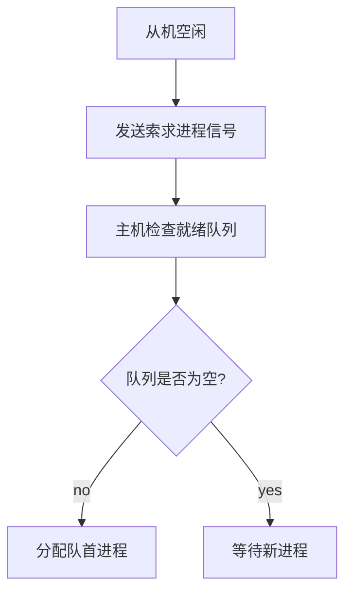

# 1 操作系統概論

## 1.1 基本概念

### 1.1.1 什麼是操作系統

計算機系統自下而上可以大致分為4部分：硬件、操作系統、應用程序和用戶。操作系統管理各種計算機硬件，為應用程序提供基礎，並且充當計算機硬件與用戶之間的中介。

操作系統（Operating System,OS）是指**控制和管理整個計算機系統的硬件與軟件資源**，合理地組織、調度計算機的工作與資源的分配，進而為用戶和其他軟件提供方便**接口與環境**的程序集合。

操作系統是計算機系統中最基本的**系統軟件**。

### 1.1.2 功能

1. **系統資源的管理**
   1. 處理機管理
      1. 多道程序環境下，處理機的管理以進程 / 線程為單位，因此對處理機的管理可以歸結為對**進程**的管理。
         1. 同時，多道環境下，程序執行具有**制約性（存在競爭）和間斷性**
   2. 存儲器管理
      1. 內存分配與回收
   3. 文件管理
   4. 設備管理
      1. 主要是IO請求
2. **用戶與硬件之間的接口**
   1. 命令接口
      1. 聯機命令接口
      2. 脫機命令接口
   2. 程序接口
      1. 程序接口由一組**系統調用**（廣義指令）組成，用戶可以使用系統調用來請求操作系統的服務
      2. e.g. 圖形用戶界面 GUI，即圖形接口
3. 計算機資源的擴充
   1. 純硬件稱為裸機，覆蓋了軟件的的機器稱為擴充機器 / 虛擬機

### 1.1.3 特徵

1. 併發 Concurrence
   1. 單處理機環境下，宏觀上的多道程序執行（並行），在微觀上表現為**分時交替執行**
      1. CPU 與 IO設備的並行是真正的並行
   2. 若要實現進程並行，需要硬件支持，如多處理機環境
2. 共享 Sharing
   1. 資源可供多個併發進程共同使用
      1. 互斥共享：**臨界資源**
      2. 同時訪問：微觀上還是分時的
3. 虛擬 Virtual
   1. 時分複用
      1. 虛擬處理器
   2. 空分複用
      1. 虛擬存儲器
4. 異步 Asynchronism
   1. 併發執行時，由於資源有限，進程的執行“走走停停”
   2. 異步的存在是的 OS 的運行處於某種隨機，可能導致進程有關時間的錯誤
      1. 變量訪問順序不當

## 1.2 發展歷程


- 最早是手工操作，屬於無 OS

### 1.2.1 批處理系統

#### 單道批處理

- 16真題

將一批作業以**脫機**的方式輸入磁帶，配上監督程序 Monitor，使得這批作業可以一個個連續處理。

特點：

1. 自動性
2. 順序性
3. 單道性

缺點：高速 CPU 仍需要等待低速 IO

#### 多道批處理

- 17 18 22真題

所有作業在**外存**排成隊列，調度程序選擇若干作業調入內存，在管理程序的控制下穿插地運行，共享系統資源。

某道程序因 IO操作而暫停時，CPU 立即轉去執行另一道程序，實現系統各部件之間的並行。

特點：

1. 多道
2. 宏觀上並行
3. **微觀上串行**

技術實現：

1. 處理器的分配
2. 多道程序的內存分配
3. IO設備的分配
4. 大量程序 / 數據的存放和組織

優點：

1. 資源利用率高，多道共享資源
2. 吞吐量大

缺點：

1. 響應時間長
2. **不**提供人機交互
   1. 例外：18真題是有交互的多道
   2. 常考：多道的缺點是沒有交互性

### 1.2.2 分時操作系統

分時技術，將處理器的運行時間分成很短的時間片，輪流分配給各聯機作業。

特點：

1. 同時性 / 多路性
   1. **多用戶性**
2. 交互性
3. 獨立性
4. 及時性

### 1.2.3 實時操作系統

1. 硬實時系統
   1. 某個動作可以在絕對的、規定的時刻發生
      1. e.g. 飛行器控制
2. 軟實時系統
   1. 能偶爾違反時間規定
      1. e.g. 訂票系統

## 1.3 運行環境

### 1.3.1 處理器運行模式

- 14、21、22真題

兩種程序：

1. 應用程序
   1. 用戶態
2. 內核程序
   1. 內核態
   2. 可以執行**特權指令**
      1. e.g. **IO指令**、關中斷、內存相關、修改狀態字寄存器

注意，切換到用戶態的指令也是特權指令。

**內核**是計算機的底層軟件，可以視為連接應用和硬件的橋樑。

內核主要包括：

1. 時鐘管理
   1. 提供時鐘中斷服務
      1. 18真題
2. 中斷機制
   1. 中斷的初衷是為了提高多道程序運行的 CPU 利用率
      1. 16真題
   2. 中斷機制只有一小部分屬於內核
   3. 主要負責 保護恢復中斷現場、轉移控制權
3. **原語**
   1. Atomic Operation 原子操作
      1. 底層可被調用的公用小程序，最接近硬件，
      2. 運行時間短、調用頻繁
      3. 是一個整體，執行過程**不可中斷**
   2. 定義（實現）原語的直接方法是關中斷，使其所有動作**不可分割**地完成後再開中斷
   3. 因為原語是內核的一部分，所以原語在**內核態**執行，常駐內存
4. 系統控制的數據結構及處理
   1. 系統DS
      1. 進程控制塊 PCB、緩衝區、消息隊列、各類鏈表、內存分配表
   2. 處理
      1. 進程管理
      2. 存儲器管理
      3. 設備管理

### 1.3.2 中斷和異常

- 計組：[5.5 異常和中斷](计算机组成原理.md#5.5%20异常和中断)

中斷（和異常）是**切換**內核態和用戶態的**唯一**方式，且是**硬件**實現的。

- 硬件：用一位寄存器保存狀態
- **訪管中斷**是用戶程序主動請求操作系統內核為其提供服務時，故意觸發的一種**軟中斷**（Trap）
  - 它是用戶態 to 內核態的唯一入口
  - 換言之，訪管指令是一條在**用戶態**執行的指令
  - 再換言之，內核態可以執行**除了訪管指令**之外的全部指令

### 1.3.3 系統調用

系統調用是 OS 提供給應用程序（程序員）的接口，可視為一種特殊的公共子程序。每個系統調用都有**唯一**的系統調用號。

系統中各種共享資源都由 OS 統一管理，所以凡是與**共享資源**有關的操作（存儲分配、IO傳輸、文件管理），都必須通過**系統調用**的方式向 OS 提出請求。

功能：

1. 設備管理
2. 文件管理
3. 進程控制
4. 進程通信
5. 內存管理

#### 系統調用過程

- 12 17 22 23 真題

1. 用戶程序首先將**系統調用號**和所需的**參數**壓入堆棧
   1. 調用實際的調用指令，然後執行一個**陷入指令**（異常）
      1. **用戶態 to 內核態**
   2. 由硬件和操作系統內核程序保護被中斷進程的現場
      1. 將**PC、PSW及通用寄存器**內容等壓入堆棧
         1. 一般的調用不需要保存 PSW
2. 分析**系統調用類型**，轉入相應的系統調用處理子程序
   1. 系統中配置了一張系統調用入口表，表中的每個表項都對應一個系統調用，根據**系統調用號**可以找到該系統調用處理子程序的**入口地址**。
3. 系統調用結束後，恢復被中斷的或設置新進程的CPU現場，返回被中斷進程或新進程，繼續往下執行。
   1. **內核態 to 用戶態**

這麼設計的目的是：用戶程序不能直接執行對系統影響非常大的操作，必須通過系統調用的方式請求 OS 代為執行，以便保證系統的穩定性和安全性。

OS 的**運行環境**可以理解：

1. 用戶通過 OS 運行上層程序
   1. e.g. 系統提供的命令解釋程序或用戶自編程序
2. 上層程序的運行依賴於 OS 的底層管理程序提供服務支持
   1. 當需要管理程序服務時，系統通過硬件中斷機制進入內核態，運行管理程序
   2. 也可能是程序運行出現異常情況，被動地需要管理程序的服務，此時則通過異常處理進入內核態
3. 管理程序運行結束時，退出中斷或異常處理程序，返回到用戶程序的斷點處繼續執行。


一些由**用戶態 to 內核態**的例子：

1. 用戶程序要求操作系統的服務，即系統調用。
2. 發生一次中斷。
3. 用戶程序中產生了一個**錯誤狀態**。
4. 用戶程序中企圖執行一條**特權指令**。

以內核態轉向用戶態由一條指令實現，也是特權指令。

==缺少 4. 程序的鏈接與裝入 5. 程序運行時內存映像與地址空間

## 1.4 結構

### 1.4.1 分層法


### 1.4.2 模塊化


衡量模塊的獨立性主要有兩個標準：

- 內聚性
  - 模塊內部各部分間聯繫的緊密程度
  - 內聚性越高，模塊獨立性越好
- 耦合度
  - 模塊間相互聯繫和相互影響的程度
  - 耦合度越低，模塊獨立性越好

### 1.4.3 宏內核

從 OS 的內核架構來劃分，可分為宏內核和微內核。

**宏內核**，也稱單內核或大內核，是指將系統的主要功能模塊都作為一個**緊密聯繫**的整體運行在**內核態**，從而用戶程序提供**高性能的系統服務**。因為各管理模塊之間**共享信息**，能有效利用相互之間的有效特性，所以具有無可比擬的性能優勢。

主流 OS 都是基於宏內核的架構，以 Linux 為例，Linux 內核是一個非常大的、單一的二進制程序。操作系統最核心的功能，如**進程調度、內存管理、文件系統、設備驅動、網絡協議棧**等，都作為內核的一部分，在**特權模式（內核態）** 下運行。

- 其實微內核和宏內核是同步發展的，目前的 OS 是一種吸收了微內核優點的混合內核

### 1.4.4 微內核

- 背景：隨著 OS 提供的服務越來越複雜，設計規模急劇增長，OS 面臨著軟件維護問題（由於所有模塊都緊密交織在一起，即強耦合，修改一個功能可能會引發一系列不可預知的副作用，使得修復bug和添加新功能變得異常困難且風險極高）

**微內核**應運而生，就是將一些**非核心的功能移到用戶空間**，這種設計帶來的好處是方便擴展系統，所有新服務都可以在用戶空間增加，**內核基本不用去做改動**。

微內核將 OS 分為 微內核 和 多個服務器。

- **微內核**：實現了最基本核心功能的小型內核，運行在內核態
- **服務器**（進程）：OS 的大部分功能在服務器中，作為進程來實現，運行在用戶態

客戶與服務器之間藉助**微內核提供的消息傳遞機制**實現交互。


微內核的基本功能：

1. 進程管理
2. 低級存儲器管理
3. 中斷和陷入處理

微內核的特點：（23真題）

1. 擴展性和靈活性
   1. 添加服務器代替修改內核代碼
2. **可靠性**和安全性
   1. 只有微內核運行在內核態，**其餘模塊都運行在用戶態**，一個模塊中的錯誤只會使這個模塊崩潰，而**不會使整個系統崩潰**。
   - e.g. 文件服務代碼運行時出了問題：
     - **宏內核**因為文件服務是運行在內核態的，系統直接就崩潰
     - **微內核**的文件服務是運行在**用戶態**的，只要將文件服務功能強行停止，系統不會崩潰
3. 可移植性
4. 分佈式計算
   1. 消息傳遞機制很適合分佈式

微內核最大的**問題**是性能，因為需要頻繁地在內核態和用戶態切換。

### 1.4.5 外核

外核是一種極端追求性能的虛擬化方案，其核心思想是：**內核（外核）只負責最底層的資源分配和安全保護**，而將如何管理、使用這些資源的決策權完全上交給運行在用戶空間的各個**虛擬機**（或稱為“庫操作系統”）。

- 這就像房東（外核）只負責把房子的各個房間（CPU、內存、磁盤塊）安全地租給不同的租客（虛擬機），並確保他們不會進入別人的房間。至於每個租客如何裝修、佈置自己的房間，房東完全不管。

外核最大的優點：減去了映射層，**省去了昂貴的重映射查表過程**，虛擬機直接使用物理地址，外核只做安全審查。

## 1.5 引導

- 21 22 真題

OS 是一種存放在硬盤中的程序，而 **OS 引導**是指 CPU 運行特定程序，識別硬盤，找到 OS 程序，啟動 OS。

引導過程：

1. 激活 CPU
   1. CPU 讀取 ROM 中的 boot 程序
   2. 將指令寄存器置為 BIOS 的第一條指令，開始執行 BIOS
2. 硬件自檢
   1. BIOS 構建中斷向量表
   2. POST（通電自檢）
3. 加載帶有 OS 的硬盤
4. 加載主引導記錄 MBR
   1. MBR 的作用是幫助 CPU 找到 OS 所在具體的分區
5. 掃描硬盤分區表，加載活動分區
   1. MBR 包含分區表
   2. MBR 掃描分區表，識別含有 OS 的活動分區
6. 加載分區引導記錄 PBR
   1. 讀取活動分區的第一個扇區，這個扇區就是 PBR
7. 加載啟動管理器
8. 加載 OS 到內存

## 1.6 虛擬機

主要分兩類：


第一類虛擬機管理程序類似一個 OS，是**唯一**一個運行在特權級的程序。

- 虛擬機管理程序向上層提供若干虛擬機
- 虛擬機作為用戶態的一個**進程**運行

第二類虛擬機管理程序是一個依賴 OS 分配和調度的程序，類似一個普通進程。

- 此時底層的 OS 稱為宿主 OS

---

# 2 進程與線程

## 2.1 進程與線程

- 多道環境下，引入進程的概念，為了更好地描述和控制程序的併發執行。

進程是進程實體的**運行過程**，是系統進行資源分配和調度的獨立單位。

- 進程的根本特性是**動態性**，因為進程強調一次運行過程；區別於完整的程序，程序只是靜態的可執行文件

為了使每個程序獨立運行，配置了一個專門的數據結構來描述和管理進程，稱為**進程控制塊**（Process Control Block，PCB）。

- 程序段、相關數據段、PCB構成了**進程實體**（進程映像）
- 創建進程，就是創建進程的 PCB

特徵：

1. 動態性
   1. 一次執行，有生命週期
2. 併發性
3. 獨立性
4. 異步性

### 2.1.1 進程組成

1. 進程控制塊 PCB
   1. 進程描述信息
      1. 進程標識符 PID
      2. 用戶標識符 UID
   2. 進程控制和管理信息
      1. 進程狀態、優先級
   3. 資源分配清單
   4. 處理機相關信息
      1. 也稱 CPU 上下文
2. 程序段
3. 數據段

### 2.1.2 進程狀態與轉換

- 14 15 18 23 真題

五種狀態：

1. 運行態
   1. 單 CPU 中，每個時刻只有**一個**進程處於運行態
2. 就緒態
   1. 就緒態可以有很多進程，組成就緒隊列
   2. 區分於阻塞：就緒態是僅等待 CPU；阻塞態不是等待CPU
3. 阻塞態 / 等待態
   1. 等待某個資源或者 IO（**不是等待 CPU**）
   2. 即使 CPU 空閒也不能運行
4. 創建態
   1. 正在創建
5. 終止態
   1. 正在結束

狀態轉換圖：


- 運行態 to 阻塞態：進程請求資源時發生等待，轉入阻塞態
  - **主動行為**
  - e.g. 主動執行信號量的 **wait** 操作
- 阻塞態 to 就緒態：等待完成，中斷處理程序轉換進程為就緒態
  - **被動行為**，需要協助
  - e.g. 等待其他進程用 **signal** 操作喚醒

### 2.1.3 進程控制

- 10 20 21 24 真題

#### 進程創建

允許一個進程創建另一個進程，此時創建者稱父進程，被創建的進程稱為子進程。

- **子進程可以繼承父進程所擁有的資源**
- 當子進程終止時，應將其從父進程那裡獲得的資源還給父進程

在操作系統中，**終端用戶登錄、啟動程序執行、作業調度、系統提供服務、用戶程序的應用請求**等都會引起進程的創建。

- 10 真題

創建過程（創建原語）：

1. 分配唯一的進程標識號，並申請一個空白 PCB
   1. PCB 是**有限**的
   2. 若PCB 申請失敗，則創建失敗
2. 分配資源
   1. **內存、文件、1/O設備和 CPU 時間**等（在 PCB 中體現）
      1. 不分配 CPU
   2. 這些資源或從操作系統 / 父進程獲得
   3. 若資源不足（如內存），並不是創建失敗，而是處於**創建態**，等待內存資源
3. 初始化PCB
   1. 初始化標誌信息、CPU狀態信息、CPU 控制信息
   2. 設置進程的優先級
4. 插入就緒隊列
   1. 若進程就緒隊列能夠接納新進程，則將新進程插入就緒隊列，等待被調度運行。

#### 進程終止

引起進程終止的事件主要有：

1. 正常結束
   1. 表示進程的任務已完成並準備退出運行
2. 異常結束
   1. 表示進程在運行時，發生了某種異常事件
   2. e.g. 存儲區越界、保護錯、非法指令、特權指令錯、運行超時、算術運算錯、1/0 故障等
3. 外界干預
   1. 進程應外界的請求而終止運行，如操作員或操作系統干預、父進程請求和父進程終止

終止過程（終止原語）：

1. 根據被終止進程的**標識符**，檢索出該進程的**PCB**，從中讀出該進程的狀態。
2. 若被終止進程處於運行狀態，立即終止該進程的執行，將CPU 資源分配給其他進程。
3. 若該進程還有子孫進程，則通常需將其所有子孫進程終止，**有些系統無此要求**。
4. 將該進程所擁有的全部資源，或歸還給其父進程，或歸還給操作系統。
5. 將該PCB 從所在隊列（鏈表）中刪除。

有些系統不允許子進程在父進程終止的情況下存在，對於這類系統，若一個進程終止，則它所有子進程也終止，這種現象稱為**級聯終止**。

#### 進程阻塞和喚醒

- 14 18 19 22 23 真題

阻塞是進程的一種**主動**行為，**只有運行態能轉為阻塞態**。

阻塞過程（阻塞原語 Block）：

1. 找到 PID 對應的 PCB
2. 若為運行態，則保護線程並轉為阻塞態
3. 將該 PCB 插入等待隊列

所等待的數據到達時，調用喚醒原語。

喚醒過程（喚醒原語 Wakeup）：

1. 在等待隊列中找到對應的 PCB
2. 轉為就緒態
3. 將該 PCB 插入就緒隊列

注意，Block 和 Wakeup 必須成對使用。

### 2.1.4 進程通信

- 14 真題，新修

後文提到的 PV 操作是低級通信方式，本小節介紹高級通信方式。

1. 共享存儲
   1. 進程之間直接設置一塊共享存儲空間，作信息交換
2. 消息傳遞
   1. 數據交換以格式化消息 Message 為單位
   2. 很好地支持分佈式系統
   3. 分為直接、間接（利用中間實體傳遞）
   4. e.g. 微內核與服務器
3. **管道通信**
   1. 管道是一個特殊的**共享文件**，即 pipe 文件
      1. 只能由創建進程訪問，子進程繼承父進程的管道
   2. FIFO；生產者-消費者方式通信
   3. **只允許單向通信**；雙向需要兩根管道
   4. 讀數據是**一次性**的，讀完即釋放
   5. 互斥：只有一個進程讀寫（**可以有多個讀寫**），其餘**阻塞**
   6. 同步：管道滿則阻塞
4. 信號
   1. 通知進程發生某事件的機制
   2. 在進程的 PCB 中，至少 n 位向量記錄該進程的待處理 / 被阻塞信號
   3. CPU 只在**進程從內核態返回用戶態之前**處理信號
      1. 更具體地說，是在**一次系統調用、中斷或異常處理完成之後，即將恢復進程在用戶態的上下文並繼續執行之前**，內核會檢查**該進程的 PCB**，看是否有待處理的信號。

### 2.1.5 線程

線程類似輕量級進程：

- 是一個基本的 CPU 執行單位
- 是程序執行流的**最小單位**
- 是進程中的一個實體

線程由 線程ID、PC、寄存器集合、堆棧 組成。

線程自己不擁有系統資源，只擁有一點兒在運行中必不可少的資源，但它可與同屬一個進程的其他線程**共享進程所擁有的全部資源**。

一個線程可以創建和撤銷另一個線程，**同一 / 不同進程**中的多個線程之間都可以**併發執行**（注意，併發不等於並行）。

- 由於線程之間相互制約，致使線程在運行中呈現出間斷性
- 線程也有就緒、阻塞和運行三種基本狀態。

補充：併發和並行的區別

- **併發**：多個任務**同時開始、交替執行**，強調的是系統處理多個任務的**能力**。
- **並行**：多個任務**同時執行**，強調的是同時執行多個任務的**手段**。

#### 線程和進程的比較

1. 調度方面
   1. 線程切換代價小
2. 併發性
3. 資源方面
   1. 線程不擁有系統資源
4. 獨立性
   1. 每個進程都擁有**獨立**的地址空間和資源，除了共享全局變量，不允許其他進程訪問。
   2. 某個進程中的**線程**對其他進程不可見。
   3. 同一進程中的不同線程是為了提高併發性及進行相互之間的合作而創建的，它們**共享進程的地址空間和資源**。
   4. 線程雖然不能脫離進程單獨運行，但是線程包含 CPU 現場，可以獨立執行程序。（王道小題）
5. 系統開銷
   1. 線程系統開銷小
6. 多線程支持多處理器系統
   1. 對於傳統單線程進程，不管有多少個 CPU，進程只能運行在一個 CPU上
   2. 對於**多線程進程**，可將進程中的多個線程分配到多個 CPU 上執行

#### 線程的屬性

1. 線程是一個輕型實體，不擁有系統資源，但每個線程都應有一個**唯一的標識符**和一個線程控制塊，線程控制塊記錄線程執行的寄存器和棧等現場狀態。
   1. **一個線程只可以屬於一個進程**
2. 不同的線程可以執行相同的程序，即同一個服務程序被不同的用戶調用時，操作系統將它們創建成不同的線程。
3. 同一進程中的各個線程**共享該進程所擁有的資源**。
4. **線程是 CPU 的獨立調度單位**，多個線程是可以**併發**執行的。在單 CPU 的計算機系統中，各線程可交替地佔用 CPU；在多 CPU 的計算機系統中，各線程可同時佔用不同的 CPU，若各個 CPU 同時一個進程內的各線程服務，則可縮短進程的處理時間。
5. 一個線程被創建後，便開始了它的生命週期，直至終止。
6. 提高系統併發性：線程切換時，有可能**不發生進程切換**，平均而言每次切換所需的開銷就變小了。

#### 線程的控制

類似進程，有一個線程控制塊 TCB，包含：

- 線程標識符
- 寄存器（PC、狀態、通用）
- 運行狀態
- 優先級
- 線程存儲區
- 堆棧

注意，**同一進程的所有線程**可以訪問進程的地址空間和全局變量；同時，每個線程有自己的堆棧，**互不共享**

- 24 真題

通常，線程終止後**不立即釋放資源**，只有執行了分離函數後，被終止線程才釋放資源。

#### 線程的實現

線程分為兩類：

1. 用戶級線程 ULT
   1. 也稱**線程庫支持的線程**
   2. 對 OS 透明
      1. 所以用戶級的 TCB **不是 OS 分配的**，是由庫函數維護
   3. 優點
      1. 線程切換不需要轉換到內核空間，**系統開銷小**
      2. 調度算法可以是進程專用的，不同的進程可根據自身的需要，對自己的線程選擇不同的調度算法
      3. 用戶級線程的實現**與操作系統平臺無關**，對線程管理的代碼是屬於用戶程序的一部分。
   4. 缺點
      1. 因為內核給一個進程分配一個 CPU，而用戶級線程是一個進程控制多個線程，所以一個進程中至多有一個線程的執行，**無法並行**
         1. 自然地，進程中的某個線程阻塞，則**整個進程阻塞**，即其他用戶級線程都阻塞
2. 內核級線程 KLT
   1. 也稱**內核支持的線程**
   2. 優點
      1. 內核調度能發揮出多 CPU 的優勢，可以調度同一進程的**多線程並行**
      2. 內核線程有很小的數據結構，**線程切換開銷小**
   3. 缺點
      1. **系統開銷大**


#### 多線程模型

1. **多對一模型**
   1. 多個用戶級線程映射到一個內核級線程
   2. 優點：線程管理是在用戶空間進行的，無須切換到內核態，因此效率比較高。
   3. 缺點：若一個線程在訪問內核時發生阻塞，則**整個進程都會被阻塞**
      1. 在任何時刻，只有一個線程能夠訪問內核，**多個線程不能同時在多個 CPU 上運行**，因為多個線程都是對應一個內核級線程（對應一個內核）。
      2. 這點類似用戶級線程的缺點，**本質**是因為多用戶級線程映射到一個內核級線程 與 一個進程控制多用戶級線程是相似的。
2. **一對一模型**
   1. 將每個用戶級線程映射到一個內核級線程
   2. 線程切換由內核完成，需要切換到內核態
   3. 優點：當一個線程被阻塞後，允許調度另一個線程運行，所以**併發能力較強**。
   4. 缺點：每創建一個用戶線程，相應地就需要創建一個內核線程，開銷較大。
3. **多對多模型**
   1. 將 n 個用戶級線程映射到 m 個內核級線程上，要求 n≥m
   2. 特點：既克服了多對一模型併發度不高的缺點，又克服了一對一模型的一個用戶進程佔用太多內核級線程而開銷太大的缺點。此外，還擁有上述兩種模型各自的優點。

## 2.2 CPU 調度

### 2.2.1 調度

調度：按照算法選擇進程分配給 CPU，實現併發。

三級調度：

1. 高級調度 / **作業調度**
   1. 輔存與內存之間
   2. 後備隊列 to 就緒隊列
2. 中級調度 / **內存調度**
   1. 外存與內存之間
   2. 掛起隊列 to 就緒隊列
3. 低級調度 / **進程調度**
   1. 就緒隊列 to 運行態
   2. **頻率最高**、最低級


### 2.2.2 調度的實現

#### 調度程序

- 也稱調度器
- 是 OS **內核**程序

由排隊器、分派器、上下文切換器組成。


#### 調度過程

- 12 21真題

可以進行進程調度的情況：

1. **創建新進程**後，父子進程都處於就緒態，調度程序選一個先運行。
   1. 不是必然的
2. 當前**進程結束**後，**必須**從就緒隊列中選擇一個進程運行。
   1. 若沒有就緒進程，則運行一個閒逛進程
3. 當前進程因 IO請求、信號量操作或其他原因**阻塞**時，**必須**調度其他進程運行。
4. 運行進程出錯。
5. （IO設備就緒後）發出 IO中斷時，原先等待 IO 的進程由阻塞態 to 就緒態，此時需要選擇 新就緒的進程 或者 中斷髮生時運行的進程 運行。
6. 優先級更高的進程強行剝奪 CPU。

**不能**進行進程調度的情況：

1. **處理中斷的過程中**
2. 完全屏蔽中斷的原子操作
   1. e.g. 鎖相關、中斷保護、恢復

#### 調度方式

1. 非搶佔式
2. 搶佔式
   1. 主要遵循 優先權、短進程、時間片原則

### 2.2.3 調度的目標

- 真題

#### CPU 利用率

$$
\text{CPU utilization} = \frac{\text{CPU有效工作时间}}{\text{CPU有效工作时间} + \text{CPU空闲等待时间}}
$$

- 注意，CPU 與設備、設備與設備之間是可以並行的。

#### 系統吞吐量

單位時間內 CPU 完成的作業數量，長作業耗時長，降低吞吐量。

#### 週轉時間

**週轉時間** 指的是從一個作業**提交給系統**開始，到該作業**執行完成**所經歷的全部時間。

$$
\text{周转时间} = \text{作业完成时间} - \text{作业提交时间}
$$

$$
\text{带权周转时间} = \frac{\text{周转时间}}{\text{实际运行时间}}
$$

#### 等待時間

字面意思，完成之前所有等待的時間，可能有多段。衡量一個調度算法的優劣，常常只需簡單地考察等待時間。

#### 響應時間

從用戶提交請求到系統首次產生響應所用的時間。

在交互式系統中，週轉時間不是最好的評價準則，一般採用**響應時間**作為衡量調度算法的重要準則之一。從用戶角度來看，調度策略應儘量降低響應時間，使響應時間處在用戶能接受的範圍之內。

### 2.2.4 進程切換

- 23 24 真題
- 進程切換的重點在於**上下文切換**

對通常的進程而言，其創建、撤銷及要求由系統設備完成的 IO 操作，都是**利用系統調用進入內核**，再由內核中的相應處理程序予以完成的。

**進程切換同樣是在內核的支持下實現的**，因此可以說，任何進程都是在操作系統內核的支持下運行的。

切換 CPU 到另一個進程需要保存當前進程狀態並恢復另一個進程的狀態，這個任務稱為**上下文切換**。

- 已知進程切換在內核態，上下文切換肯定也在內核態

**進程上下文采用 PCB 表示**，包括 CPU 寄存器的值、進程狀態和內存管理信息等。

#### 上下文切換

具體流程：

1. 掛起一個進程，將 CPU 上下文保存到 PCB
   1. 包括程序計數器和其他寄存器
2. 將進程的 PCB 移入相應的隊列
   1. e.g. 就緒、在某事件阻塞等隊列
3. 選擇另一個進程執行，並更新其 PCB
4. 恢復新進程的CPU 上下文
5. 跳轉到新進程 PCB 中的程序計數器所指向的位置執行

上下文切換的消耗：

- 上下文切換通常是計算密集型的，即它需要相當可觀的CPU 時間，在每秒幾十上百次的切換中，每次切換都需要納秒量級的時間，所以**上下文切換對系統來說意味著消耗大量的CPU 時間**。
- 有些 CPU 提供多個寄存器組，這樣，上下文切換就只需要**簡單改變當前寄存器組的指針**。

#### 上下文切換與模式切換

- 用戶進程最開始都運行在用戶態，若進程因中斷或異常進入內核態運行，執行完後又回到用戶態剛被中斷的進程運行。

用戶態 to 內核態，稱為**模式切換**，而不是上下文切換，因為沒有改變當前的進程。**上下文切換隻能發生在內核態**，它是多任務操作系統中的一個必需的特性。

**模式切換**與上下文切換是不同的，模式切換時，CPU 邏輯上可能還在執行同一進程。

### 2.2.5 CPU 調度算法

- 真題

#### FCFS

先來先服務，優先選擇最早進入隊列的進程。

- 不可搶佔算法
- 對短作業不利，很多後來的短作業卡著
- **效率低**：利於 CPU 繁忙型作業，**不利於 IO 繁忙型**
  - CPU 繁忙型是指佔用 CPU 時間長的作業
    - 類似長作業，FCFS 適合長作業
  - IO 繁忙型是指頻繁調用 IO 的作業
    - IO 繁忙型需要頻繁讓出 CPU，不適合 FCFS
- **系統開銷最小**，最簡單

#### SJF

短作業優先，優先選擇運行時間最短的作業。

- 也稱最短剩餘時間優先算法
- 默認不可搶佔，不一定
- 對長作業不利，產生**飢餓現象**

#### 高響應比優先

綜合了 FCFS 和 SJF，同時考慮每個作業的**等待時間和（估計）運行時間**，計算響應比，克服了飢餓現象。

- 默認不可搶佔

**響應比**的計算公式為：

$$
R_p = \frac{\text{等待时间} + \text{要求服务时间}}{\text{要求服务时间}}
$$

#### 優先級調度

按優先級，有搶佔 / 非搶佔、靜態 / 動態優先級等。

進程優先級設置：

1. 系統 > 用戶
2. 交互型 > 非交互型
3. **IO型** > 計算型

#### RR

時間片輪轉算法，適用於分時系統，特點是**公平**。

所有就緒進程按照 FCFS 排隊，然後每隔一定時間產生一次**時鐘中斷**（時間片輪轉）。

- **時鐘中斷髮生後，系統會修改當前進程在時間片內的剩餘時間**
  - 時間片用完（剩餘時間為0），則進程立刻被釋放
  - 時間片尚未用完，但進程已完成，則**調度程序被立刻激活**。
- **時間片大小**對性能影響很大
  - 很大，則退化為 FCFS
  - 很小，則 CPU 頻繁切換，開銷大
  - 影響時間片的主要因素包括：響應時間、進程數量、系統開銷

#### 多級隊列調度

綜合 RR 和 優先級調度，**動態調整時間片大小和優先級**。


- 每個隊列採用 FCFS
- 優先級越高的隊列，時間片越短
- 核心規則：
  - **一個進程在用完一次時間片之後，下放到低一級隊列的末尾**
  - 按隊列優先級調度：第1級空了才能調度第2級

總結：


#### 基於公平原則的調度

1. 保證調度
   1. 若系統中有 n 個用戶登錄，則每個用戶都保證獲得 1/n 的 CPU 時間；若在單用戶系統中有 n 個進程正在運行，則每個進程都保證獲得 I/n 的 CPU 時間。
2. 公平分享調度
   1. 保證所有用戶獲得相同的 CPU 時間

### 2.2.6 多處理機調度

多處理機系統的調度較單處理機系統複雜，與**系統結構**密切相關。

#### 系統架構類型

1. 非對稱多處理機（AMP）

- 主從式操作系統
- **調度方式**：
  - 內核駐留在主機
  - **從機**只運行用戶程序
  - 進程調度由**主機**負責
- **工作流程**：



- **缺點**：主機易成為系統瓶頸

2. 對稱多處理機（SMP）

- 所有處理機相同
- **調度方式**
  - 調度程序可將任何進程分配給任何CPU
- 本節主要討論 SMP 系統的調度問題

#### 核心調度問題

1. 處理器親和性
   1. 讓進程運行在同一個CPU上的特性
2. 負載平衡
   1. 將負載平均分配到所有CPU上

目標：避免 CPU 空閒與高負載並存的情況

#### 多處理機調度方案

1. 公共就緒隊列
   1. 所有CPU共享一個就緒隊列
   2. 良好的負載平衡
      1. CPU空閒時立即獲取進程
   3. **處理器親和性差（進程頻繁遷移）**
2. 私有就緒隊列
   1. 每個CPU有自己的就緒隊列
   2. 良好的處理器親和性
   3. 需要額外的負載平衡機制

## 2.3 同步與互斥

- 重點

多道環境下，進程是併發的 且 不同進程之間存在制約關係，為了協調製約，引入了進程同步的概念。

### 2.3.1 基本概念

#### 臨界資源

臨界資源：同一時刻只能為一個進程所用的資源。

- e.g. 打印機、共享變量、數據

必須**互斥**地訪問臨界資源，在每個進程中，訪問臨界資源的代碼稱作**臨界區**。

訪問臨界資源的過程：

1. 進入區
   1. 檢查是否可以進入臨界區
      1. 若可以，則設置訪問臨界區的標誌，阻止其他進程同時進入臨界區
2. 臨界區
   1. 訪問臨界資源的代碼
3. 退出區
   1. 清除之前設置的訪問臨界區標誌
4. 剩餘區
   1. 剩餘部分

#### 同步

- 也稱 直接制約關係
- **本質是合作**

同步：為同一任務服務的多個進程在合作中需要**協調運行次序**而產生的制約關係。

e.g. 輸入進程 A 通過單緩衝向進程 B 提供數據：

- 當該緩衝區空時，進程 B 不能獲得所需數據而阻塞，一旦進程 A 將數據送入緩衝區，進程 B 就被喚醒。
- 反之，當緩衝區滿時，進程 A 被阻塞，僅當進程 B 取走緩衝數據時，才喚醒進程A。
- 重點在於運行次序

#### 互斥

- 也稱 間接制約關係
- **本質是競爭**

互斥：同一時刻只有一個進程可以訪問**臨界資源**，其餘進程必須等待。

**互斥準則**：前兩個規定臨界區，後兩個規定進程

1. 空閒讓進
   1. 臨界區空閒則讓進
2. 忙則等待
   1. 臨界區忙則等待
3. 有限等待
   1. 進程不能無限等待
4. 讓權等待（非必須）
   1. **進程不能進入臨界區時，需要釋放 CPU，防止忙等待**

### 2.3.2 互斥的實現

#### 軟件實現

設置標誌表明臨界區是否有進程。

1. 單標誌法
   1. 設置一個公用變量，表示**允許進入**臨界區的進程編號
      1. 不能表示臨界區空
   2. 不滿足空閒讓進
      1. 本質問題是臨界區空閒時，只能讓**指定**的進程進入
      2. 
2. 雙標誌先檢查法
   1. 設置一個 bool 數組，表示各個進程進入臨界區的意願
   2. 
3. 雙標誌後檢查法
   1. 先設置後檢查
   2. 還是有問題，標誌全是 true，大家都會飢餓
4. Peterson 算法
   1. 比前三個好，**通過 turn 謙讓的機制，解決了飢餓問題**，但仍未遵循讓權等待
   2. 

#### 硬件實現

1. 中斷屏蔽方法（關中斷）
   1. 屏蔽中斷直接破壞了依靠進程切換（[調度過程](操作系统.md#调度过程)）實現的併發，限制了 CPU 交替執行作業的能力（併發），**效率降低**！
2. 硬件指令方法
   1. TSL指令
      1. TestAndSetLock指令是原子操作，功能是讀出指定**標誌**並置為 true
      2. **自旋**
      3. 
   2. Swap指令
      1. 類似 TS

### 2.3.3 互斥鎖

- Mutex Lock

一個進程進入臨界區時，調用 `acquire()` 獲得鎖；退出臨界區時，調用 `release()` 釋放鎖。每個互斥鎖有一個 bool 變量表示鎖是否可用。

`acquire()` 和 `release()` 都是**原子操作**，不可被中斷，因此互斥鎖一般用硬件實現。

上述互斥鎖是**自旋鎖**，缺點是**忙等待**。

- 自旋：在一個小循環中不斷地檢查鎖的狀態
- 忙等待：當進程在調用 `acquire()` 時發現鎖被佔用，**不會釋放CPU**，而是會持續執行一個循環（自旋），不斷地檢查鎖是否被釋放。

### 2.3.4 信號量

信號量機制用於解決同步、互斥問題，可以被 `wait()` 和 `signal()` 訪問，簡寫為 PV操作。

- PV操作可以理解為消耗和生產資源

#### 信號量的含義

1. 整型信號量
   1. 表示資源數量 $S$
   2. `wait()` 操作在 $S \leq 0$ 時，會不斷循環測試，陷入**忙等待**
      1. 未遵守讓權等待
2. 記錄型信號量
   1. 在整型基礎上，再加一個進程鏈表，用於記錄所有等待該資源的進程
   2. **避免了忙等待的問題**

遵循**讓權等待**的互斥方法的 `wait(S)` 和 `signal(S)` 的操作如下：

- 調用了 `block` 做自我阻塞

```c
void wait(semaphore S) { // 相当于申请资源
    S.value--;   // 注意此处，是先减1，再判断value大小
    if (S.value < 0) {
        add this process to S.L;
        block(S.L);
    }
}
```

對信號量 $S$ 的一次 $P$ 操作，表示進程請求一個該類資源，因此執行 `S.value--`，使系統中可供分配的該類資源數減 1。

當 `S.value < 0` 時，表示該類資源已分配完畢，因此應調用 `block` 原語進行**自我阻塞**，主動放棄 CPU，並插入該類資源的等待隊列 $S.L$（等待後續喚醒）。

- **運行態 → 阻塞態**

```c
void signal(semaphore S) { // 相当于释放资源
    S.value++;
    if (S.value <= 0) {
        remove a process P from S.L;
        wakeup(P);
    }
}
```

對信號量 $S$ 的一次 $V$ 操作，表示進程釋放一個該類資源，因此執行 `S.value++`，使系統中可供分配的該類資源數加 1。

若加 1 後仍是 `S.value <= 0`，則表示仍有進程在等待該類資源，因此應調用 `wakeup` 原語將 $S.L$ 中的第一個進程喚醒。

- **阻塞態 → 就緒態**

#### 信號量機制的使用

**互斥**操作中，PV操作必須成對出現：


**同步**操作中，目的是**有序執行**，因此**設置初始** $S = 0$，假如要求 P1 P2 的順序來執行，則代碼規定 P1 生產資源（V操作），P2消耗資源（P操作），這樣 $S$ 的設置恰能保證有序執行。


e.g. 信號量實現前驅關係


### 2.3.5 經典同步問題

- 大題

#### 生產者-消費者

1. 互斥：生產者和消費者對緩衝區的訪問是互斥的
2. 同步：按照生產-消費的順序

e.g. 桌子上有一個盤子，每次只能向其中放入一個水果。爸爸專向盤子中放蘋果，媽媽專向盤子中放橘子，兒子專等吃盤子中的橘子，女兒專等吃盤子中的蘋果。只有盤子為空時，爸爸或媽媽才可向盤子中放一個水果；僅當盤子中有自己需要的水果時，兒子或女兒可以從盤子中取出。

偽代碼：

```c
dad() {
    while(1) {
        准备一个苹果;    // 生产操作
        P(plate);       // 申请盘子使用权（互斥向盘中取、放水果）
        把苹果放入盘子;  // 临界区操作
        V(apple);       // 释放苹果资源（允许取苹果）
    }
}

mom() {
    while(1) {
        准备一个橘子;
        P(plate);
        把橘子放入盘子;
        V(orange);
    }
}

son() {
    while(1) {
        P(orange);      // 申请橘子资源（互斥向盘中取橘子）
        从盘子中取出橘子; // 临界区操作
        V(plate);       // 释放盘子资源（允许向盘中取、放水果）
        吃掉橘子;       // 消费操作
    }
}

dau() {
    while(1) {
        P(apple);
        从盘子中取出苹果;
        V(plate);
        吃掉苹果;
    }
}
```

#### 讀者-寫者

互斥：

1. 讀者 寫者
2. 寫者 寫者

讀優先方案：

1. 第一個讀者要判斷是否互斥，非第一個讀者不用判斷。
2. 讀優先：**有一個讀者之後，讀者始終優先於寫者**
   1. 代碼分析：從有第一個讀者開始，讀者佔據`rw`，直到 `count == 0` 時，最後一個讀者讀完才把 `rw` 釋放，才能有寫者訪問。

```c
int count=0;          //用于记录当前的读者数量
semaphore mutex=1;    //用于保护更新 count 变量时的互斥
semaphore rw=1;       //用于保证读者和写者互斥地访问文件

writer() {            //写者进程
    while (1) {
        P(rw);        //互斥访问共享文件
        写文件;
        V(rw);        //释放共享文件
    }
}

reader() {            //读者进程
    while (1) {
        P(mutex);     //互斥访问 count 变量
        if (count==0) //当第一个读进程读共享文件时
            P(rw);    //阻止写进程写
        count++;      //读者计数器加 1
        V(mutex);     //释放互斥变量 count

        读文件;

        P(mutex);     //互斥访问 count 变量
        count--;      //读者计数器减 1
        if (count==0) //当最后一个读进程读完共享文件
            V(rw);    //允许写进程写
        V(mutex);     //释放互斥变量 count
    }
}
```

讀寫公平：

- 也成為寫相對優先
- 讀寫者都額外加一對PV操作 `P/V(w)`，使得讀寫地位平等

```c
int count=0;          //用于记录当前的读者数量
semaphore mutex=1;    //用于保护更新 count 变量时的互斥
semaphore rw=1;       //用于保证读者和写者互斥地访问文件
semaphore w=1;        //用于实现"写相对优先"

writer() {            //写者进程
    while(1){
        P(w);         //在无写进程请求时进入
        P(rw);        //互斥访问共享文件
        写文件;
        V(rw);        //释放共享文件
        V(w);         //恢复对共享文件的访问
    }
}

reader() {            //读者进程
    while(1){
        P(w);         //在无写进程请求时进入
        P(mutex);     //互斥访问 count 变量
        if(count==0)  //当第一个读进程读共享文件时
            P(rw);    //阻止写进程写
        count++;      //读者计数器加 1
        V(mutex);     //释放互斥变量 count
        V(w);         //恢复对共享文件的访问

        读文件;

        P(mutex);     //互斥访问 count 变量
        count--;      //读者计数器减 1
        if(count==0)  //当最后一个读进程读完共享文件
            V(rw);    //允许写进程写
        V(mutex);     //释放互斥变量 count
    }
}
```

#### 哲學家進餐

問題描述：一張圓桌邊上坐著5名哲學家，每兩名哲學家之間的桌上擺一根筷子，兩根筷子中間是一碗米飯，哲學家們傾注畢生精力用於思考和進餐，哲學家在思考時，並不影響他人。只有當哲學家飢餓時，才試圖拿起左、右兩根筷子（一根一根地拿起）。若筷子已在他人手上，則需要等待。飢餓的哲學家只有同時拿到了兩根筷子才可以開始進餐，進餐完畢後，放下筷子繼續思考。


避免死鎖的算法：

- 加一個 `mutex` 使得**取筷子**這件事互斥，便不會有所有人同時取一邊的死鎖情況了

```c
semaphore chopstick[5]={1,1,1,1,1}; //初始化信号量
semaphore mutex=1;                   //设置取筷子的信号量

Pi() {                               //i号哲学家的进程
    do {
        P(mutex);                    //重点：在取筷子前获得互斥量
        P(chopstick[i]);             //取左边筷子
        P(chopstick[(i+1)%5]);       //取右边筷子
        V(mutex);                    //释放取筷子的信号量

        进餐;

        V(chopstick[i]);             //放回左边筷子
        V(chopstick[(i+1)%5]);       //放回右边筷子

        思考;
    } while(1);
}
```

### 2.3.6 管程

管程是一種**進程同步工具**，保證進程互斥，無需程序員自己實現互斥，降低了死鎖的概率。同時，管程提供了**條件變量**，可以讓程序員靈活地實現進程同步。

**管程（monitor）**：利用共享數據結構抽象地表示系統中的**共享資源**，而將對該數據結構實施的**操作**定義為一組過程。

- 包括進程對共享資源的申請、釋放等操作
- 根據資源情況，或接受或阻塞進程的訪問
  - 確保每次僅有一個進程使用共享資源，實現進程互斥
  - **管程每次只允許一個進程進入**

管程定義了**一個數據結構**和**能為併發進程所執行（在該數據結構上）的一組操作**。

管程由4部分組成：

1. 管程的名稱
2. 局部於管程內部的共享數據結構說明
3. 對該數據結構進行操作的一組過程（或函數）
4. 對局部於管程內部的共享數據設置初始值的語句

管程就像一個類（class），封裝了一個數據結構和相關的一些操作，定義如下：


#### 條件變量

- 18 真題

當一個進程進入管程後被阻塞，直到**阻塞的原因**解除時，在此期間，若該進程不釋放管程，則**其他進程無法進入管程**。其中，將阻塞原因定義為**條件變量 condition**。

通常，一個進程被阻塞的原因可以有多個，因此在管程中設置了**多個條件變量**。每個條件變量保存了一個**等待隊列**， 用於記錄因該條件變量而阻塞的所有進程，對條件變量只能進行兩種操作，即 `wait` 和 `signal`。

```c
monitor Demo{
   共享数据结构 S;
   condition x;       //定义一个条件变量

   init_code(){ ... }

   take_away(){
      if(S<=0) x.wait();    //资源不够，在条件变量x上等待
      // 阻塞该进程，并加入x的阻塞队列
      资源足够，分配资源，做一系列相应处理；
   }

   give_back(){
      归还资源，做一系列相应处理；
      if(有进程在等待) x.signal();    //唤醒一个等待进程
   }
}
```

條件變量和信號量的比較：

- 相似點
  - 條件變量的 `wait/signal` 操作類似於信號量的 P/V 操作，可以實現進程的阻塞/喚醒
    - 且 條件變量的 `wait` 有阻塞隊列
- 不同點
  - 條件變量是**沒有值**的，僅實現了**排隊等待**的功能
  - 信號量是**有值**的，信號量的值反映了剩餘資源數
  - 在管程中，剩餘資源數用共享數據結構記錄

## 2.4 死鎖

- 死鎖：**每個**進程都在等待
  - 多個進程的概念
- 飢餓：**一個**進程在信號量內無窮等待
  - 單個進程的概念

飢餓不一定死鎖，比如長作業在很長時間內（甚至無限期）因為短作業而被推遲，這並不是死鎖。

### 2.4.1 原因

#### 系統資源的競爭

通常是指系統中的**不可剝奪資源**，e.g. 磁帶機、打印機，其數量不足以滿足多個進程的運行。

**只有對不可剝奪資源的競爭才可能產生死鎖。**

#### 進程順序非法

請求和釋放資源的**順序不當**會導致死鎖。

e.g. 進程 P1 P2 分別保持了資源 R1 R2， 而 P1 申請資源 R2，P2 申請資源 R1 時，兩者都會因為所需資源被佔用而阻塞，於是導致死鎖。

信號量使用不當也會造成死鎖（信號量其實也是一種資源）。進程間彼此相互等待對方發來的消息，也會使得這些進程無法繼續向前推進。

e.g. 進程 A 等待進程 B 發的消息，進程 B 又在等待進程 A 發的消息，可以看出進程 A 和 B 不是因為競爭同一資源，而是在順序不當導致等待對方的資源，最終死鎖。

### 2.4.2 必要條件

同時滿足 4 條才會發生死鎖：

1. **互斥條件**
   1. 資源是互斥的
2. **不可剝奪條件**
   1. 進程佔用的資源不能被搶佔，只能主動釋放
3. **請求並保持條件**
   1. 進程已經保持了至少一個資源，同時又在請求新資源
4. **循環等待條件**
   1. 存在進程資源的循環等待鏈
   2. 只是必要條件，不是充分條件
      1. 

### 2.4.3 處理策略

| 資源分配策略 | 各種可能模式                                                               | 主要優點                                     | 主要缺點                                                 |
| ------------ | -------------------------------------------------------------------------- | -------------------------------------------- | -------------------------------------------------------- |
| 死鎖**預防** | 保守，寧可資源閒置<br />一次請求所有資源，資源剝奪，資源按序分配           | 適用於突發式處理的進程，不必進行剝奪         | 效率低，初始化時間延長；剝奪次數過多；不便靈活申請新資源 |
| 死鎖**避免** | 是預防和檢測的折中（在運行時判斷是否可能死鎖）<br />尋找可能的安全允許順序 | 不必進行剝奪；**性能較好**                   | 必須知道將來的資源需求，進程不能被長時間阻塞             |
| 死鎖**檢測** | 寬鬆，只要允許就分配資源<br />定期檢查死鎖是否已經發生                     | 不延長進程初始化時間，允許對死鎖進行現場處理 | 通過剝奪解除死鎖，造成損失                               |

#### 死鎖預防

破壞死鎖的4個必要條件的其中幾個。

1. 破壞互斥
   1. 將只能互斥使用的資源改成允許共享使用
2. 破壞不可剝奪
   1. 請求新資源得不到滿足時，必須釋放已經保持的資源
   2. 缺點：反覆申請釋放增加系統開銷
3. 破壞請求並保持
   1. 要求進程在請求時不能持有不可剝奪資源
      1. 預先靜態分配：進程在運行錢一次申請完它所需要的全部資源
      2. 逐步釋放：獲取初期資源後開始運行，運行過程中逐步釋放用完的資源，再請求
4. 破壞循環等待
   1. **順序資源分配法**：給資源編號，進程必須按照遞增（順序）請求資源，所以請求大號必須持有小號，已經持有大號的進程不可能請求小號，預防了死鎖

#### 避免死鎖

同樣屬於事先預防策略，但是不是事先破壞死鎖條件，而是在資源的**動態分配**過程中，防止系統進入死鎖。

- 優點：較好的系統性能

1. 確定**安全狀態**
   1. 在資源分配前，先確定系統是否安全。
   2. 安全狀態：系統能按照某種進程順序分配資源，滿足每個進程的最大需求
   3. 
2. **銀行家算法**
   1. 進程運行前先聲明對各種資源的最大需求量，數量不超過系統的資源總量。
   2. OS 在分配資源之前，先確定是否有足夠資源分配給進程，在確定分配之後是否會處於**不安全狀態**。

#### 銀行家算法

假設系統中有 $n$ 個進程，$m$ 類資源，在銀行家算法中需要定義下面 4 個數據結構。

1. **可利用資源向量 Available**：含有 $m$ 個元素的數組，其中每個元素代表一類可用的資源數量。
   1. `Available[j] = K` 表示此時系統中有 $K$ 個 $R_j$ 類資源可用。
2. **最大需求矩陣 Max**：$n \times m$ 矩陣，定義系統中 $n$ 個進程中的每個進程對 $m$ 類資源的最大需求。
   1. `Max[i,j] = K` 表示進程 $P_i$ 需要 $R_j$ 類資源的最大數量為 $K$。
3. **分配矩陣 Allocation**：$n \times m$ 矩陣，定義系統中每類資源當前已分配給每個進程的資源數。
   1. `Allocation[i,j] = K` 表示進程 $P_i$ 當前已分得 $R_j$ 類資源的數量為 $K$。
4. **需求矩陣 Need**：$n \times m$ 矩陣，表示每個進程接下來最多還需要多少資源。
   1. `Need[i,j] = K` 表示進程 $P_i$ 還需要 $R_j$ 類資源的數量為 $K$。

上述三個矩陣間存在下述關係：

$$Need = Max - Allocation$$

通常，Max 矩陣和 Allocation 矩陣是題中的已知條件，而求出 Need 矩陣是解題的第一步。

##### 銀行家算法描述

設 `Request` 是進程 $P_i$ 的請求向量，`Request[j] = K` 表示進程 $P_i$ 需要 j 類資源 $K$ 個。當 $P_i$ 發出資源請求後，系統按下述步驟進行檢查：

1. 若 `Request[j] <= Need[i,j]`，則轉向步驟2；否則認為出錯，因為它所需要的資源數已超過它所宣佈的最大值。
2. 若 `Request[j] <= Available[j]`，則轉向步驟3；否則，表示尚無足夠資源，$P_i$ 必須等待。
3. 系統試探著將資源分配給進程 $P_i$，並修改下面數據結構中的數值：

```python
Available = Available - Request;
Allocation[i,j] = Allocation[i,j] + Request[j];
Need[i,j] = Need[i,j] - Request[j];
```

4. 系統執行安全性算法，檢查此次資源分配後，系統是否處於安全狀態。若安全，才正式將資源分配給進程 $P_i$，以完成本次分配；否則，將本次的試探分配作廢，恢復原來的資源分配狀態，讓進程 $P_i$ 等待。

##### 安全性算法

- 重點

設置工作向量 `Work`，表示**當前的剩餘可用資源數量**，其實就是一個不斷更新的 `Available`，它有 m 個元素，在執行安全性算法前，令 `Work =Available`。

1. 初始時安全序列為空。
2. 從 `Need` 矩陣中找出符合下麵條件的行，將對應的進程加入安全序列；若找不到，則執行步驟4。
   1. 該行對應的進程不在安全序列中，而且該行小於或等於 `Work`
3. 進程 P 進入安全序列後，當作順利完成，**釋放分配給它的資源，加到工作向量**，所以應執行 `Work = Work + Allocation[i]`，返回步驟2。
4. 若此時安全序列中己有所有進程，則系統處於安全狀態，否則系統處於不安全狀態。

e.g. 例題輔助理解


#### 死鎖檢測

可以用**資源分配圖**來檢測系統是否處於死鎖狀態。


- 對於資源結點，**出邊是已分配資源，入邊是進程的請求**
- 簡化的過程就是嘗試滿足進程請求，消除入邊，進而消除進程結點及其佔用
- a b c 是一次完全簡化的過程

**死鎖定理**：當且僅當資源分配圖是**不可完全簡化**的時，發生死鎖。

#### 死鎖解除

1. 資源剝奪
   1. 掛起死鎖進程，搶佔其資源
2. 撤銷進程
   1. 強制撤銷死鎖進程，剝奪資源
3. 進程回退
   1. 讓死鎖進程回退，使其**在回退時自願釋放資源**而非剝奪
   2. 需要保留歷史，設置還原點

---

# 3 內存管理

## 3.1 內存管理基礎

### 3.1.1 基本概念

內存管理的主要功能：

1. 內存空間的分配與回收
2. 地址轉換
3. 內存空間的擴充
4. 內存共享
5. 存儲保護

#### 邏輯地址 物理地址

- **邏輯地址**：每個模塊從 0 開始編址，稱為邏輯地址 / 相對地址 /虛擬地址
  - 進程運行時，看到的和使用的地址都是邏輯地址
  - 用戶只需要知道邏輯地址
- **物理地址**：內存中物理單元的地址
  - 是地址轉換的最終地址
  - 進程通過物理地址從**主存**中存取
  - **地址重定位**：裝入程序將可執行代碼裝入內存時，必須通過地址轉換將邏輯地址轉換為物理地址

OS 通過**內存管理部件**（MMU），將邏輯地址轉換為物理地址。

#### 鏈接 裝入

創建進程首先需要**將程序和數據裝入內存**。將用戶源程序變為可在內存中執行的程序，通常需要以下幾個步驟：

1. 編譯
   1. 編譯程序將源代碼編譯成若干**目標模塊**
2. 鏈接
   1. 鏈接程序將一組**目標模塊**和所需的**庫函數**鏈接在一起，形成一個完成的**裝入模塊**
   2. **形成邏輯地址**
3. 裝載
   1. 裝入程序將裝入模塊裝入內存
   2. **形成物理地址**


##### 三種裝入方式

1. 絕對裝入
   1. 只適合單道程序環境
   2. 編譯程序產生**絕對地址**的目標代碼
   3. 邏輯地址和實際內存地址完全相同
2. 可重定位裝入
   1. 也稱**靜態重定位**
   2. **靜態**：作業一旦進入內存，在整個運行期間就不能在內存中移動，也不能申請內存空間
3. **動態**運行時裝入
   1. 也稱**動態重定位**
   2. 程序可以在內存中發生移動
   3. 裝入程序將裝入模塊裝入內存後，並不會立即將裝入模塊中的相對地址轉換為絕對地址，而是推遲到程序真正執行的時候才轉換，因此，裝入內存後所有地址均為相對地址
      1. **動態重定位是在作業的執行過程中運行的**
   4. 需要**重定位寄存器**，存放裝入模塊的起始位置
      1. 

##### 三種鏈接方式

1. 靜態鏈接
   1. 一組目標模塊形成**完整**的裝入模塊之後**不再拆開**
   2. 由於所有目標模塊都是從 0 開始的相對地址，需要**修改相對地址**
   3. 變換外部調用符號
2. **裝入時**動態鏈接
   1. 一組目標模塊在裝入內存時，邊裝入邊鏈接
   2. 便於修改和**更新**
   3. 便是實現對目標模塊的**共享**
3. **運行時**動態鏈接
   1. 程序執行中需要某個目標模塊時，才對它進行鏈接（到裝入模塊上）
   2. 未用到的目標模塊都**不會被調入內存，不會被鏈接**
   3. 加快裝入過程
   4. 節省內存空間

#### 內存映像

**當程序調入內存運行時**，就構成了進程的內存映像。

內存映像：

1. 代碼段
   1. 只讀
   2. 可共享
2. 數據段
   1. 包含全局 / 靜態變量
3. 進程控制塊 PCB
   1. 存放在系統區
   2. OS 通過 PCB 控制進程
4. 堆
   1. 存放動態分配的變量
   2. e.g. malloc函數
5. 棧
   1. 實現函數調用
   2. 從高往低增長

代碼段和數據段在調入內存時就指定了大小，但是**堆棧都是動態的**。


#### 內存保護

確保每個進程有一個單獨的內存空間。

- 保護 OS 不受用戶進程影響
- 保護用戶進程不受其他進程影響

內存保護的 2 種方法：

1. CPU 中設置上、下限寄存器
   1. 存放用戶進程在主存中的上下限地址，判斷有無越界
2. 重定位寄存器、界地址寄存器
   1. 也稱基地址寄存器、限長寄存器
   2. 用於**越界檢查**
   3. 重定位：存放進程的**起始物理地址**
   4. 界地址：存放進程的**最大邏輯地址**
   5. 使用特權指令，**只有內核可以加載這兩個存儲器**


#### 內存共享

- 只有只讀的區域適合共享

**可重入代碼**也稱純代碼，是一種允許多個進程同時訪問，但不允許被修改的代碼。

### 3.1.2 連續分配管理

- 連續：為用戶程序分配一個連續的內存空間。

連續管理主要是**分區管理**，這種管理最簡單，系統代價最小。

1. 單一連續分配
   1. 採用**靜態**重定位
   2. 內存分為系統區和用戶區
      1. 用戶區只有一道用戶程序
   3. 簡單、無外部碎片
      1. **有內部碎片**
   4. 無需內存保護，因為內存中永遠只有一道程序
      1. 只能用戶單用戶、單任務的 OS
      2. 內存利用率低
2. 固定分區分配
   1. 採用**靜態**重定位
   2. 最簡單的多道存儲管理方式
   3. 將用戶內存空間劃分為若干固定大小的分區，**每個分區只裝入一道作業**
   4. 建議分區大小不等，增加靈活性
   5. 通過**分區使用表**來分配回收內存
   6. 程序大小不一，經常發生佔不滿 / 裝不下的情況，形成**內部碎片**
      1. 無外部碎片
      2. 內存利用率低
3. **動態**分區分配
   1. 採用動態重定位
   2. 在進程裝入內存時，根據進程的實際需要，動態分配內存
   3. 分區數量、大小可變
   4. 隨著時間推移，會出現越來越多的小內存塊，稱為**外部碎片**
      1. 外部碎片形成過程：
      2. 外部碎片可以通過**緊湊技術**克服，即 OS 移動進程，進行整理，但是相對費時

> [!tip] 內部 / 外部碎片
> 內外部是指在**分區**的內部還是外部。
>
> 動態分區由於每個分區大小就是進程所需大小，每個分區都是剛好裝滿，顯然沒有內部碎片。

#### 動態分區的內存回收

設置**空閒分區鏈表**，可以按始址排序。

**分配內存時**，檢索空閒分區鏈，找到所需的分區，若其大小大於請求大小，則從該分區中按請求大小分割一塊空間分配給裝入進程（若剩餘部分小到不足以劃分，則不需要分割），餘下部分仍然留在空閒分區鏈中。

**回收內存時**，系統根據回收分區的始址，從空閒分區鏈中找到相應的插入點，此時可能出現四種情況：

1. 回收區與插入點的前 / 後一空閒分區相鄰，此時將這兩個分區合併，並修改前一分區表項的大小為兩者之和 / 修改後一分區表項的始址和大小。
2. 回收區同時與插入點的前、後兩個分區相鄰，此時將這三個分區合併，修改前一分區表項的大小為三者之和，並取消後一分區表項。
3. 回收區沒有相鄰的空閒分區，此時應該為回收區新建一個表項，填寫始址和大小，並插入空閒分區鏈。

#### 基於順序的分配算法

1. **首次適應算法**
   1. 空閒分區**按地址**遞增排序，順序找到**第一個**能滿足大小的空閒分區分配給作業
   2. 由於從低往高找，所以保留了高地址的大空閒分區，而低地址出現許多碎片
      1. 這句話並不是說大空閒區一開始就在高地址，而是低地址的大空閒區已經被分配了（切碎了）
2. 鄰近適應算法
   1. 也稱循環首次適應
   2. 從上次查找結束的位置開始查找
   3. 高低地址同等概率被分配，但是高地址沒有大空閒分區可用，比首次適應算法更差
3. 最佳適應算法
   1. 空閒分區**按容量**遞增排序
   2. 順序找到第一個能滿足大小的空閒分區
   3. 最佳是指能更多地留下大空閒分區，但是性能差，產生**最多的外部碎片**
4. 最壞適應算法
   1. 與最佳相反，按容量遞減
   2. 很快導致沒有大空閒分區可用，性能也差

綜上，**首次適應算法開銷最小，性能最好**。

#### 基於索引的分配算法

大型系統由於分區鏈表很長，一般採用索引的方式。

1. 快速適應算法
   1. 空閒分區**按大小分類**
   2. 根據進程大小，在索引表中找到滿足的**最小空閒分區鏈表**
   3. 從鏈表中取第一塊分配
      1. 查找效率高，沒有內存碎片
      2. 算法複雜，系統開銷大
2. 夥伴系統
   1. 夥伴系統是一種**動態分區分配**算法，規定所有分區的大小均為 $2^k$（$k$ 為正整數）。
   2. 分配過程：需要為進程分配大小為 $n$ 的分區（$2^{i-1} < n \leq 2^i$）
      1. 在大小為 $2^i$ 的空閒分區鏈中查找
      2. 若找到，則將該空閒分區分配給進程
      3. 若未找到（表示大小為 $2^i$ 的空閒分區已耗盡），則在大小為 $2^{i+1}$ 的空閒分區鏈中繼續查找
         1. 若存在大小為 $2^{i+1}$ 的空閒分區，則將其等分為兩個分區（這兩個分區稱為**一對夥伴**）
            1. **其中一個用於分配，另一個加入大小為 $2^i$ 的空閒分區鏈**
         2. 若不存在，則繼續在更大的分區鏈中查找，直至找到為止
   3. 回收過程：
      1. 回收分區時，需要檢查相鄰的空閒分區是否為**夥伴關係**
         1. 如果是夥伴分區，則將它們合併成更大的分區
      2. **繼續檢查**合併後的分區是否能與更大的夥伴分區合併
      3. 重複此過程直到無法合併為止
   4. 特點：
      - 分區大小總是 2 的冪次方
      - 通過夥伴關係快速合併空閒分區，**減少外部碎片**
      - 分配和回收**效率較高**，適用於內核內存管理
3. 哈希算法
   1. 建立哈希表，每個表項記錄一個空閒分區鏈表的頭指針

連續分配的**存儲密度高於**非連續分配，常見的**非連續分配有分頁、分段**，後文介紹。

### 3.1.3 分頁管理

固定分區有內部碎片，動態分區有外部碎片，為了減少碎片的產生，引入了**分頁**的思想。

將內存（物理）空間分為固定大小的分區（e.g. 4KB），稱為**頁框 / 頁幀 / 物理塊**。同時，進程的邏輯空間也分為**與塊大小相等**的區域，稱為**頁**。

> [!NOTE] 分頁和固定分區
> 形式上看，分頁和固定分區類似，但是**塊的大小相對分區要小很多**，同時進程也按照塊劃分。一個佔用多個塊的進程只有最後一塊中存在內部碎片（頁內碎片），這種碎片很小，比固定分區好很多。

#### 基本概念

- **頁號**
  - **邏輯空間**中每個頁面的編號
- **頁框號** / 物理塊號
  - **物理空間**中每個頁框 / 塊的編號
    - 為了方便地址轉換，頁面大小應該是 $2^n$
- 邏輯地址結構
  - 頁號 + 頁內偏移量 
    - 偏移量對應頁大小（e.g. $2^{12}$）
    - 頁號對應頁數（e.g. $2^{20}$）
- 頁表
  - 頁面映射表
  - 實現頁號到物理塊號的映射 
  - 進程的每個頁面對應一個**頁表項**，每個頁表項由頁號和塊號組成
    - 在頁表中，**頁表項連續存放**，因此頁號可以是隱含的，索引就可以表示頁號，不用單獨佔用存儲空間，所以上圖中頁號寫在了外面。

#### 基本地址變換機構

- 藉助頁表實現


為了提高變換速度，設置了**頁表寄存器 PTR**，存放頁表始址和頁表長度。

寄存器的造價昂貴，因此在單 CPU 系統中只設置一個頁表寄存器。**平時，進程和頁表長度存放在 PCB，當進程被調度執行時，才裝入頁表寄存器中**。

設頁面大小為 $L$，邏輯地址 A 到物理地址 E 的變換過程如下（假設邏輯地址、頁號、每頁的長度都是十進制數）：

1. 根據邏輯地址計算
   1. 頁號 $P = A/L$，頁內偏移量 $W = A \mod L$
2. 判斷頁號是否越界
   1. 若頁號 $P >$ 頁表長度 $M$，則產生**越界中斷**，否則繼續執行。
3. 在頁表中查詢頁號對應的**頁表項**，確定頁面存放的**物理塊號**。
   1. 頁號 $P$ 對應的頁表項地址 $=$ 頁表始址 $F +$ 頁號 $P \times$ 頁表項長度，取出該頁表項內容 $b$，即為物理塊號。
4. 計算物理地址 $E = b \times L + W$
   1. 用物理地址 $E$ 去訪存
   2. 注意：
      1. 物理地址 $=$ 頁面在內存中的始址 $+$ 頁內偏移量
      2. 頁面在內存中的始址 $=$ 塊號 $\times$ 塊大小

- **以上整個地址變換過程均是由硬件自動完成的**
- 頁式管理只需要一個整數就能確定對應的物理地址，因為頁⾯大⼩是固定的。因此，頁式管理中**地址空間是一維的**

> [!NOTE] 如何確定頁表項大小
> 頁表項的作用是找到該頁在內存中的位置。
>
> 以 32 位內存地址空間、按字節編址、一頁 4KB 為例，地址空間內共有 $2^{32}B/4KB = 2^{20}$ 頁，因此需要 $\log_2 2^{20} = 20$ 位才能保證表示範圍能容納所有頁面。
>
> 又因為**內存以字節作為編址單位**，即頁表項的大小 $\geq \lceil 20/8 \rceil = 3B$。
>
> 所以在這個條件下，頁表項的大小應大於等於 3B。

> [!tip] 分頁管理的兩個問題
>
> 1. 每次訪存都需要做邏輯地址 to 物理地址的變換，轉換必須要快，否則訪存速度降低
> 2. 頁表不能太大，否則內存利用率降低

#### 具有快表的地址變換機構

上文介紹的**基本地址變換**存取一個數據**至少要訪問兩次內存**：第一次是訪問頁表；第二次是根據該地址存取數據。顯然，這種方法比通常的速度慢了一半。

為此，在地址變換機構中增設一個**具有並行查找能力的高速緩衝存儲器**，稱為快表 TLB， 也稱**相聯存儲器**，用來存放當前訪問的若干頁表項，以加速地址變換的過程。與此對應，**主存中的頁表常稱為慢表**。

- 先找快表，再找慢表
- **查快表不算訪存**
  - 查快表成功，則只需一次訪存（訪問快表查到的物理地址）


一般快表的命中率可達 90% 以上，這樣分頁帶來的速度損失就可降低⾄ 10% 以下。快表的有效性基於著名的局部性原理，後文虛擬內存介紹。

#### 多級頁表


訪存次數計算：每級頁表一次 + 最後訪問數據一次

- e.g. 二級頁表需要 3 次訪存

### 3.1.4 分段管理

- **分頁管理通過硬件機制實現**，對用戶完全透明。
  - e.g. 頁號和偏移量對用戶透明
- **分段管理**的提出則考慮了**用戶和程序員**，以滿⾜⽅便編程、信息保護和共享、動態增長及動態鏈接等多⽅⾯的需要。
  - e.g. 段號和偏移量由用戶顯式提供

分段系統將用戶進程的邏輯地址空間劃分為**大⼩不等的段**。

- 和分頁類似，有段號和段內偏移

e.g. 用戶進程由主程序段、兩個子程序段、棧段和數據段組成，於是可以將**這個進程劃分為 5 段**，每段從0開始編址，並分配一段連續的地址空間

- 段內要求連續，段間不要求連續，進程的地址空間是**二維的**
  - **段頁式也是二維**

#### 段表

段表項包含 **段號、段長、基址**，段號同樣是隱式的。


#### 地址變換機構

變換過程和分頁類似，也是**兩次訪存**，不贅述。


#### 段的共享和保護

- 19 真題

在分頁系統中，雖然也能實現共享，但遠不如分段系統來得方便。**在分段系統中，不管該段有多大，都只需為該段設置一個段表項，因此非常容易實現共享。**

為了實現段共享，在系統中配置一張共享段表，所有共享的段都在共享段表中佔一個表項。表項中記錄了共享段的段號、段長、內存始址、狀態（存在）位、外存始址和共享進程計數 `count` 等信息。

共享進程計數 `count` 記錄有多少進程正在共享該段，僅當所有共享該段的進程都不再需要它時，此時其 `count=0`，才回收該段所佔的內存區。**對於一個共享段，在不同的進程中可以具有不同的段號**，每個進程用自己進程的段號去訪問該共享段。但是，在物理內存中，應當僅有**一份**共享段。

不能被任何進程修改的代碼稱**可重入代碼 / 純代碼**，它是一種允許多個進程同時訪問的代碼。

為了防止程序在執行時修改共享代碼，在每個進程中都必須配以**局部數據區**，將在執行過程中可能改變的部分複製到數據區，這樣，進程就可對該數據區中的內容進行修改。

與分頁管理類似，分段管理的保護方法主要有兩種：

1. 存取控制保護
2. 地址越界保護
   1. 地址越界保護將段表寄存器中的段表長度與邏輯地址中的段號比較，若段號大於段表長度，則產生越界中斷
   2. 再將段表項中的段長和邏輯地址中的段內偏移進行比較，若段內偏移大於段長，也會產生越界中斷
   3. 分頁管理只需要判斷頁號是否越界，頁內偏移是不可能越界的。

### 3.1.5 段頁式管理

在段頁式系統中，進程的地址空間首先被分成若⼲邏輯段，每段都有自己的段號，然後**將各段分成若⼲大⼩固定的頁**。

- 每個段有一張頁表
- 自然地，邏輯地址包含 段號、頁號、頁內偏移量
- **在段頁式存儲管理中，每個進程的段表只有一個，而頁表可能有多個**

對內存空間的管理仍然和分頁存儲管理一樣，將其分成若⼲和頁⾯大⼩相同的物理塊，**對內存的分配以物理塊單位**。


三次訪存：


## 3.2 虛擬內存管理

### 3.2.1 基本概念

#### 傳統存儲管理

上一節討論的內存管理策略都是為了**同時將多個進程保存在內存中**，便於多道程序設計。它們有以下特徵：

1. 一次性
   1. 作業一次性全部裝入內存，才開始運行
2. 駐留性
   1. 作業一直駐留在內存中，直至結束

顯然，有許多作業其實並不需要一直呆在內存中，它們佔據了大量內存空間。

#### 局部性原理

- [局部性原理](计算机组成原理.md#局部性原理)

**時間局部性**通過將近來使用的指令和數據保存到⾼速緩存中，並使用⾼速緩存的層次結構實現。

**空間局部性**通常使用較大的⾼速緩存，並將預取機制集成到⾼速緩存控制邏輯中實現。

虛擬內存技術實際上建⽴了“內存-外存”的兩級存儲器結構，利用局部性原理實現⾼速緩存。

#### 虛擬存儲器

基於局部性原理，程序裝入時，只需要裝入少量頁 / 段進入內存，其餘留在外存，即可開始執行。

1. 在執行過程中，發現所訪問信息不在內存時，再由 OS 將所需信息從外存調入內存，稱為**請求調頁**/段。
2. 當內存空間不夠時，OS 再將內存中暫時不用的信息換到外存，騰出空間，稱為**頁面置換**/段置換。
   - **部分裝入、請求調入、置換功能均對用戶透明**

基於此，OS 彷彿提供了一個比實際內存容量大得多的存儲器，稱為**虛擬存儲器**。

- 虛擬是因為這種存儲器並不存在，容量大隻是錯覺

特徵：

1. 多次性
   1. 多次調入內存
2. 對換性
   1. 作業在內存外存多次對換
3. 虛擬性

硬件支持：

1. 一定容量的內外存
2. 頁表機制
3. 中斷機制
4. 地址變換機構

### 3.2.2 請求分頁管理

#### 頁表項


- 狀態位：是否調入內存
- 訪問字段：本頁被訪問的次數 / 多長時間未被訪問
- 修改位：調入內存後是否被修改
  - 決定換出時是否寫回外存
- 外存地址：記錄該頁在外存的存放地址

#### 缺頁中斷機構

每當訪問頁不在內存，便產生缺頁中斷，請求 OS 的缺頁中斷處理程序。

此時缺頁的進程阻塞，放入阻塞隊列，調頁完成後再將其喚醒，放回就緒隊列。

1. 若內存中有空閒頁框，則為進程分配一個頁框，**將所缺頁⾯從外存裝入該頁框**，並修改頁表中相應的表項。
2. 若內存中沒有空閒頁框，則由頁⾯置換算法**選擇一個頁⾯淘汰**，若該頁在內存期間被修改過，則還要將其寫回外存。
   1. **未被修改過的頁⾯不用寫回外存。**

> [!NOTE] 缺頁中斷區別於一般的中斷
>
> 缺頁中斷作為中斷，同樣要經歷諸如保護 CPU 環境、分析中斷原因、轉入缺頁中斷處理程序、恢復 CPU 環境等⼏個步驟。但與一般的中斷相⽐，它有以下兩個明顯的區別：
>
> - 在**指令執行期間**而非一條指令執行完後產⽣和處理中斷，屬於**內部異常**。
> - 一條指令在執行期間，可能產⽣**多次**缺頁中斷。

#### 地址變換機構

地址變換過程：


### 3.2.3 頁框分配

- 新增

#### 駐留集

操作系統必須決定讀取多少頁，即決定給特定的進程分配⼏個頁框。給一個進程分配的頁框的集合就是這個進程的**駐留集**，注意，駐留集在外存。

1. 駐留集越⼩，留在內存中的進程就越多，可以提⾼多道程序的併發度，但分配給每個進程的頁框太少，會導致**缺頁率較⾼**，CPU 需耗費大量時間來處理缺頁。
2. 駐留集越大，當分配給進程的頁框超過某個數量時，再為進程增加頁框對缺頁率的改善 是不明顯的，反而只能是浪費內存空間，還會導致多道程序**併發度的下降**。

#### 內存分配

主要有 可變 / 固定分配、全局 / 局部置換 兩方面，分為一下三種：

1. 固定分配局部置換
   1. **固定分配**
      1. 為每個進程分配固定數量的物理塊
   2. **局部置換**
      1. 若發生缺頁，則**只能從分配給進程的（在內存的）頁面中**選一頁置換
      2. 以保證分配給該進程的內存空間不變
2. 可變分配全局置換
   1. **可變分配**
      1. 先為每個進程分配一定數量的物理塊
      2. 在進程運行期間可根據情況**適當地增加或減少**
   2. **全局置換**
      1. 若發⽣缺頁，則系統從**空閒物理塊隊列**中取出一塊分配給該進程， 並將所缺頁⾯調入。
   3. 這種⽅法⽐固定分配局部置換更加靈活，但是盲目地增加物理塊可能導致系統多道程序的併發能⼒下降。
3. 可變分配局部置換
   1. 若進程在運行中**頻繁地發⽣缺頁中斷**，則系統再為該進程分配若⼲物理塊，直⾄該進程的缺頁率趨於適當程度；反之，若進程在運行中的缺頁率特別低，則可適當減少分配給該進程的物理塊，但不能引起其缺頁率的明顯增加（局部：只允許從該進程在內存的頁中選出一頁換出）。
   2. 這種⽅法在保證進程不會過多地調頁的同時，也**保持了系統的多道程序併發能⼒**。
      1. 需要更復雜的實現， 也需要更大的開銷，但對⽐頻繁地換入/換出所浪費的計算機資源，這種犧牲是值得的。

> [!tip] 為什麼沒有固定分配全局置換
> 全局置換意味著一個進程擁有的物理塊數量必然會變化，不可能是固定分配。

#### 物理塊調入算法

採用**固定分配**策略時，可以採用以下幾種方式調入物理塊：

1. 平均分配
2. 按比例分配：根據進程大小
3. 優先權分配

#### 調入頁面的時機

1. 預調頁策略
   1. 根據局部性原理，可能一次調入若干相鄰的頁面會更高效
   2. 主要用於首次調入
2. 請求調頁策略
   1. 缺頁時提出請求
   2. 主要用於運行時

#### 何處調入頁面

請求分頁系統的**外存**主要有兩個部分：

- 存放文件的**文件區**
  - 離散分配
- 存放對換頁面的**對換區**
  - 連續分配

基於此，缺頁調入主要有三種情況：

1. 有足夠的對換區
   1. 全部從對換區調入頁面，提高速度
2. 對換區不足
   1. 不會被修改的文件直接從**文件區**調入
   2. 可能被修改的部分在換出時放在對換區
3. Unix 方式
   1. 與進程有關的文件都放在**文件區**
   2. 運行過但是被換出的都放在**對換區**
      1. 因此，未運行過的文件都在**文件區**

> [!NOTE] 內存與虛擬內存
> 注意，頁面的換入換出的概念都是針對**內存（主存儲器）與磁盤**而言的，而虛擬內存（虛擬存儲器）是指內存+對換區，所以頁面並不是從虛擬內存換出，是從內存換出。
>
> 

#### 如何調入頁面

1. 當進程所訪問的頁⾯不在內存中時（存在位為 0），便向 CPU 發出缺頁中斷，中斷響應後便轉入缺頁中斷處理程序。
2. 該程序通過查找頁表得到該頁的物理塊
   1. 若內存未滿，則啟動磁盤 IO，將所缺頁調入內存，並修改頁表。
   2. 若內存已滿，則先按某種置換算法從內存中選出一頁 準備換出。
      1. 若該頁未被修改過（修改位為 0），則不需要將該頁寫回磁盤
      2. **若該頁已被修改（修改位為 1），則必須將該頁寫回磁盤，然後將所缺頁調入內存，並修改頁表中的相應表項，置其存在位為1。**
3. 調入完成後，進程就可利用修改後的頁表形成所要訪問數據的內存地址。

### 3.2.4 頁面置換算法

#### 最佳置換

- OPT

淘汰**最長時間內不被訪問** / 永不使用的頁面，但是屬於上帝視角。雖然性能最好，但是無法實現，可以用於評估其他算法。

#### 先進先出

- FIFO

沒有利用局部性原理，**性能差**。甚至**可能**出現分配的物理塊增多但是缺頁次數反而增加的現象，稱為 Belady 現象。

#### 最近最久未使用

- LRU

性能較好，需要寄存器和棧的**硬件支持**，開銷大。

#### 時鐘置換

- CLOCK

性能接近 LRU，但是開銷比 LRU 小。

1. 簡單的 CLOCK 置換
   1. 每個頁設置一個**訪問位** A，首次裝入時置為 1。
   2. 算法將內存中的頁⾯鏈接成一個**循環隊列**，並有一個**替換指針**與之相關聯。
      1. 替換指針初始設置（沒有發生過替換前）指向首項
   3. 當某一頁被替換時，該指針被設置指向被替換頁⾯的**下一頁**。
   4. 在選擇淘汰一頁時，只需檢查頁⾯的訪問位：
      1. 若為 0，就選擇該頁換出
      2. 若為 1，則將它置 0，暫不換出，給予該頁第二次駐留內存的機會，再依次順序檢查下一個頁⾯。
   5. 當檢查到隊列中的最後一個頁⾯時，若其訪問位仍 1，則返回到隊首去循環檢查。因為該算法是循環地檢查各個頁⾯的使用情況，所以稱為 CLOCK 算法。
   6. 該算法只有一位訪問位，而置換時將**未使用過**的頁⾯換出，所以也稱最近未用（NRU）算法。
2. 改進型 CLOCK
   1. 增加一個修改位 M，在選擇頁面換出時，優先考慮**未使用且未修改**的頁面
      1. 優先級從高到低依次是：
         1. 一類：未訪問 未修改
         2. 二類：未訪問 已修改
         3. 三類：已訪問 未修改
         4. 四類：已訪問 已修改
   2. 多輪掃描：
      1. 第一輪掃描一類，不改變訪問位，沒有找到則進行二輪
      2. 第二輪掃描二類，改變訪問位，沒有找到則將所有頁幀的訪問位設為 0，重複第一輪、第二輪
   3. 優點：減少磁盤 IO 次數
   4. 缺點：多輪掃描，算法本身開銷增大

### 3.2.5 抖動和工作集

抖動：剛剛換出的頁面馬上又要換入內存，或者反之，這種頻繁的頁面調度稱為抖動。

抖動的根本原因是分配給每個進程的物理塊（駐留集）太少，不能滿足進程的正常運行，頻繁地出現缺頁。

工作集：進程最近訪問的頁面集合，一般可以用時間 + 工作集窗口尺寸來確定。


### 3.2.6 頁框回收

- 新增，但是12已涉及，主要考察頁面緩衝算法

> [!note] 2012真題描述
> 被系統回收的頁框，放入空閒頁框鏈尾，其中內容在下一次分配之前不清空

#### 頁面緩衝算法

頁面緩衝算法在置換算法的基礎上增加了已修改頁面的鏈表，用於保存已修改且需要換出的頁面，等鏈表中換出頁面達到一定量，再一起換出，**以減少頁面換出的磁盤 IO 開銷**。

緩衝算法在內存中設置瞭如下兩個鏈表：

1. 空閒頁⾯鏈表
   1. 當進程需要讀入一個頁⾯時，便從空閒頁⾯鏈表中取鏈首的頁框並裝入該頁。當有一個未被修改的頁⾯要換出時，實際上並不將它換出到磁盤，而將它所在的頁框掛在空閒鏈表的鏈尾。
   2. 注意，這些掛在空閒鏈表內且未被修改的頁框中是有數據的，若以後某個進程需要這些數據，則可從空閒鏈表上將它們取下， 進而避免從磁盤讀入的操作，**減少頁⾯換入的開銷**。
2. 修改頁⾯鏈表
   1. 當進程需要將一個已修改的頁⾯換出時，系統並不⽴即將它換出到磁盤， 而將它所在的頁框掛在修改頁⾯鏈表的末尾。這樣做的目的是降低將已修改頁⾯寫回磁盤的頻率，**減少頁⾯換出的開銷**。

上述將物理頁⾯換出的過程即為頁框的回收。

> [!NOTE] 頁緩衝隊列的位置
>
> 頁緩衝隊列在內存外存之間，不影響缺頁率
> 

#### 頁框回收

- 不屬於 OS 的重點

當系統可分配的內存不⾜時，就必須回收一些頁框，但並非所有頁框都是可以回收的。屬於 內核的大部分頁框（如內核棧、內核代碼段、內核數據段和大部分內核使用的頁框）都是不能回收的，而由進程使用的頁框（如進程代碼段、進程數據段、進程堆棧、進程訪問文件時映射的文件頁、進程間共享內存使用的頁框）大部分是可以回收的。

在Linux 內核中，設置了一個負責頁⾯換出的守護進程 kswapd，它定期檢查內存的使用情況， 當空閒頁框數量少於特定的閾值時，便發起頁框回收操作。下⾯解釋為什麼空閒頁框數量少於特定的閾值時就要發起回收操作。例如，要釋放一個頁框，內核可能需要將頁框的數據寫回磁盤， 為此內核可能要請求一個頁框來作為 IO 傳送的緩衝區，而系統中不存在空閒頁框，因此不可能釋放頁框，此時可能導致內核陷入一種內存請求的僵局，並導致系統奔潰。

Linux 系統採用 3.1.2 節介紹的“夥伴算法”對內存中具有不同長度的連續空閒頁框進行統計和記錄。將內存中連續的空閒頁框視為空閒頁框塊，並根據它們的大⼩（連續頁框的數量）分組。 分配頁框是一個化整為零的過程，會產⽣很多碎⽚，而系統也必須有把零碎的頁框合併成大的連 續頁框塊的機制，Linux 使用夥伴算法的逆操作進行頁框的回收。回收頁框時，算法先檢查是否 有大⼩相等的夥伴頁框塊存在，若有，則將它們合併成一個大⼩為原來兩倍的新空閒頁框塊，每次合併完後，還要檢查是否可以繼續合併成更大的頁框塊。

### 3.2.7 內存映射文件

內存映射文件是 OS 嚮應用程序提供的一個**系統調用**，在磁盤文件與進程的虛擬空間之間建立映射關係，**將一個文件映射到其虛擬地址空間的某個區域**，之後就能用**訪問內存的⽅式**來讀/寫文件，使得編程簡單。

磁盤文件的讀/寫由 OS 負責完成，**對進程而⾔是透明的**。在映射進程的頁⾯時，不會實際讀入文件的內容，而只在訪問頁⾯時才被每次一頁地讀 入。當進程退出或關閉文件映射時，所有被改動的頁⾯才被寫回磁盤文件。

- 前文提到的共享內存很多時候是通過映射相同文件實現的。

### 3.2.8 虛擬存儲器的性能

缺頁率是影響性能的主要因素，缺頁率又受到頁面大小、分配給進程的物理塊數量、置換算法的影響。

| 指標           | 指標表現 | 缺頁率 |
| -------------- | -------- | ------ |
| 頁面           | 大       | 低     |
| 物理塊         | 多       | 低     |
| 置換算法       | 好       | 低     |
| 程序局部化程度 | 高       | 低     |

### 3.2.9 地址翻譯

- 408綜合題方向

**地址翻譯的全流程**：

1. 虛擬地址 to 物理地址
   1. 由虛擬地址的 TLB 組索引、TLB 標記，查 TLB / 頁表（TLB 不命中），得到物理頁號，翻譯為物理地址。
2. 物理地址 to Cache
   1. 由物理地址的 Cache 標記、Cache 組號、塊內地址查 Cache，得到實際數據
   2. Cache 查不到 / 無效，則再根據物理頁號和頁內偏移去主存查找

假設某系統滿足：

- 虛擬地址：14位
- 物理地址：12位
- 頁面大小：64B
- TLB：四路組相聯，16個條目
- Cache：物理尋址、直接映射，行大小4B，16組

寫出訪問地址為 0x03d4、0x00f1、0x0229的過程。

1. 先算頁號和頁內偏移
   1. 頁面大小 64B，字節編址，$\text{页内偏移位数} = \log_2(64) = 6\text{位}$
   2. 虛擬頁號：$14 - 6 = 8\text{位}$，物理頁號：$12 - 6 = 6\text{位}$
   3. **物理頁號是通過虛擬頁號找到的，和原來的頁內偏移拼接成一個物理地址**
2. 由四路組相聯，16條目，得到 TLB 有 4 組，需要 2 位組索引
   1. 虛擬頁號低 2 位為組索引，高 6 位為 TLB 標記
3. Cache 行大小 4B，需要 2 為塊偏移；16組，需要 4 位組索引
   1. 物理地址的低 2 位為塊偏移（塊內地址）
   2. 物理地址的往上 4 位作為組索引

最終得到地址結構：


補充：


圖表：


找地址過程：


---

# 4 文件管理

## 4.1 文件

計算機以進程為基本單位進程資源的調度和分配；用戶 IO 則以文件為基本單位。

文件系統提供了與二級存儲相關的資源的**抽象**，讓用戶能在不瞭解文件的各種屬性、文件存儲介質的特徵及文件在存儲介質上的具體位置等情況下，⽅便快捷地使用文件。用戶通過文件系統建⽴文件，用於應用程序的輸入、輸出，對資源進行管理。

> [!NOTE] 二級存儲
>
> - 二級存儲：硬盤、固態硬盤（SSD）、U盤等非易失性存儲設備
> - 一級存儲：內存

### 4.1.1 文件控制塊

文件控制塊（File Control Block, FCB）是用於存放控制文件需要的各種信息的數據結構。

- 文件與 FCB 一一對應
- FCB 的有序集合稱為**文件目錄**
- 一個 FCB 就是一個**文件目錄項**


> [!NOTE] 目錄、文件目錄、目錄文件
>
> 1. 目錄 = 文件目錄
> 2. 目錄文件是描述目錄的文件

### 4.1.2 索引節點

Unix 採用了**文件名與文件描述分離**的⽅法，使**文件描述信息**單獨形成一個稱為**索引節點**的數據結構，簡稱 i 節點 （inode）。 在文件目錄中的**每個目錄項僅由文件名和相應的索引節點號**（或索引節點指針）構成。

假設一個 FCB 為 64 B，盤塊大小是 1 KB，則每個盤塊中可以存放 16 個 FCB（**FCB 必須連續存放**），若一個文件目錄共有 640 個 FCB，則查找文件平均需要啟動磁盤 20 次。而在 UNIX 系統中，一個目錄項僅佔 16 B，其中 14 B是文件名，2 B 是索引節點號。在 1 KB 的盤塊中可存放 64 個目錄項，**可使查找文件的平均啟動磁盤次數減少到原來的1/4，大大節省了系統開銷。**

索引節點主要有：

1. 磁盤索引節點
   1. 每個文件有一個**唯一**的磁盤索引節點。
2. 內存索引節點
   1. 當文件被打開時，要將磁盤索引節點**複製**到內存的索引節點中，便於以後使用。

> [!tip] 關閉文件的操作
> 關閉文件最多刪除內存索引節點，不刪除磁盤索引節點。

### 4.1.3 文件的操作

#### 讀文件

1. 按文件描述符在打開文件表中找到該文件的目錄項
2. 按存取控制說明檢查訪問的合法性
3. 根據目錄項中該文件的邏輯和物理組織形式，將邏輯記錄號轉換為物理塊號
4. 向設備發出 IO 請求，完成數據交換

#### 刪除文件

根據文件名查找目錄，刪除指定文件的目錄項和文件控制塊，然後回收該文件所佔用的存儲空間（包括磁盤空間和內存緩衝區）。

#### 打開文件

當用戶對一個文件實施多次讀/寫等操作時，**每次都要從檢索目錄開始**。為了避免多次重複地檢索目錄，大多數操作系統要求，當用戶首次對某文件發出操作請求時，須先利用系統調用 open 將該文件打開。系統維護一個包含所有打開文件信息的表，稱為**打開文件表**。

所謂“打開”，是指系統檢索到指定文件的目錄項後，**將該目錄項從外存複製到內存中的打開文件表的一個表目中**，並將該表目的**索引號**（也稱文件描述符）返回給用戶。

當用戶再次對該文件發出操作請求時， 可通過**索引號**在**打開文件表**中查找到文件信息，從而節省了大量的檢索開銷。當文件不再使用時，可利用系統調用 close 關閉它，則系統將從打開文件表中刪除這一表目。

**多個進程可以同時打開文件**，通常採用兩級表：系統級文件表和進程級文件表。

1. 整個系統的打開文件表包含與進程⽆關的信息
   1. e.g. 文件在磁盤上的位置、訪問⽇期和文件大⼩
2. 每個進程的打開文件表保存的是進程對文件的使用信息
   1. e.g. 文件的當前讀/寫指針、文件訪問權限， 幷包含指向系統表中適當條目的指針。

> [!tip]
> 一旦有一個進程打開了一個文件，**系統級文件表就已經包含了該文件的條目**。 當另一個進程執行調用open 時，只不過是在這個進程自己的打開文件表中增加一個條目，並指向系統表的相應條目。

通常，系統級打開文件表為每個文件關聯一個打開計數器（Open Count），以記錄多少進程打開了該文件。當文件不再使用時，利用系統調用 close 關閉它，會刪除單個進程的打開文件表中的相應條目，系統表中的相應打開計數器也會遞減。當打開計數器為 0 時，表⽰該文件不再被使用，並且可從系統表中刪除相應條目。


- 要明確，系統級/進程級的打開文件表都在**內存**中，和外存沒關係

> [!tip] 重要考點：文件名不必是打開文件表的一部分
>
> 因為一旦完成對 FCB 在磁盤上的定位，系統就不再使用文件名，而是使用文件描述符 / 文件句柄。因此，只要文件未被關閉，所有文件操作都是通過**文件描述符**（而非文件名）來進行。
>
> - e.g. 只要完成了文件打開（open 系統調用），後⾯再使用 read、write、Lseek、close 等文件操作的系統調用，就不再使用文件名，而使用**文件描述符**。

每個打開文件都具有如下關聯信息：

1. 文件指針
   1. 系統跟蹤上次的讀/寫位置作為當前文件位置的指針，這種指針對打開文件的某個進程來說是**唯一**的，因此必須與磁盤文件屬性分開保存。
2. 文件打開計數
   1. 計數器跟蹤當前文件打開和關閉的數量。因為多個進程可能打開同一個文 件，所以系統在刪除打開文件條目之前，必須等待最後一個進程關閉文件。
3. 文件磁盤位置
   1. 大多數文件操作要求系統修改文件數據。查找磁盤上的文件所需的信息保存在內存中，以便系統不必為每個操作都從磁盤上讀取該信息。
4. 訪問權限
   1. 每個進程打開文件都需要有一個**訪問模式**（創建、只讀、讀/寫、添加等）。該信息保存在進程的打開文件表中，以便操作系統能夠允許或拒絕後續的 IO 請求。

> [!tip]
> 關閉文件是將當前文件的**控制信息**從內存寫回磁盤，不是文件數據。

### 4.1.4 文件的邏輯結構

- 文件的**邏輯結構**是指從**用戶**⾓度出發所看到的文件的組織形式。
  - **文件的邏輯結構與存儲介質特性⽆關**，它實際上是指在文件的內部，數據在邏輯上是如何組織起來的。
- 文件的**物理結構**（也稱存儲結構）是指將文件存儲在**外存**上的存儲組織形式，是用戶所看不見的。

按邏輯結構，文件可劃分為：⽆結構文件、有結構文件

1. **⽆結構文件**
   1. 也稱流式文件
   2. 由字符流構成，以字節為單位
   3. e.g. 系統中運行的**大量源程序、可執行文件、庫函數**
   4. 對流式文件的訪問，是通過讀/寫指針來指出下一個要訪問的字節
   5. 由於沒有結構，因此對記錄的訪問只能通過**窮舉搜索**的⽅式
2. **有結構文件**
   1. 由一個以上的記錄構成的文件，所以也稱**記錄式文件**
   2. 各記錄由數據項組成

後兩個小節進一步討論有結構文件的分類。

#### 按記錄的長度

有結構文件按記錄的長度是否相等，可分為：

1. 定長記錄
   1. 所有記錄的長度都是相同的，各數據項都在記錄中的相同位置，具有 相同的長度。
   2. **檢索記錄的速度快**，⽅便用戶對文件進行處理，⼴泛用於數據處理中。
2. 變長記錄
   1. 文件中各記錄的長度不一定相同，原因可能是記錄中所包含的數據項數量不同，也可能是數據項本⾝的長度不定。
   2. 檢索記錄只能順序查找，**速度慢**。

#### 按組織形式

有結構文件按記錄的組織形式，可分為：

##### 順序文件

1. 串結構：順序與關鍵字無關
2. 順序結構：按照關鍵字順序排列，**查找效率高**

處理大批記錄時，順序文件的效率最高；增刪改查單個記錄時，順序文件的性能差。

##### 索引文件

對於定長記錄的順序文件，要查找第 $i$ 條記錄，可直接根據下式計算得到第 $i$ 條記錄相對於第 1 條記錄的地址：$A_i = iL$。

然而，對於**變長記錄**的順序文件，要查找第 $i$ 條記錄，**必須順序地查找前 $i-1$ 條記錄**，以獲得相應記錄的長度 $L$，進而按下式計算出第 $i$ 條記錄的地址：

$$
A_i = \sum_{i=0}^{i-1} L_i + 1
$$

變長記錄的順序文件只能順序查找，效率較低。為此，引入了索引文件解決這個問題。

可以建立一張**索引表**，為主文件的每個記錄在索引表中分別設置一個索引表項，其中包含指向記錄的指針和記錄長度，索引表按關鍵字排序，因此其本身也是一個定長記錄的順序文件。

這樣就將對變長記錄順序文件的順序檢索，**轉變成了對定長記錄索引文件的隨機檢索**，從而加快了記錄的檢索速度。


同時，配置索引表增加了存儲開銷。

##### 索引順序文件

- 索引 + 順序

e.g. 主文件包含姓名和其他數據項，**姓名為關鍵字**， 記錄按姓名的首字母分組，同一個組內的關鍵字可以⽆序，但是組與組之間的關鍵字必須有序。**將每組的第一個記錄的姓名及其邏輯地址放入索引表，索引表按姓名遞增排列**。

檢索時，首先查找**索引表**，找該記錄所在的組，然後在該組內使用**順序查找**，就能很快地找到記錄，**提高了查找效率**。


##### 直接文件 / 散列文件

- Hash File

給定記錄的鍵值或通過散列函數轉換的鍵值直接決定記錄的物理地址。**散列文件具有很高的存取速度，但是會引起衝突**，即不同關鍵字的散列函數值可能相同。

### 4.1.5 文件的物理結構

- 在磁盤上在磁盤上在磁盤上

物理結構本質是在研究文件數據在物理存儲設備/**外存**上是如何分佈和組織的。

1. 文件的分配⽅式：對**磁盤非空閒塊**的管理
2. 文件存儲空間管理：對磁盤空閒塊的管理 [4.3 文件系統](操作系统.md#4.3%20文件系统)

本小節討論的是**文件在磁盤上的分配方法**，分為 連續分配、鏈接分配、索引分配。

#### 連續分配

連續分配⽅法要求每個文件在磁盤上佔有一組連續的塊。磁盤地址定義了磁盤上的一個**線性排序**，這種排序使進程訪問磁盤時需要的尋道數和**尋道時間最⼩**。


優點：

1. 支持順序訪問和直接訪問，速度快
2. 磁頭移動距離最小

缺點：

1. 要求分配連續空間，容易造成**外部碎片（存儲碎片）**
2. 需要事先確定文件長度，無法動態增長
3. 為保持有序性，插入 / 刪除麻煩，需要做物理塊的移動（**IO 次數增多**）

#### 鏈接分配

鏈接分配是一種採用**離散分配**的⽅式。

優點：

1. 消除了磁盤的外部碎⽚，提⾼了磁盤的利用率。
2. 便於動態地為文件分配盤塊，⽆須事先知道文件的大⼩。
3. 文件的插入、 刪除和修改非常⽅便

##### 隱式鏈接

目錄項中**僅**含有文件第一塊的指針（盤塊號）和最後一塊的指針。每個文件對應一個磁盤塊的鏈表，磁盤塊分佈在磁盤的任何地⽅。除文件的最後一個盤塊外，**每個盤塊都存有指向文件下一個盤塊的指針，這些指針對用戶是透明的**。


缺點：

1. 只支持順序訪問，效率低
2. 穩定性問題：任何一個指針丟失就會導致數據丟失
3. 指向下一個盤塊的指針也要耗費一定的存儲空間
   1. 解決方案：**⼏個盤塊組成一個簇**，按簇而不按塊來分配，可以大幅地減少查找時間，也可以改善許多算法的磁盤訪問時間。⽐如一簇為4塊，指針所佔的磁盤空間⽐例也要⼩得多。這種⽅法的代價是**增加了內部碎⽚**。

##### 顯式鏈接

將用於鏈接文件各物理塊的指針，**顯式地存放在內存的一張鏈接表**中，該表在整個文件系統中**僅設置一張**，稱為文件分配表（File Allocation Table，FAT）。

每個表項中存放指向下一個盤塊的指針。文件目錄中**只**需記錄該文件的起始塊號，後續塊號可通過查 FAT 找到。


- **注意，圖中的 FAT 只寫了盤塊號和下一塊，但是表項包含了指向對應物理塊的指針**，所以直接訪問是可行的。

FAT 的表項與全部磁盤塊一一對應，並且可以用特殊數字 -1 表示最後一塊，用 -2 表⽰空閒塊。

因此，**FAT 還標記了空閒的磁盤塊**，操作系統可以通過 FAT 對磁盤空閒空間進行管理，當某進程請求系統分配一個磁盤塊時，系統只需從 FAT 中找到 -2 的表項，並將對應的磁盤塊分配給該進程即可。

- **19 真題：FAT 也可以用於管理空閒磁盤塊**

優點：

1. ⽀持順序訪問、**直接訪問**
2. 顯著提⾼了檢索速度
   1. FAT 在系統啟動時就被讀入內存，檢索記錄是在內存中進行的，所以不僅顯著提⾼了檢索速度，還明顯減少了訪問磁盤的次數。
   2. 同時，缺點是 FAT 需要佔用一定的內存空間。

#### 索引分配

事實上，在打開某個文件時，只需將該文件對應的**盤塊的編號**調入內存即可，完全沒有必要將整個 FAT 調入內存。為此，應該將**每個文件所有的盤塊號集中地放在一起**，當訪問到某個文件 時，將該文件對應的盤塊號一起調入內存即可，這就是**索引分配**的思想。

它每個文件分配一個索引塊，將分配給該文件的所有盤塊號都記錄在該索引塊中。


優點：

1. 支持直接訪問
   1. 索引塊的第 i 項指向第 i 塊
2. 不會產⽣外部碎⽚

缺點：增加了額外的存儲空間開銷

當索引塊太多時，可以採用**多級索引分配**⽅式：


> [!NOTE] e.g. 二級索引計算
> 假設盤塊大⼩為 4 KB，每個盤塊號佔 4 B，一個索引塊中可存放 1024 個盤塊號，則⽀持的最大文件為 1024 × 1024 × 4 KB= 4 GB。

#### 混合索引

1. 對於⼩文件，為了提⾼對眾多⼩文件的訪問速度，最好能將它們的每個盤塊地址直接放入 FCB，這樣就可以直接從 FCB 中獲得該文件的盤塊地址，即為直接尋址。
2. 對於中型文件，可以採用單級索引分配，需要先從 FCB 中找到該文件的索引表，從中獲得該文件的盤塊地址，即為一次間址。
3. 對於大型文件，可以採用兩級和三級索引分配。

Unix 的 inode 就採用了混合索引的方式：


### 4.1.6 文件保護

文件保護：防⽌文件共享可能導致文件被破壞或未經核准的用戶修改文件。

可以通過⼜令保護、加密保護和訪問控制等⽅式實現。

- **訪問控制**：控制用戶對文件的訪問⽅式
- **⼜令和加密**：為防⽌用戶文件被他⼈存取或竊取，**沒有控制用戶對文件的訪問類型**

#### 訪問控制

解決**訪問控制**最常用的⽅法是根據**用戶⾝份**進行控制。而實現基於⾝份訪問的最為普通的⽅法是，為每個文件和目錄增加一個**訪問控制列表（Access-Control List,ACL）**，以規定每個用戶名及其所允許的訪問類型。

- 優點：可以使用複雜的訪問⽅法
- 缺點：長度⽆法預計並且可能導致複雜的空間管理
  - 使用**精簡的訪問列表**可以解決這個問題

精簡的訪問列表包括：

1. 擁有者：創建文件的用戶
2. 組：一組需要共享文件且具有類似訪問的用戶
3. 其他：系統內的所有其他用戶

創建文件時，系統將文件擁有者的名字、所屬組名記錄在 **FCB** 中。用戶訪問該文件時，若用戶是文件主，按照文件主所擁有的權限訪問文件；若用戶和文件主在同一個用戶組，則按照同組權限訪問，否則只能按其他用戶權限訪問。

> [!NOTE] 計算描述文件權限的位數
> 按矩陣存放，`位数 = 用户类别数 * 访问权限数`

#### 口令與加密

⼜令：用戶在建⽴一個文件時提供一個⼜令，系統為其建⽴ FCB 時附上相應⼜令，同時告訴允許共享該文件的其他用戶。用戶請求訪問時必須提供相應的⼜令。這種⽅法時間和空間的開銷不多，**缺點是⼜令直接存在系統內部，不夠安全**。

密碼：用戶對文件進行加密，文件被訪問時需要使用密鑰。這種⽅法保密性強，節省了存儲空間，不過編碼和譯碼要花費一定的時間。

## 4.2 目錄

### 4.2.1 基本概念

- FCB 的有序集合稱為文件目錄，一個 FCB就是一個文件目錄項。
- 與文件管理系統和文件集合相關聯的是文件目錄，它包含有關文件的屬性、位置和所有權等。

目錄管理的基本要求：

- 從用戶的⾓度看，目錄在用戶（應用程序）所需要的**文件名和文件**之間提供一種映射，所以目錄管理要實現“**按名存取**”
- 目錄存取的效率直接影響到系統的性能，所以要提⾼對目錄的檢索速度
- 在多用戶系統中，應允許多個用戶共享一個文件，因此目錄還需要**提供用於控制訪問文件的信息**
- 應允許不同用戶對不同文件採用相同的名字， 以便於**用戶按自己的習慣給文件命名**，目錄管理通過**樹形結構**來解決和實現

### 4.2.2 目錄的操作

- 搜索：找到該文件的對應**目錄項**。
  - 順序檢索法：路徑名中的一個分量未找到，即說明文件不存在，無需繼續檢索。
  - 散列法：有衝突、開銷大
- 創建文件：當創建一個新文件時，需要在目錄中增加一個目錄項。
- 刪除文件：當刪除一個文件時，需要在目錄中刪除相應的目錄項。
- 創建目錄：在樹形目錄結構中，用戶可創建自己的用戶文件目錄，並可再創建子目錄。
- 刪除目錄
  - 不刪除非空目錄，刪除時要先刪除目錄中的所有文件，並遞歸地刪除子目錄
  - 可刪除非空目錄，目錄中的文件和子目錄同時被刪除。
- 移動目錄：將文件或子目錄在不同的父目錄之間移動，文件的路徑名也會隨之改變。
- 顯示目錄：用戶可以請求顯示目錄的內容，如顯示該用戶目錄中的所有文件及屬性。
- 修改目錄：某些文件屬性保存在目錄中，因此這些屬性的變化需要改變相應的目錄項。

### 4.2.3 目錄的結構

#### 單級目錄結構

在整個文件系統中只建立一張目錄表，每個文件佔一個目錄項。


- 建立新文件時，需要確保沒有**重名**的情況

#### 兩級目錄結構

分為 主文件目錄（Master File Directory, MFD）和 用戶文件目錄（User File Directory, UFD）兩級。

- 主文件目錄記錄用戶對應的**用戶文件目錄**所在的位置
- 用戶文件目錄記錄該用戶所有文件的 FCB


二級結構的多用戶之間文件可以重名，也提高了檢索速度，但是不能分類。

#### 樹形目錄結構

- Linux 的目錄就是樹形目錄
- 有絕對路徑、相對路徑

一個進程運行時，其所訪問的文件大多侷限於某個範圍，當層次較多時，每次從根目錄查詢會浪費時間， 因此可為每個進程設置一個**當前目錄**（也稱**工作目錄**），此時進程對各文件的訪問都只需相對於當前目錄進行。

- `.` 表示當前目錄


樹形實現了文件分類，但是仍不便於文件共享。

#### 無環圖目錄

無環圖允許目錄共享子目錄/文件。為防止刪除錯誤，需要為共享節點設置**共享計數器**，計數器為 0 才能刪除節點，否則只刪除共享鏈。


### 4.2.4 文件共享

文件共享使多個用戶共享同一個文件，系統中只需保留該文件的一個副本，節省了存儲空間。

文件共享可以通過無環圖建立鏈接關係實現，將被共享文件的物理地址（盤塊號）複製到相應目錄。但是當某用戶向該文件添加新數據且添加了新盤塊，則這些新增的盤塊只會出現在執行操作的目錄，對其他共享用戶不可見。

#### 硬鏈接

- 基於**索引節點**的共享方式
- [4.1.2 索引節點](#4.1.2%20索引节点)
- 此處是內存索引節點

內存索引節點中添加一個鏈接計數 count，也稱引用計數，表示鏈接到本索引節點（文件）上的用戶目錄項的數量，**共享文件之間共享同一個內存索引節點**。

- 一個用戶創建新文件時，`count = 1`
- 一個用戶刪除文件時，如果`count = 0`，刪除文件及其**索引節點**，否則僅刪除當前用戶的目錄項


#### 軟鏈接

- 符號鏈接，類似 Windows 的快捷方式

創建一個 LINK 類型文件記錄共享文件的路徑：


當用戶 B 訪問文件 L 時，操作系統看到要讀的文件屬於 LINK 類型，則**根據其中記錄的路徑名去查詢文件 F**，然後對 F 進行讀/寫操作，實現共享。- 只有**文件主**才擁有指向索引節點的指針，文件主刪除文件後，其他共享用戶會訪問失敗，**隨後刪除符號鏈接**。

> [!NOTE] 軟鏈接的 count 值
>
> 1. 創建軟鏈接之後，不管源文件的索引節點是多少，新創建的共享文件的內存索引節點 count 值置為 1。
> 2. 刪除源文件時，新文件的 count 不變化。

## 4.3 文件系統

- **磁盤的文件系統**
  - 直接把數據存儲在磁盤中
  - e.g. Ext 2/3/4、XFS 等都是這類文件系統
- **內存的文件系統**
  - 數據存儲在內存空間
  - e.g. `/proc` 和 `/sys` 文件系統都屬於這一類
  - 讀寫這類文件，實際上是讀寫內核中相關的數據
- **網絡的文件系統**
  - 用來訪問其他計算機主機數據的文件系統
  - e.g. NFS、SMB

### 4.3.1 文件系統的結構

#### 層次結構


#### 磁盤結構

文件系統存放在磁盤上，磁盤被劃分為若干個分區，**每個分區中有一個獨立的文件系統**。

- **主引導記錄（MBR）**
  - 也稱主引導程序
    - 位於磁盤的 **0 號區**，用來引導計算機
      - **每個磁盤有一個唯一的 MBR**，不屬於每個分區獨立的文件系統
    - MBR 後面是**分區表**，給出每個分區的起始和結束地址
    - 表中的第一個分區被標記為**活動分區**，當計算機啟動時，計算機讀入並執行 MBR
    - MBR 做的第一件事就是確定 1 活動分區，讀入它的第一塊，即引導塊
- **引導塊**
  - Windows 系統稱之為**分區引導扇區**
  - MBR 執行引導塊中的程序後，該程序負責啟動該分區中的**操作系統**
  - 每個分區都從一個**引導塊**開始，即使它不含有一個可啟動的操作系統
  - 除了從引導塊開始，磁盤分區的佈局是隨著文件系統的不同而變化的
- **超級塊**
  - 包含文件系統的所有關鍵信息
  - e.g. 分區的塊的數量、塊的大小、空閒塊的數量和指針、空閒的 FCB 數量和 FCB 指針
  - 在計算機啟動時/該文件系統首次使用時，超級塊會被讀入內存
- **文件系統中空閒塊的信息**
  - 使用位示圖或指針鏈接的形式給出
- **i 節點**
  - 每個文件對應一個 i 節點，說明了文件的描述信息
- **根目錄**
  - 存放文件系統目錄樹的根部
- 其他所有的**目錄和文件**

> [!NOTE] 主引導扇區
> 主引導扇區由三部分構成：主引導記錄 MBR、分區表、結束標誌（AA55）

#### 內存結構

內存中的信息用於管理文件系統並通過**緩存**來提高性能，這些數據在安裝文件系統時被加載時加載，在文件系統操作期間被更新，在卸載時被丟棄。

- 內存中的**安裝表**（mount table）：包含每個已安裝文件系統**分區**的有關信息
- 內存中的**目錄結構的緩存**：包含最近訪問目錄的信息
- 整個系統的打開文件表
- 每個進程的打開文件表

補充：邏輯卷和物理盤可以互相包含


### 4.3.2 外存空閒空間管理

- 磁盤空閒塊的管理

#### 空閒表法

- 連續分配方式
- 與內存的動態分區分配類似

在外存上為所有空閒區建立**一張空閒表**，每個空閒區對應一個**空閒表項**，按照盤塊號遞增。


- 表項序號
- 該空閒區的第一個空閒盤塊號
- 該空閒區的空閒盤塊數

**如何分配磁盤塊**：

- 與內存管理中的動態分區分配很類似，同樣可採用首次適應、最佳適應、最壞適應等算法來決定要為文件分配哪個區間。

**如何回收磁盤塊**：

- 與內存管理中的動態分區分配很類似，考慮回收區是否與前後空閒區相鄰，需要合併。

優點：

- 較高的分配速度
- 減少磁盤 IO 頻率
- 適合小文件

#### #### 空閒鏈表法

##### 空閒盤塊鏈

以**盤塊**為單位拉成一條鏈，每個盤塊都有指向下一個空閒盤塊的指針。

當用戶請求分配存儲空間時，系統從鏈首開始，依次摘下適當數目的空閒盤塊分配給用戶。

當用戶釋放存儲空間時，系統將回收的盤塊依次插入空閒盤塊鏈的末尾。

**優點**：

- 分配和回收一個盤塊的過程非常簡單
- 適用於離散分配的物理結構

**缺點**：

- 在為一個文件分配盤塊時可能要重複操作多次，效率較低

##### 空閒盤區鏈

每個盤區包含若干相鄰的盤塊，同樣連成一條鏈。

- 每個盤區含有下一個空閒盤區的指針和**本盤區的盤塊數**
- 分配盤區的方法與內存的動態分區分配類似，通常採用首次適應算法
- 回收盤區時，同樣也要將回收區與相鄰接的空閒盤區合併
- 優缺點與盤塊法相反

#### 位示圖法

利用二進制的一位來表示磁盤中一個盤塊的使用情況，磁盤上所有的盤塊都有一個二進制位與之對應。

- 0 代表盤塊空閒，1 代表盤塊已分配


盤塊的分配：

1. 順序掃描位示圖，從中找出一個/一組其值為 “0” 的二進制位
2. 將找到的一個/一組二進制位，轉換成與之對應的盤塊號 `b = n (i - 1) + j`
   1. 參數：第 i 行、第 j 列、每行 n 位
3. 修改位示圖置為 1

盤塊的回收：

- 將回收盤塊的盤塊號轉換成位示圖中的行號和列號：
  - `i = (b - 1) / n + 1`
  - `j = (b - 1) % n + 1`
- 修改位示圖置為 0

**優點**：

- 很容易在位示圖中找到一個或一組相鄰接的空閒盤塊
- 佔用空間少，可將其保存在內存中，節省磁盤啟動的開銷

**缺點**：

- 位示圖大小會隨著磁盤容量的增加而增大，故常用於小型計算機

#### 成組鏈接法

- Unix 採用成組鏈接
- 這一節王道書和課講的簡直是一坨，建議聽[【天勤考研】成組鏈接法\_嗶哩嗶哩\_bilibili](https://www.bilibili.com/video/BV1HE41167kj/?spm_id_from=333.337.search-card.all.click&vd_source=7f5cf2ae748c813cc5d4d6f55495312c)

將空閒盤塊分成若干個組，每組的**第一個盤塊**是**超級塊**，記錄下一組的空閒盤塊總數和下一組空閒盤塊號（記錄的本質就是存放指向相應塊的指針）。

由各組的第一個盤塊（超級塊）可以鏈接成一條鏈，超級塊保存在**內存**的專用棧中，稱為**空閒盤塊號棧**。


總體視圖：


盤塊的分配：

- 根據空閒盤塊號棧的**指針**，將與之對應的盤塊分配給用戶，同時移動指針
- 若該指針指向的是**棧底的盤塊號（每組的第一塊）**，則由於該盤塊號對應的盤塊中保存的是下一組空閒盤塊號，因此要將該盤塊的內容讀入棧中，**作為新的空閒盤塊號棧的內容**，並將原棧底盤塊號對應的盤塊分配出去 ( 其中有用的數據已讀入棧中)
- 最後，將棧中的空閒盤塊數減 1

盤塊的回收：

- 將回收的盤塊號存入空閒盤塊號棧的頂部，同時移動指針，並將棧中的空閒盤塊數加 1
- 當棧中的空閒盤塊數已達 100 時，表示棧已滿，將現有棧中的 100 個空閒盤塊號存入新回收的盤塊，並**將新回收的盤塊號作為新棧底（新開一組）**，再將棧中的空閒盤塊數置為 1

### 4.3.3 虛擬文件系統

- Virtual File System, VFS

屏蔽了不同文件系統的差異和操作細節，向上為用戶提供了文件操作的**統一調用接口**。

**特點**：

- 向上層用戶進程提供**統一標準的系統調用接口**，屏蔽底層具體文件系統的實現差異
- VFS 要求下層的文件系統必須實現某些規定的函數功能 `open/read/write`
- 一個新的文件系統想要在某 OS 上被使用，則必須滿足 VFS 的要求
- 每打開一個文件，VFS 就在主存中新建一個 vnode，用統一的數據結構表示文件，無論該文件存儲在哪個文件系統
  - vnode 的功能指針指向具體文件系統的函數功能

### 4.3.4 文件系統掛載

文件系統在進程使用之前必須先**掛載**到某個目錄，此後便可通過這個目錄來訪問設備上的文件。

- 這裡的設備是**邏輯上**的設備，如一個磁盤上的不同分區都可視為不同的設備

掛載過程：

1. 在 VFS 中註冊新掛載的文件系統，**內存中的掛載表**包含每個文件系統的相關信息，包括文件系統類型、容量大小等
2. 新掛載的文件系統，要向 VFS 提供一個**函數地址列表**
3. 將新文件系統加到**掛載點**，也就是將新文件系統掛載到某個父目錄下

---

# 5 IO 管理

## 5.1 IO 基礎

### 5.1.1 IO 設備

- 詳情見計組：[7 IO系統](计算机组成原理.md#7%20IO系统)

#### 分類

按照信息交換單位分類：

1. 塊設備
   1. 信息交換以**數據塊**為單位，如**磁盤、磁帶**等。
   2. 磁盤設備的基本特徵是**傳輸速率較高、可尋址**，即對它可隨機地讀/寫任意一塊
      1. **共享設備**要求可尋址、可隨機訪問
   3. 通常採用 DMA 方式
2. 字符設備
   1. 信息交換以**字符**單位，如交互式終端機、打印機等
   2. 它們的基本特徵是傳輸速率低、**不可**尋址
   3. 通常採用中斷 IO 方式

按設備的傳輸速率分類：高中低速

#### IO 接口

IO 接口，也稱**設備控制器**，是 CPU 和 IO設備之間的橋樑。


> [!NOTE] IO 邏輯
> **用於實現對設備的控制**。
>
> 它通過一組控制線與 CPU 交互，對從 CPU 收到的 IO 命令進行譯碼。CPU 啟動設備時，將啟動命令發送給控制器，通過地址線將地址發送給控制器，由控制器的 IO 邏輯對地址進行譯碼，並對所選設備進行控制。

設備控制器的主要功能有：

1. 接收和識別命令
2. 數據交換
3. 標識和報告設備的狀態
4. 地址識別
5. 數據緩衝
6. 差錯控制

### 5.1.2 IO 軟件層次結構

- 12 真題


#### 用戶層軟件

用戶層軟件實現了**與用戶交互的接口**。

- 用戶可直接使用該層提供的、與 IO 操作相關的**庫函數**對設備進行操作
- 用戶層軟件**將用戶請求翻譯成格式化的 IO 請求**，並通過**系統調用**請求下層服務

#### 設備獨立性軟件

- **設備獨立性**：又稱**設備無關性**，使得應用程序獨立於具體使用的物理設備

為實現設備獨立性，引入了**邏輯設備**和**物理設備**兩個概念。

- 使用邏輯設備名的**好處**：
  - 增加設備分配的靈活性
  - 易於實現 IO 重定向，用於 IO 操作的設備可以更換 ，而不必改變應用程序

為實現設備獨立性，必須在驅動程序之上設置一層**設備獨立性軟件**，主要功能：

- 向上層提供統一的調用接口（如 read/write 系統調用）
  - 將上層的**系統調用參數翻譯成設備操作命令**
- 設備的保護
- 差錯處理
- 設備的分配與回收
- 數據緩衝區管理
- 建立邏輯設備名到物理設備名的映射關係，根據設備類型選擇調用相應的驅動程序

#### 設備驅動程序

- **與硬件直接相關**，負責**具體實現系統對設備發出的操作命令**，驅動 IO 設備工作的驅動程序
- 每類設備設置一個設備驅動程序，它是 IO 進程與設備控制器之間的通信程序，通常**以進程的形式存在**
- 設備具體的差別被設備驅動程序所封裝，設備驅動程序向上層用戶程序提供一組標準接口
  - **接收上層軟件發來的抽象 IO 命令**（如 read/write 命令）轉換為具體命令後，**發送給設備控制器**，控制 IO 設備工作
- 將由設備控制器發來的信號傳送給上層軟件，從而為 IO 內核子系統**隱藏設備控制器之間的差異**

### 5.1.3 IO 應用程序接口

#### 基本分類

- **字符設備接口**
  - 字符設備：指數據的存取和傳輸是**以字符為單位**的設備（如鍵盤、打印機等）
  - 基本特徵：
    - 傳輸速率較低、不可尋址
    - IO 通常採用中斷驅動方式
- **塊設備接口**
  - 塊設備：指數據的存取和傳輸是**以數據塊為單位**的設備（如磁盤）
  - 基本特徵：
    - 傳輸速率高、可尋址
    - IO 通常採用 **DMA 方式**
- **網絡設備接口**
  - 又稱網絡套接字（socket）接口
  - 套接字接口的系統調用使應用程序創建的本地套接字連接到遠程應用程序創建的創建的套接字，通過此連接發送和接收數據

#### 阻塞/非阻塞 IO

- **阻塞 IO**
  - 指當用戶進程調用 IO 操作時，**進程就被阻塞**，需要等待 IO 操作完成，進程才被喚醒繼續執行
  - 大多數 OS 提供的 IO 接口都是採用阻塞 IO
  - **優點**：操作簡單，實現難度低，適合併發量小的應用開發
  - **缺點**：IO 執行階段進程會一直阻塞下去
- **非阻塞 IO**
  - 指用戶進程調用 IO 操作時，不阻塞該進程，但進程需要通過**輪詢**的方式來查詢 IO 操作是否完成
  - **優點**：進程在等待 IO 期間不會被阻塞，可以做其他事情，適合併發量大的應用開發
  - **缺點**：輪詢方式詢問 IO 結果，會佔用 CPU 的時間

## 5.2 設備獨立軟件

- 也稱與設備無關的軟件，是 IO 系統的**最高層軟件**
- 它的**下層**是設備驅動程序，其界限因操作系統和設備的不同而有所差異。
  - 比如，一些本應由設備獨立性軟件實現的功能，也可能放在設備驅動程序中實現。這樣的差異主要是出於對操作系統、設備獨立性軟件和設備驅動程序運行效率等多方面因素的權衡。
- 總體而言，設備獨立性軟件包括執行所有設備**公有操作**的軟件

### 5.2.1 高速緩存

- 主要介紹磁盤高速緩存 Disk Cache

磁盤高速緩存技術可以提高磁盤的 **IO 速度**，訪問高速緩存比原始磁盤數據更高效。

磁盤高速緩存在**邏輯**上屬於磁盤，但是**物理**上是駐留在**內存**的盤塊，主要有兩種形式：

1. 在內存開闢一個單獨空間作為緩存區，大小固定
2. 將未利用的內存空間作為一個緩衝池，供請求分頁系統和磁盤 IO 共享

### 5.2.2 緩衝區 Buffer

緩存區有硬件/軟件兩種實現方法，由於硬件成本太高，所以一般都用軟件，**利用內存作為緩衝區**。

#### 單緩衝

每當用戶進程發出一個 IO 請求，OS 便在內存中為其分配一個緩衝區。

- 通常，一個緩存區的大小就是**一個塊**
- 注意，必須等緩衝區**裝滿**才能取出數據
  - 緩存區是共享資源，使用時必須互斥

假定在塊設備輸入時，從設備將一塊數據輸入緩衝區的時間為 T，OS 將該緩衝區中的數據傳送到工作區的時間為 M，而 CPU 對這一塊數據進行處理的時間為C。

工作流程：


- 在單緩衝區中，T、M 是串行的，T、C 是**並行**的。
- 當`T > C`時，CPU 處理完一塊數據後，暫時不能將下一塊數據傳送到工作區，必須等待緩衝區裝滿數據，平均處理一塊數據的時間為 `T + M`。
  - 上圖展示的是`T > C`這種情況
- 當`T < C`時，緩衝區中裝滿數據後，暫時不能繼續送入下一塊數據，必須等待 CPU 處理完上一塊數據，再將下一塊數據從緩衝區傳送到工作區，平均處理一塊數據的時間為 `C + M`。
- 綜上，單塊緩衝區處理每塊數據的平均時間為 `Max(C, T) + M`

#### 雙緩衝

為了提高設備利用率（並行程度），引入了雙緩衝，也稱緩衝對換。


- 裝滿緩衝區 1 之後，繼續裝滿緩衝區 2
- C、M 可以與 T 並行
- 雙緩衝區處理每塊數據的平均時間為 `Max(C, M) + T`

雙機**雙向通信**時的緩衝區設置：

- 同一時刻的雙向數據傳輸, 必須在兩臺機器中都設置兩個緩衝區
  

#### 循環緩衝


- IN OUT 指針沿著循環方向不斷移動

#### 緩衝池

相比於緩衝區（僅是一塊內存空間），緩衝池是包含一個用於管理自身的數據結構和一組操作函數的管理機制，用於**管理多個緩衝區**。

緩衝池可供多個進程共享使用。緩衝池由多個系統公用的緩衝區組成，緩衝區按其使用狀況可以分為：

1. 空緩衝隊列，由空緩衝區鏈接而成的隊列
2. 輸入隊列，由裝滿輸入數據的緩衝區鏈接而成的隊列
3. 輸出隊列，由裝滿輸出數據的緩衝區鏈接而成的隊列

此外還應具有4 種**工作緩衝區**：

1. 用於**收容**輸入數據的工作緩衝區（hin）
   1. **收容輸入**：需要輸入數據時，從**空緩衝隊列**的隊首摘下一個空緩衝區，作為**收容輸入工作緩衝區**，然後將數據輸入其中，裝滿後再將它掛到**輸入隊列**的隊尾。
2. 用於**提取**輸入數據的工作緩衝區（sin）
   1. 提取輸入：用戶需要數據時，從**輸入隊列**的隊首取得一個緩衝區，作為**提取輸入工作緩衝區**，從中提取數據，用完該數據後將它掛到**空緩衝隊列**的列尾。
3. 用於收容輸出數據的工作緩衝區（hout）
4. 用於提取輸出數據的工作緩衝區（sout）


### 5.2.3 設備的分配與回收

設備分配是指根據用戶的需求分配所需的設備。

#### 相關數據結構

1. 設備控制表 DCT
   1. 設備的各個屬性 
2. 控制器控制表 COCT
   1. 每個控制器由一個通道控制
3. 通道控制表 CHCT
   1. 一個通道可以為多個控制器服務
4. 系統設備表 SDT
   1. 整個系統唯一，記錄了所有物理設備

#### 考慮因素

1. 設備固有屬性：獨佔/共享/虛擬
2. 設備分配算法
3. 安全性：防止死鎖

> [!NOTE] 設備分配需要考慮的因素
>
> 1. 設備的類型
> 2. 設備的訪問權限
> 3. 設備的佔用狀態
> 4. 邏輯設備與物理設備的映射關係
>
> **這是23真題選擇題，和書上（王道/湯小丹）講的“設備分配需要考慮的因素”這一板塊毫無關係，這種屬於不用複習也能做對的題目，雖然某種程度上說屬於送分題，因為選出答案很簡單，但是不知道出這題的意義在哪，感覺出題人像是沒有看過書一樣，或者看錯了，編的很奇怪的答案，說理解也談不上理解，說背誦也談不背誦。有時候彈幕噴王道的書和題完全分離，其實本質是出題人的思路很怪，不好評價，我覺得王道書上抄考研指定參考書的部分，抄得已經還不錯了，不怪王道。**

#### 分配過程

1. 分配設備
2. 分配控制器
3. 分配通道

#### 邏輯設備名到物理設備名的映射

在系統中需要配置一張**邏輯設備表**，用於將邏輯設備名映射為物理設備名。

邏輯設備表（Logical Unit Table,LUT）的每個表項中包含3項內容：

1. 邏輯設備名
2. 物理設備名
3. **設備驅動程序的入口地址**

當進程用**邏輯設備名**來請求分配設備時，系統會為它分配一臺相應的物理設備，並在 LUT 中建立一個表目，填上相應的信息，當以後進程再利用該邏輯設備名請求 IO 操作時，系統通過查找 LUT 來尋找**對應的物理設備及其驅動程序**。

在系統中，可採取兩種方式設置邏輯設備表：

1. 整個系統中只設置一張 LUT。
   1. 所有進程的設備分配情況都記錄在同一張 LUT 中，這就要求所有用戶不能使用相同的邏輯設備名，主要適用於單用戶系統。
2. 為每個用戶設置一張 LUT。
   1. 系統為每個用戶設置一張 LUT，同時在多用戶系統中都配置系統設備表。因此，不同用戶可以使用相同的邏輯設備名。


### 5.2.4 假脫機技術 SPOOLing

為了緩和 CPU 的高速性與 IO 設備的低速性之間的矛盾，引入了假脫機技術，它是操作系統中採用的一項將**獨佔設備改造成共享設備**的技術。

該技術利用專門的外圍控制機，先將低速 IO 設備上的數據傳送到**高速磁盤**上，或者相反。

1. 當CPU 需要輸入數據時，便可直接從磁盤中讀取數據
2. 當CPU 需要輸出數據時，也能以很快的速度將數據先輸出到磁盤上

引入多道程序技術後，系統便可利用程序來**模擬**脫機輸入/輸出時的外圍控制機，在主機的直接控制下實現脫機輸入/輸出功能。

SPOOLing 系統的組成：


1. 輸入井和輸出井
   1. 在**磁盤**上開闢出的兩個存儲區域。
   2. 輸入井模擬脫機輸入時的磁盤，用於收容 IO 設備輸入的數據。
   3. 所有進程的輸入（或輸出）文件鏈接成一個輸入（或輸出）隊列。
2. 輸入緩衝區和輸出緩衝區
   1. 在**內存**中開闢的兩個緩衝區。
   2. 輸入緩衝區用於暫存由輸入設備送來的數據，以後再傳送到輸入井。
3. 輸入進程和輸出進程
   1. 輸入進程用於模擬脫機輸入時的**外圍控制機**，將用戶要求的數據從輸入設備傳送到輸入緩衝區，再存放到輸入井中。**當 CPU 需要輸入數據時，直接從輸入井讀入內存**。
4. 井管理程序
   1. 用於控制作業與磁盤井之間信息的交換。

打印機是典型的**獨佔設備**，利用 SPOOLing 技術可將它改造為一臺可供多個用戶**共享**的打印設備。

- 共享的同時也實現了**虛擬性**,，對每個進程而言， 它們都認為自己獨佔了一臺設備
- 空間換時間

#### 打印機輸出的例子

當多個用戶進程發出打印輸出請求時，SPOOLing 系統同意它們的請求，但並不真正立即將打印機分配給它們，而由**假脫機管理進程**為每個進程做如下兩項工作：

1. 在磁盤緩衝區中為進程申請一個空閒盤塊，並將要打印的數據送入其中暫存（**輸出井**）。
2. 為用戶進程申請一張空白的用戶請求打印表，並將用戶的打印要求填入其中，再將該表掛到**假脫機文件隊列**上（**輸出進程**）。

對每個用戶進程而言，系統並非即時執行真實的打印操作，而只是即時將數據輸出到緩衝區，這時的數據並未被真正打印，而只讓用戶感覺系統已為它打印，真正的打印操作是在打印機空閒且該打印任務在等待隊列中已排到隊首時進行的。

- **以上過程用戶是不可見的**

### 5.2.5 設備驅動程序接口

設備驅動程序是 IO 系統的**上層**與**設備控制器**之間的通信程序，其主要任務是接收上層應用發來的**抽象 IO 請求**，如 read/write 命令，將它們轉換為**具體要求**後發送給設備控制器，進而使其**啟動設備**去執行任務；反之，同理。

**設備驅動程序**應具有以下功能：

1. 接收由上層軟件發來的**命令**和**參數**，並將抽象要求轉換為與設備相關的具體要求（具體的 IO 操作）。
   1. e.g. 將抽象要求中的盤塊號轉換為磁盤的盤面號、磁道號和扇區號。
2. 檢查用戶 IO 請求的合法性，瞭解設備的工作狀態，傳遞與設備操作有關的參數，設置設備的工作方式。
3. **發出 IO 命令**（具體的 IO 操作），若設備空閒，則立即啟動它，完成指定的 IO 操作；若設備忙，則將請求者的 PCB 掛到設備隊列上等待。
4. 及時**響應**由設備控制器發來的**中斷請求**，並根據其中斷類型，調用相應的中斷處理程序進行處理。

相比於普通的程序，設備驅動程序具有以下**差異**：

1. 設備驅動程序將抽象的 IO 請求轉換成具體的 IO 操作後，傳送給設備控制器，並將設備控制器中記錄的設備狀態和 IO 操作的完成情況**及時地反饋**給請求進程。
2. 設備驅動程序與設備採用的 **IO 控制方式**緊密相關，常用的控制方式是中斷驅動方式和 DMA 方式。
3. 設備驅動程序與**硬件**密切相關，對於不同類型的設備，應配置不同的設備驅動程序。
   1. 由於設備驅動程序與硬件緊密相關，目前很多設備驅動程序的基本部分**已固化在 ROM 中**。
4. 設備驅動程序應允許同時**多次調用執行**。

為了使所有的設備驅動程序都有**統一的接口**，一方面，要求每個設備驅動程序與操作系統之間都有相同或相近的接口，以便更容易地添加一個新的設備驅動程序，同時更容易地編制設備驅動程序；另一方面，要將抽象的設備名轉換為**具體的物理設備名**，並且進一步找到相應的設備驅動程序入口。此外，還應對設備進行保護，防止無權訪問的用戶使用設備。

### 5.2.6 IO 操作的例子

- 本節以 C 語言中的庫函數 scanf 為例，分析 IO 操作的具體執行細節。

先補充兩個概念：

1. 內核緩衝區
   1. 處於內核空間的緩衝區
   2. 內核空間用來存放 OS 的代碼和數據，是供所有進程**共享**的
2. 用戶緩衝區
   1. 在 scanf 函數執行的第一階段，就申請了用戶緩衝區 buf，由於 buf 位於用戶空間中，而接下來需要在內核空間中運行，**系統調用函數運行在內核態**，因此要**先把 IO 端口中的數據複製到內核空間**中，在系統調用返回前，再將數據從內核空間複製到用戶空間。

程序調用 `scanf("%c", &d)` 時，嘗試用鍵盤輸入對變量 d 進行賦值。`scanf()` 會關聯一個用戶緩衝區 buf，這個緩衝區是 C 語言函數庫在用戶空間中管理的。

#### 第一階段

`scanf()` 的第一階段的工作是在C語言函數庫中完成的：

1. 檢查與 scanf 函數關聯的用戶緩衝區 buf
   1. 若緩衝區中非空，則直接讀取。
   2. 若緩衝區為空，則觸發系統調用 read，以從**內核緩衝區**中讀取數據。
2. 執行系統調用read
   1. read 調用會在執行 trap 指令前傳入本次調用的三個參數：
      1. fd：文件描述符，指明輸入設備。
      2. buf：用戶空間的緩衝區，數據從內核緩衝區被複制到這個緩衝區。
      3. count：讀取的最大字節數。

#### 第二階段

第二階段的工作是系統調用，read 調用會展開成一段包含**陷阱指令**的代碼，從**用戶態 to 內核態**以執行相關的操作。

系統調用的大致過程：


進入內核態後，系統調用服務例程申請一個**內核緩衝區**，並且最終轉到真正執行 IO 操作的設備驅動層。

在中斷方式下，系統調用服務例程執行過程的大致描述如下：

1. 設置相應的 IO 參數後，發起 IO 的進程 P 進入阻塞態，CPU 調度其他進程運行。
2. 用戶通過鍵盤輸入字符，字符被送到鍵盤 IO 接口的數據端口。
3. 鍵盤 IO 接口向 CPU 發出中斷請求。
4. CPU 響應中斷並執行鍵盤中斷處理程序，將字符從 **IO 接口**的數據端口送入**內核緩衝區**。
5. 進程 P 被喚醒，插入就緒隊列，等待被調度。
6. 進程 P 再次獲得 CPU 後，系統調用服務例程將字符從**內核緩衝區**複製到**用戶緩衝區**。
7. 進程P從系統調用返回，之後 scanf 函數進行字符解析，最終將該字符存儲到變量 d 中。

整個 IO 操作過程的工作流程：


數據流向：


## 5.3 外存管理

### 5.3.1 磁盤

- 計組：[3.4.1 磁盤的組成](计算机组成原理.md#3.4.1%20磁盘的组成)

#### 磁盤管理

##### 磁盤初始化

一個新的磁盤只是一個磁性記錄材料的空白盤。在磁盤可以存儲數據之前，必須將它**分成扇區**，以便磁盤控制器能夠進行讀/寫操作，這個過程稱為**低級格式化/物理格式化**。

每個扇區通常由頭部、數據區域和尾部組成。頭部和尾部包含了一些磁盤控制器的使用信息，其中利用磁道號、磁頭號和扇區號來標誌一個扇區，利用 CRC 字段對扇區進行校驗。大多數磁盤在工廠時作為製造過程的一部分就已低級格式化，這種格式化能夠讓製造商測試磁盤，並且初始化邏輯塊號到無損磁盤扇區的映射。對於許多磁盤，當磁盤控制器低級格式化時，還能指定在頭部和尾部之間留下多長的數據區，通常選擇256 字節或512字節等。

##### 分區

在可以使用磁盤存儲文件之前，還要完成兩個步驟：

1. 將磁盤**分區**（C 盤、D 盤等形式的分區），每個分區由一個或多個柱面組成，每個分區的起始扇區和大小都記錄在磁盤主引導記錄的分區表中。
2. 對物理分區進行**邏輯格式化**（也稱高級格式化），將初始的文件系統數據結構存儲到磁盤上，這些數據結構包括空閒的空間和已分配的空間，以及一個初始為空的目錄，建立根目錄、對保存空閒磁盤塊信息的數據結構進行初始化。

因為扇區的單位太小，為了提高效率，操作系統將多個相鄰的扇區組合在一起，形成一**簇**（在Linux 中稱為塊）。

- 為了更高效地管理磁盤，**一簇只能存放一個文件的內容**
- 文件所佔用的空間只能是簇的整數倍
- 若文件大小小於一簇（甚至是0字節），則也要佔用一簇的空間

##### 引導塊

計算機啟動時需要運行一個**初始化程序**/自舉程序，它初始化 CPU、寄存器、設備控制器和內存等，接著啟動操作系統。為此，自舉程序找到磁盤上的操作系統內核，將它加載到內存，並轉到起始地址，從而開始操作系統的運行。

**自舉程序通常存放在 ROM 中**，為了避免改變自舉代碼而需要改變 ROM 硬件的問題，通常只在 ROM 中保留很小的自舉裝入程序，而將**完整功能的引導程序保存在磁盤的啟動塊**上，啟動塊位於磁盤的固定位置。具有啟動分區的磁盤稱啟動磁盤或系統磁盤。引導 ROM 中的代碼指示磁盤控制器將引導塊讀入內存，然後開始執行，它可以從非固定的磁盤位置加載整個操作系統，並且開始運行操作系統。

Windows 允許將磁盤分為多個分區，有一個分區為引導分區，它包含操作系統和設備驅動程序。Windows 系統將引導代碼存儲在磁盤的第 0 號扇區，它稱為**主引導記錄**（MBR）。

下面以 Windows 為例來分析引導過程：

1. 引導首先運行 ROM 中的代碼，這個代碼指示系統從 MBR 中讀取**引導代碼**。除了引導代碼，MBR 還包含一個**磁盤分區表**和一個標誌（以指示從哪個分區引導系統）。
2. 當系統找到**引導分區**時，讀取分區的第一個扇區，稱為**引導扇區**，並繼續餘下的引導過程，包括加載各種系統服務。


##### 壞塊

磁盤有移動部件且容錯能力弱，因此容易導致扇區損壞（甚至在出廠時就有壞塊）。

對壞塊有多種處理方式：

1. 對於簡單磁盤，如採用 IDE 控制器的磁盤，壞塊可手動處理，如 MS-DOS 的 Format命令執行邏輯格式化時會掃描磁盤以檢查壞塊。壞塊在 FAT 表上會標明，因此程序不會使用它們。
2. 對於複雜的磁盤，控制器維護磁盤內的壞塊列表。這個列表在出廠低級格式化時就已初始化，並在磁盤的使用過程中**不斷更新**。
3. 低級格式化將一些塊保留作為備用，**OS 看不到這些塊**。控制器可以採用備用塊來邏輯地替代壞塊，這種方案稱**扇區備用**。

對壞塊的處理實質上就是用某種機制使系統**不去使用壞塊**。

#### 磁盤調度算法

- 計組：[3.4.2 磁盤的性能指標](计算机组成原理.md#3.4.2%20磁盘的性能指标)

**磁盤存取時間**主要有三部分相加：

1. 尋道時間
   1. $T = mn+s$
   2. 跨越 n 條磁道、每次跨道的時間 m、啟動磁頭臂的時間 s
2. 旋轉延遲時間
   1. $T = \frac{1}{2r}$
   2. 磁盤的旋轉速度為 r
   3. 邏輯上對扇區**交替編號**可以減少延遲時間
      1. 因為磁頭讀入一個扇區需要短暫的處理時間，此時盤片仍在高速旋轉！如果下一個邏輯扇區**物理上緊挨著前一個扇區**，那麼當處理完成時，盤片已經轉過頭了。
3. 傳輸時間
   1. $T = \frac{b}{rN}$
   2. 旋轉速度 r、一個磁道上的字節數 N

四種磁盤調度算法：

1. FCFS
   1. 公平性
2. SSTF
   1. 最短尋道時間優先
   2. 飢餓
3. SCAN
   1. 在 SSTF 的基礎上規定了磁頭移動的方向：**只有磁頭移動到最外側磁道時才能向內移動**，反之同理
   2. 也稱電梯調度算法
4. Circular-SCAN
   1. 在 SCAN 的基礎上規定磁頭只能單向移動，到結束端後立即返回起始端

   2. 實際使用時還可以改進：即磁頭只需移動到**最遠端的一個請求**即可返回，不需要到達磁盤端點。這種改進後的 SCAN 算法和 C-SCAN 算法稱LOOK 調度和 C-LOOK 調度。

#### 提高磁盤 IO 速度的方法

1. 採用磁盤高速緩存
2. 調整磁盤請求順序（各種磁盤調度算法）
3. 提前讀
   1. 在讀磁盤當前塊時，將下一磁盤塊也讀入內存緩衝區。
4. 延遲寫
   1. 僅在緩衝區首部設置延遲寫標誌，然後釋放此緩衝區並將其鏈入空閒緩衝區鏈表的尾部，\*_當其他進程申請到此緩衝區時，才真正將緩衝區信息寫入磁盤塊_。
5. 優化物理塊的分佈
   1. 除了扇區編號優化，當文件採用鏈接方式和索引方式組織時，應儘量將同一個文件的盤塊安排在一個磁道或相鄰的磁道上，以減少尋道時間。
   2. 另外，將若干盤塊組成簇，按簇對文件進行分配，也可減少磁頭的平均移動距離。
6. 虛擬盤
   1. 用**內存**空間去仿真磁盤，又叫 RAM 盤。
   2. 常用於存放臨時文件。
7. 採用磁盤陣列 RAID
   1. 因為可以採用**並行交叉**存取，所以能大幅提高磁盤1/0速度。

### 5.3.2 固態硬盤

- Solid State Disk, SSD

#### 讀寫特性

一個 SSD 由**閃存芯片**和**閃存翻譯層**組成。

- **閃存芯片**替代傳統磁盤中的**機械驅動器**
- **閃存翻譯層**將來自 CPU 的邏輯塊讀/寫請求翻譯成對底層物理設備的讀/寫控制信號，因此閃存翻譯層替代了**磁盤控制器**


數據以**⻚**為單位讀/寫，以**塊**為單位擦除。

只有在一⻚所屬的塊整個被擦除後， 才能寫這一⻚。 一旦一個塊被擦除, 塊中的每個⻚就都可以直接再寫一次。 某個塊進行了若干重複寫後, 就會磨損壞， 不能再使用。

比起傳統磁盤，SSD 有很多優點：

1. 它由半導體存儲器構成，沒有移動的部件，因此**隨機訪問速度比機械磁盤要快很多**
2. 沒有任何機械噪聲和震動，能耗更低、抗震性好、安全性高

#### 磨損均衡

為了彌補 SSD 有限壽命的缺陷，引入了**磨損均衡**。

SSD 磨損均衡技術大致分為兩種：

1. 動態磨損均衡
   1. 寫入數據時，優先選擇**擦除次數少**的新閃存塊。
2. 靜態磨損均衡
   1. 更先進
   2. SSD 也會監測並自動進行數據分配，讓**老的閃存塊承擔以讀為主**的任務。同時讓較新的閃存塊騰出空間，以承擔更多以寫為主的存儲任務。

---

# 6 考綱

## 6.1 第一章 操作系統概述

(一) 操作系統的基本概念

(二) 操作系統的發展歷程

(三) 程序運行環境

1. CPU 運行模式(內核模式、用戶模式)
2. 中斷和異常的處理
3. 系統調用
4. 程序的鏈接與裝入
5. 程序運行時內存映像與地址空間

(四) 操作系統結構(分層，模塊化，宏內核，微內核，外核

(五) 操作系統引導

(六) 虛擬機

## 6.2 第二章 進程管理

(一) 進程與線程

1. 進程與線程的基本概念
2. 進程/線程的狀態與轉換
3. 線程的實現(內核支持的線程，線程庫支持的線程)
4. 進程與線程的組織與控制
5. 進程間通信(共享內存，消息傳遞，管道，信號) （新增）

(二) CPU 調度與上下文切換

1. 調度的基本概念
2. 調度的目標
3. 調度的實現
4. CPU 調度算法（新增）
5. 多處理機調度（新增）
6. 上下文及其切換機制

(三) 同步與互斥

1. 同步與互斥的基本概念
2. 基本的實現方法(軟件方法;硬件方法)
3. 鎖
4. 信號量
5. 條件變量
6. 經典同步問題(生產者-消費者問題;讀者-寫者問題;哲學家進餐問題)

(四) 死鎖

1. 死鎖的基本概念
2. 死鎖預防
3. 死鎖避免
4. 死鎖檢測和解除

## 6.3 第三章 內存管理

(一) 內存管理基礎

1. 內存管理的基本概念
2. 連續分配管理方式
3. 頁式管理
4. 段式管理
5. 段頁式管理

(二) 虛擬內存管理

1. 虛擬內存基本概念
2. 請求頁式管理
3. 頁框分配與回收（新增）
4. 頁置換算法
5. 內存映射文件(Memory-MappedFiles)
6. 虛擬存儲器性能的影響因素及改進方式

## 6.4 第四章 文件管理

(一) 文件

1. 文件的基本概念
2. 文件元數據和索引節點(inode)
3. 文件的操作(建立，刪除，打開，關閉，讀，寫)
4. 文件的保護
5. 文件的邏輯結構
6. 文件的物理結構

(二) 目錄

1. 目錄的基本概念
2. 樹形目錄
3. 目錄的操作
4. 硬鏈接和軟鏈接

(三) 文件系統

1. 文件系統的全局結構(layout)
2. 外存空閒空間管理辦法
3. 虛擬文件系統
4. 文件系統掛載(mounting)

## 6.5 第五章 輸入輸出（IO）管理

(一) IO管理基礎

1. 設備(設備的基本概念，設備的分類，IO 接口，I/0 端口)
2. IO控制方式(輪詢方式，中斷方式，DMA方式)
3. IO軟件層次結構
4. 輸入/輸出應用程序接口

(二) 設備獨立軟件

1. 緩衝區管理
2. 設備分配與回收
3. 假脫機技術(SPOOLing)
4. 設備驅動程序接口

(三) 外存管理

1. 磁盤(磁盤結構，格式化，分區，磁盤調度方法)
2. 固態硬盤(讀寫性能特性，磨損均衡)

---

# 7 REF

- 非常詳細的開源408筆記，結合了PPT和書：[408/操作系統/第1章 計算機系統概述.md at master · LYuYang61/408 · GitHub](https://github.com/LYuYang61/408/blob/master/%E6%93%8D%E4%BD%9C%E7%B3%BB%E7%BB%9F/%E7%AC%AC1%E7%AB%A0%20%E8%AE%A1%E7%AE%97%E6%9C%BA%E7%B3%BB%E7%BB%9F%E6%A6%82%E8%BF%B0.md)
- 王道網課：[1.1.1+1.1.2 操作系統的概念、功能\_嗶哩嗶哩\_bilibili](https://www.bilibili.com/video/BV1YE411D7nH?spm_id_from=333.788.videopod.sections&vd_source=7f5cf2ae748c813cc5d4d6f55495312c&p=2)
- 王道408課本：這篇筆記基本是參考408課本做的，有少部分的補充知識


